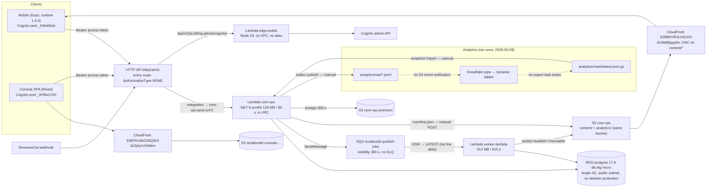

# DeveloperCards 后端架构生产就绪评审（2026-09-22）

用途：(1) 决定下一个工程 wave 做什么；(2) 作为中级软件工程师（NZ）面试 system-design 讲解的骨架。

证据来源：三份只读调查（infra / code / pipelines，2026-09-22，`AWS_PROFILE=dev`，账户 622994489535，ap-southeast-2；只用 describe/get/list；从未打印 secret 值），仓库 `/Users/qc/src/recallsmith-release` @ e867b54（main），根 `README.md`，以及下文引用的 dated docs。每条结论后面都有 `file:line` 或 CLI 查询；调查没核到的写"未核"。月成本为 ap-southeast-2 目录价的估算（≈），基线是 2026-08 账单 **$42.06/月**（`aws ce get-cost-and-usage --granularity MONTHLY --group-by Type=DIMENSION,Key=SERVICE`，us-east-1）。

本文不买域名、不改任何资源；域名购买是 owner 的决定，§2.4 给出买了以后怎么接。

---

## §0 结论先说

1. **现在的水平**：一个能跑、成本 $42/月、14 天 0 错误 0 限流的 serverless 单环境（core-vpc 19 431 次调用，avg 303 ms，`cloudwatch get-metric-statistics`），代码层的幂等 / 事务 outbox / keyset 分页 / 错误封装是中级偏上的水平；但基础设施是 2025-12 起的 console click-ops，仓库里没有一行 IaC（`find . -name '*.tf' -o -name cdk.json -o -name template.y*ml` → 只有 `src_C/deploy.sh`、`frontend/deploy.sh`）。
2. **离"企业生产级"差四类东西**：(a) 安全边界——API 上 0 条路由挂 authorizer，Lambda 走"NOT SECURE"回退解 JWT，执行角色挂 4 个 `*FullAccess`，密码在 env var；(b) 运维反馈回路——0 alarm、0 SNS topic、log 永不过期、无 CloudTrail、无 DLQ；(c) 交付管线——无 staging、无 CD、迁移是控制台按钮、部署靠笔记本上 9.5 个月没轮换的 admin key；(d) 可复现性——无 IaC、无 restore 演练、无自有域名。
3. **必须（14 项）**：≈ 6 人日，净月成本 **−$3 到 +$5**（删掉死版本的 SnapStart/PC 省 $4.93，加 alarm/快照/CloudTrail 花 ≈ $3）。
4. **应该（15 项）**：≈ 20 人日，≈ **+$6–10/月**（域名 + zone、staging 共享实例、scheduler、跨区快照）。
5. **可选（10 项）**：≈ 8 人日，≈ **+$50–60/月**（Multi-AZ +$15、WAF +$9、SSM endpoint +$7.3、Snowflake +$10、独立 staging RDS +$15）。
6. **两条路线**：省钱路线（必须 + 应该）≈ 26 人日、月账单 ≈ **$45–50**；好看路线（全部）≈ 34 人日、月账单 ≈ **$100–110**。
7. **最大的一个意外**：手机端用户在 Cognito pool `ap-southeast-2_04hd6iisb`（名字 "cpspy"，app client `MobileDeveloperCards`，5 个用户；`cognito-idp list-user-pool-clients`），而 API 唯一的 JWT authorizer `828ehi` 只认控制台 pool `_4Vf8uCXKt`（`apigatewayv2 get-authorizers`）。code survey 里"把现有 authorizer 挂到 `ANY /{proxy+}`"的修法会让全部手机用户 401——需要第二个 authorizer + 路由拆分（§2.1.1）。
8. **最贵的一个浪费**：Lambda 月费 $4.93 **100% 花在没有流量的版本上**（SnapStart 缓存在 v30–32 / worker v1，Provisioned Concurrency 1 个挂在 v33，prod 别名指向 v47；`lambda list-provisioned-concurrency-configs`、`list-versions-by-function`）。
9. **最危险的一个设置**：RDS `DeletionProtection=false` + 单 AZ + 位于有 IGW 路由的公有子网 + 7 天备份 + 0 手工快照（`rds describe-db-instances`）。修第一项 5 分钟、$0。
10. **面试价值**：这个项目已经有 4 个可讲的真实事故（2026-09-21 Lambda 别名、账本超付 critical、0.25 s 音频循环、ASC API 建版本不继承 supportUrl），每个都有 commit 和复盘；§4 给了讲稿和 20 道追问。

---

## §1 现状架构

| 组件 | 现在怎么配的（CLI 事实） |
|---|---|
| HTTP API `ktbq1sie2c` (`developercards-api`) | 10 条路由全部 `AuthorizationType: NONE`；JWT authorizer `828ehi`（issuer `_4Vf8uCXKt`，audience `6lkofepp…`）存在但无路由引用；stage `$default` 与 `dev` 都打到 `core-vpc:prod`；无 throttling、无 access log、无 custom domain（`apigatewayv2 get-routes/get-stages/get-domain-names`）。控制台的 `VITE_API_BASE` 指向 `…/dev` stage（`frontend/.env.production:11`）。 |
| Lambda `core-vpc` | dotnet8/arm64，128 MB/90 s，alias `prod`→v47；PC=1 挂在 v33；SnapStart 缓存在 v30–32；32 个 env var 含 `PGPASSWORD`（长度 8）、`MIGRATE_SECRET`、`INTERNAL_SHARED_SECRET`、`RC_WEBHOOK_AUTH_*`；log group Never expire；TracingConfig PassThrough（`lambda get-function-configuration`）。 |
| Lambda `worker-lambda` | 512 MB/615 s；ESM `BatchSize 1`、`MaximumBatchingWindow 60 s`、`MaximumConcurrency 2`，目标是裸 ARN = `$LATEST`（`lambda list-event-source-mappings`）；与 core-vpc **共用**角色 `core-vpc-role-joizyiwt`。 |
| Lambda `edge-public` | nodejs24.x，21.9 MB zip，无 alias；仓库里的 `src_C/Public/` C# 项目不是线上跑的东西。 |
| IAM | 角色挂 `AmazonEC2FullAccess`、`AmazonRDSFullAccess`、`AmazonSQSFullAccess`、`AmazonS3FullAccess`（`iam list-attached-role-policies`）；1 个 IAM user，1 个 access key 建于 2025-12-08 从未轮换；无 CloudTrail trail、无 GuardDuty、无 Config。 |
| SQS `recallsmith-publish-jobs` | VisibilityTimeout 300 s（< 消费者 615 s）、RedrivePolicy null、SSE-SQS；14 天 7 条消息（`sqs get-queue-attributes --attribute-names All`）。 |
| RDS `developercards` | postgres 17.9，db.t4g.micro，gp3 20 GB；MultiAZ false，DeletionProtection false，备份 7 天，手工快照 0，无 CloudWatch log export，无 event subscription，`IAMDatabaseAuthenticationEnabled false`，master user `postgres` 就是应用用户（`rds describe-db-instances`）。 |
| VPC `vpc-04af44dd8f5f48717` | 3 个 /24 子网全部走 IGW 主路由表（没有私有子网）、无 NAT；S3 gateway endpoint + SQS interface endpoint（单 AZ，$9.67/月）。Lambda ENI 没有公网 IP ⇒ 函数**没有任何互联网出口**——这是 RevenueCat/Cognito 调用被放到 `edge-public` 的真实原因。 |
| S3 | `core-vpc`（content + analytics 同桶，versioning off，无 lifecycle）；`core-vpc-premium`（versioning off）；`devcards-content-dev` **公共可读**（PAB 全关，`Principal:"*"`，`IsPublic:true`），代码无引用（`grep -rn devcards-content-dev src_C mobile/src` → 0）。 |
| CloudFront | 内容 CDN `E28BKORJLV6UXG`：OAC ✔、CachingOptimized、WAF 有（3 个 managed rule group）、TLS 最低 **TLSv1**（无自定义证书时无法提高）；控制台 `E85FKUMZZWQWX`：SPA 回退 ✔、SecurityHeaders 策略 ✔、**无 WAF**。 |
| Cognito | 控制台 pool `_4Vf8uCXKt`：2 用户，MFA OFF，access/id token 1 天，callback 含 localhost；手机 pool `_04hd6iisb`：5 用户，MFA OFF；两者都 `DeletionProtection ACTIVE`。 |
| 可观测性 | 0 alarm、0 SNS topic、0 dashboard（两区）；代码里已有 EMF `RecallSmith/Latency,Errors`（`src_C/Shared/RecallSmith.Lambda.Common/RouteMetrics.cs:42`）但没人看。 |
| 调度 / 密钥 / 预算 | EventBridge rules 0；Secrets Manager 1 条陈旧（指向已不存在的 Aurora）；SSM 空；预算 $20/月而实际 $42 ⇒ 三级告警常年 ALARM，全是噪音。 |
| 支付 | RevenueCat webhook → `POST /webhooks/revenuecat/{production,development}` → core-vpc；bearer 从 env 读（`src_C/Vpc/Webhooks/RevenuecatWebhook.cs:75-82`）；DB 失败仍回 200（`:336-339`）。 |
| 部署 | `src_C/deploy.sh:29-51`：笔记本 `update-function-code` → `publish-version` → `update-alias prod` → 核 CodeSha256；`frontend/deploy.sh` s3 sync + invalidate；迁移走 `POST /api/v1/admin/db/migrate`（`src_C/Vpc/Db/Migrate.cs:134-143`）；CI 四个 job 只测不部署（`.github/workflows/ci.yml`）；GitHub 0 environment、0 secret。 |

---

## §2 逐域评审

严重度：**critical** = 今天就可被利用 / 丢数据 / 停机；**major** = 过不了普通生产就绪评审；**minor** = 卫生/成本。工时 = 人日。

### 2.1 安全

| # | 项 | 现状（证据） | 生产级做法 | 严重度 | 具体改法 | 工时 | 月成本 |
|---|---|---|---|---|---|---|---|
| 2.1.1 | API 鉴权 | 所有路由 `AuthorizationType NONE`；`Auth.cs` 在没有 `requestContext.authorizer.jwt` 时走注释写明 "NOT SECURE" 的 `DecodeJwtWithoutVerify`（`src_C/Shared/RecallSmith.Lambda.Common/Auth.cs:66-68`），`cognito:groups`/`sub` 由客户端自述；25 个文件靠 `RequireUser/Admin/SuperAdmin` 把门。手机用户在 pool `_04hd6iisb`，authorizer 只认 `_4Vf8uCXKt`。 | 网关验签，Lambda 只信 `requestContext.authorizer`；每个 issuer 一个 JWT authorizer；无验证回退在生产二进制里不存在。 | **critical** | (1) 新建 authorizer `cognito-jwt-mobile`（issuer `…/ap-southeast-2_04hd6iisb`，audience `7agirr7f56r9k5p6v6o63al1on`）；(2) 把 `ANY /{proxy+}` 拆成 `ANY /api/v1/authoring/{proxy+}`、`ANY /api/v1/admin/{proxy+}` → 控制台 authorizer，`ANY /api/v1/sync/{proxy+}`、`GET /api/v1/me`、`ANY /api/v1/draw-state/{proxy+}`、`GET /api/v1/entitlements`、`GET /api/v1/content/premium-url` → 手机 authorizer，`/webhooks/*`、`/health` 保持 NONE；(3) `Auth.cs:66-68` 改成 `ALLOW_UNVERIFIED_JWT=1` 才启用并打 Error 日志；(4) 集成测试：无 authorizer 上下文的 bearer 请求 ⇒ `UserSub == null`。先在 staging 用真实手机 access token 验证 `client_id` 匹配（HTTP API 对 Cognito access token 用 `client_id` 当 audience）。 | 1 | $0 |
| 2.1.2 | IAM 最小权限 | 共用角色挂 4 个 `*FullAccess`；Snowflake 角色也挂 `AmazonS3FullAccess`（`iam list-attached-role-policies`）。 | 每函数一角色，inline policy 只列用到的 action+resource。 | **critical** | core-vpc：`s3:GetObject/PutObject` on `core-vpc/content/*`、`core-vpc-premium/*`，`sqs:SendMessage` on 一个队列，`ssm:GetParameter` on `/developercards/prod/*`，logs；worker：`sqs:ReceiveMessage/DeleteMessage/GetQueueAttributes`、`s3:PutObject` on builds 前缀，logs；Snowflake：只留 inline `snowflake-recallsmith-s3-read`。改完用 IAM Access Analyzer "unused access" 核一遍。 | 0.5 | $0 |
| 2.1.3 | 密钥 | DB 密码、HMAC、migrate secret、RC bearer 都是明文 env var（`src_C/Vpc/Db/Pg.cs:30`、`src_C/Vpc/Db/Migrate.cs:138`、`RevenuecatWebhook.cs:75-82`）；应用以 master `postgres` 连库；密码长度 8。 | SSM Parameter Store SecureString（标准层免费）或 Secrets Manager；INIT 时取一次缓存在静态；应用角色只有 DML；migrator 角色单独。 | **major** | (1) `CREATE ROLE app_rw` 只授 app schema DML，`migrator` 授 DDL；轮换 master 密码为 32 位；(2) 参数放 `/developercards/prod/{pg-password,migrate-secret,internal-hmac,rc-webhook-prod,rc-webhook-dev}`；(3) Lambda 在 VPC 里没有出口，二选一：**CD 注入**（Actions 用 OIDC 读 SSM → `update-function-configuration`，$0，值不再经过笔记本）或 **SSM interface endpoint**（≈ $7.3/月，运行时拉取、可轮换）；(4) 所有 secret 比较改 `CryptographicOperations.FixedTimeEquals`（`Migrate.cs:142`、`RevenuecatWebhook.cs:265` 现在是 `string.Equals`/`!=`），401 响应体去掉 `expectedLen/expectedHash8`（`:267-280`）。 | 1 | $0 / $7.3 |
| 2.1.4 | 人的凭据 | 1 个 IAM user，access key 2025-12-08 至今，两份 deploy 脚本都用它。 | 无长期 key：IAM Identity Center + `aws sso login`；CI 用 GitHub OIDC 角色。 | major | 建 OIDC provider + `recallsmith-gha-staging`/`-prod` 两个角色（trust 限 repo + branch/environment）；本机改 SSO；删旧 key。 | 0.5 | $0 |
| 2.1.5 | 审计 | `cloudtrail describe-trails` → []，只有 90 天 Event History。 | 一条多区域 management-events trail 到加密 S3，保留 ≥ 1 年。 | major | 开一条 trail（第一条 management trail 免费，只付 S3）。 | 0.1 | ≈ $0.1 |
| 2.1.6 | Cognito | 控制台 pool MFA OFF，token 24 h，callback 含 `localhost:5173`；无 threat protection。 | 管理员 pool 强制 TOTP，access token 15–60 min，prod client 不含 localhost。 | major | MFA `ON`（TOTP，2 个用户）；access/id 1 h、refresh 30 d；localhost 移到单独的 dev app client。手机 pool：MFA OPTIONAL，不强制。Cognito Plus（≈ $0.05/MAU）可选。 | 0.2 | $0 |
| 2.1.7 | 公共桶 | `devcards-content-dev` 公共可读，代码无引用。 | 生产账户里没有公共桶。 | major | 开 PAB 四项，30 天后删桶。 | 0.1 | $0 |
| 2.1.8 | 数据层网络位置 | RDS 在有 IGW 路由的子网，`PubliclyAccessible false` + SG 是仅有的两道门；无私有子网。 | 数据层和 Lambda 在私有子网，公有子网空着或只放 NAT。 | major | 新建 3 个私有子网 + 私有路由表（无 IGW）；新 DB subnet group，`modify-db-instance` 换组（单 AZ 会有几分钟中断，选维护窗）；Lambda VPC config 换到私有子网；endpoint 也搬过去。 | 1 | $0 |
| 2.1.9 | WAF | 内容 CDN 有 WAF（IP reputation + Common + KnownBadInputs），控制台 CDN 无，HTTP API 无法直接挂 WAF。 | 管理入口有 rate-based rule；API 前面有可挂 WAF 的层。 | minor（可选） | 一个 CLOUDFRONT scope web ACL 同时关联控制台分发（和以后的 API 分发）；rate 2 000/5 min/IP。API 要 WAF 得加一层 CloudFront → API GW（origin 自定义 header 作 secret）。 | 1 | ≈ $9 |
| 2.1.10 | 破坏性接口 | `db/recreate`（`DROP DATABASE … WITH (FORCE)`）在生产二进制里，只靠 `PGDATABASE=='postgres'` 关着（`src_C/Vpc/Db/Migrate.cs:267,304`）。 | 生产二进制里没有这条路径。 | major | `API_ENV=production` 时编译期/启动期拒绝注册这两条路由；或再加 `ALLOW_DESTRUCTIVE_DB=1`。 | 0.2 | $0 |

### 2.2 可靠性

| # | 项 | 现状（证据） | 生产级做法 | 严重度 | 具体改法 | 工时 | 月成本 |
|---|---|---|---|---|---|---|---|
| 2.2.1 | SQS 可见性 vs 函数超时 | 300 s < 615 s；代码注释自己写了 6 倍规则（`src_C/Worker/WorkerFunction.cs:81`）。 | visibility ≥ 6 × timeout。 | major | `VisibilityTimeout=3700`；`MaximumBatchingWindow` 60 s → 0（batch=1 时只增加延迟）。 | 0.1 | $0 |
| 2.2.2 | DLQ | RedrivePolicy null，Lambda 无 DeadLetterConfig；毒消息每 5 分钟重试 4 天后消失。 | DLQ + maxReceiveCount 3 + 深度告警。 | major | 建 `recallsmith-publish-jobs-dlq`（保留 14 d），redrive 3；alarm `ApproximateNumberOfMessagesVisible ≥ 1`；core-vpc 的异步调用（以后的 scheduler 事件）配 on-failure destination 到同一 SNS。 | 0.3 | $0 |
| 2.2.3 | 任务被抢占后孤儿 | `TryAcquireJobAsync(jobId)` 从不传 receive count（`src_C/Worker/Services/PublishJobProcessor.cs:34`），`$2 > 1` 分支死代码（`src_C/Worker/Repositories/JobRepository.cs:25`）；崩溃后 job 永远 PROCESSING，15 分钟后允许二次发布（`src_C/Vpc/Authoring/Publish.cs:271-285`）。 | 重投递能接管；acquire 失败且非陈旧时抛错让消息重试。 | major | 传 `record.Attributes["ApproximateReceiveCount"]`；`ReportBatchItemFailures`；发布加部分唯一索引 `deck_publishes(deck_id) where status in ('PENDING','PROCESSING')` → 23505 映射 409。 | 0.5 | $0 |
| 2.2.4 | Manifest 重建 | 发布成功后 `ManifestService.RebuildAsync` 只往不存在的 `MANIFEST_QUEUE_URL` 发消息，worker 无该 env（`src_C/Worker/Manifest/ManifestService.cs:34-41`；`docs/content-delivery-v3.md:122-123`）；唯一写入者是手工 `POST /api/v1/admin/manifest/rebuild`（`src_C/Vpc/Authoring/ManifestRebuild.cs:118`）。2026-09-21 上线两副卡组就是靠手工 POST。 | 发布完成 ⇒ manifest 自动更新；有回滚指针。 | major | 把 `ManifestRebuild` 核心移到 `src_C/Shared/`，worker 在 `CompleteJobAsync` 后直接调用（10 s 去抖）；删 `ManifestService`；加 `decks.live_build_id` + `POST /admin/decks/{id}/rollback`。 | 1.5 | $0 |
| 2.2.5 | 发布别名 | ESM 指向 `$LATEST`，`deploy.sh` 只保证 alias（`src_C/deploy.sh:42`）。 | 所有触发器指向 alias。 | major | `update-event-source-mapping --function-name worker-lambda:prod`。 | 0.1 | $0 |
| 2.2.6 | Lambda 并发与连接池 | 无 reserved concurrency（`lambda get-function-concurrency` → {}），`PG_MAX=1`/容器，t4g.micro ≈ 80 连接；API 无 throttling。 | 并发上限 × 每容器连接 < DB 上限；网关限流。 | major | core-vpc reserved 40、worker 2；`$default` stage 100 rps/200 burst，`sync/push`、`draw-state/sync`、`webhooks/*` 单独更低；`53300/08006` → 503 + `Retry-After`。 | 0.2 | $0 |
| 2.2.7 | 超时链 | API GW 集成 30 s < 函数 90 s；Npgsql CommandTimeout 默认 30 s；迁移与 outbox 发布走 HTTP 会被截断（`src_C/Vpc/Analytics/OutboxPublisher.cs:53-57`）。 | 请求路径超时单调递减；长任务不走 HTTP。 | major | CommandTimeout 20 s，handler 接 `ILambdaContext` 用 `RemainingTime` 取消；迁移/outbox/import 改由 scheduler 或 CD 直接 invoke（§2.4、§2.5）。 | 0.5 | $0 |
| 2.2.8 | RevenueCat webhook | DB 失败仍 200（`src_C/Vpc/Webhooks/RevenuecatWebhook.cs:336-339`）⇒ RC 不重试，付费用户停在 free。 | 只有真正落库才 200；其他 5xx 让 RC 退避重试。 | major | premium upsert 失败 → 503；`env_mismatch/product_mismatch/TEST` 仍 200；`rc_webhook_events` 插入 `RETURNING 1` 为 0 时短路。 | 0.2 | $0 |
| 2.2.9 | 冷启动 | 128 MB .NET 8，14 天 p-max 5 955 ms；SnapStart 钩子写好了但没开（`src_C/Vpc/SnapStartHooks.cs`）；PC 挂在死版本。 | 要么 SnapStart on（alias 版本），要么 512 MB；不为死版本付费。 | minor | 删 v30–33 的 SnapStart/PC；对 v47+ 二选一做 A/B，看 REPORT 的 Init Duration。 | 0.5 | −$4.9 |
| 2.2.10 | 多 AZ | RDS 单 AZ（2b）；SQS endpoint 只在 2a。 | 收入依赖时 Multi-AZ；endpoint 每个 AZ 一个 ENI。 | minor（可选） | Multi-AZ 见 §5；endpoint 加 2b/2c 子网（每 AZ +$7.3，不建议）。 | 0.1 | +$15 |
| 2.2.11 | 定时任务（EventBridge） | `events list-rules` → 0，`scheduler list-schedules` → 只有 newsapp 的 DISABLED 一条。三件该定时的事都靠人：outbox publish（跑过一次，2026-05-09）、manifest rebuild（每次发布后手工 POST）、snapshot import（跑过一次，2026-06-01）。 | 后台任务由 EventBridge Scheduler 直接 invoke Lambda alias（不经 API Gateway 的 30 s 上限），失败进 on-failure destination，有"多久没成功跑"的告警。 | major | (1) `outbox-publish` `rate(15 minutes)` → `core-vpc:prod`，事件 `{source:"scheduler",action:"outbox/publish",limit:5000}`，`VpcFunction.cs` 加 10 行识别非 API GW 事件并走 `Auth.VerifyInternalSignature` 的内部路径；循环到 `published < limit`；(2) manifest rebuild 首选在 worker 内同步调用（§2.2.4），scheduler 只做兜底：`rate(5 minutes)` 检查 `max(deck_publishes.updated_at where status='SUCCESS') > manifest.json LastModified` 才重建；同一条 schedule 顺手做孤儿 PENDING reaper（> 10 min 无消息 → FAILED）；(3) `snapshot-import` `cron(0 2 * * ? *)` → `{action:"content-intelligence/import"}`，importer 已按 etag 幂等（`src_C/Vpc/Analytics/ContentIntelligenceSnapshotImport.cs:66-82`）；(4) 每条 schedule 一个 alarm：`OutboxLag > 50 000` 或最老 pending > 6 h；import 48 h 无成功运行；scheduler 角色只有 `lambda:InvokeFunction` on 那一个 alias。 | 1 | ≈ $0.3 |

### 2.3 可观测性

| # | 项 | 现状（证据） | 生产级做法 | 严重度 | 具体改法 | 工时 | 月成本 |
|---|---|---|---|---|---|---|---|
| 2.3.1 | 告警 + 通知 | `cloudwatch describe-alarms` → 0；`sns list-topics` → 0。故障由用户发现。 | 每个故障路径一个 alarm，一个 SNS topic（email + 可选 Chatbot）。 | **critical** | SNS `developercards-alerts`；alarm：Lambda `Errors>0`(两函数)、`Throttles>0`、core-vpc `Duration p95>3 s`、API `5xx>1%`、RDS `FreeStorageSpace<2 GB`、`FreeableMemory<100 MB`、`DatabaseConnections>60`、`CPUUtilization>80%`、SQS `ApproximateAgeOfOldestMessage>900 s`、DLQ 深度、EMF `RecallSmith/Errors`、`level=error` metric filter（`Res.Error500` 自 PR #110 起记异常）；RDS event subscription（failover/maintenance/storage）；预算改 $60 + Cost Anomaly Detection。 | 0.5 | ≈ $1.3 |
| 2.3.2 | 日志保留 | 全部 `/aws/lambda/*` Never expire；`LogFormat: Text` 虽然代码已出 JSON 行。 | prod 30–90 d，dev 7–14 d；JSON 格式让 Logs Insights 直接索引 `traceId/step/Route`。 | major | `put-retention-policy` 90 d（core-vpc）/30 d（其他）；`LoggingConfig.LogFormat=JSON`，`ApplicationLogLevel` 由 env 控制；删 stray group `/aws/lambda/developercards-api`。 | 0.1 | −$ |
| 2.3.3 | API access log | `AccessLogSettings: null`，`DetailedMetricsEnabled: false`。 | JSON access log（requestId、routeKey、status、latency、authorizer error）。 | major | 两个 stage 都开，写到 `/aws/apigateway/developercards-api`，30 d。 | 0.1 | ≈ $0.1 |
| 2.3.4 | 追踪 | `TracingConfig: PassThrough`。 | X-Ray Active，SDK 已自动打 S3/SQS；Npgsql 需手动 subsegment。 | minor（可选） | 两函数 Active tracing；采样默认 5%；≤ 100k trace/月免费。 | 0.2 | $0 |
| 2.3.5 | Sentry 回归 + 隐私标签 | 1.6.0 二进制把 Sentry 移出以免改隐私标签；控制台 `frontend/src/lib/reportError.ts` 的 beacon 无收集端（`README.md` §4）。 | 三端异常集中到一个收集器；App Store 隐私标签与实际采集一致。 | minor | 1.6.x 二进制加回 `@sentry/react-native`（免费层 5k 事件）；`VITE_ERROR_REPORT_URL` 指向 Sentry；隐私标签加 "Diagnostics — Crash Data, not linked"；`apple-utils createAppDataUsageAsync` 可脚本化。分析事件的 `user_id_hash` 已经是 "linked to user"，标签也要如实。 | 1 | $0 |
| 2.3.6 | 健康检查 | `/health` 不查库（`src_C/Vpc/VpcFunction.cs:99`）。 | 浅探针 + 深探针，deep 挂 alarm。 | minor | `/health` 保持；`/health/deep` `select 1` 需 internal HMAC；Route 53 health check 或 canary 每 5 min。 | 0.2 | ≈ $0.5 |

### 2.4 交付

| # | 项 | 现状（证据） | 生产级做法 | 严重度 | 具体改法 | 工时 | 月成本 |
|---|---|---|---|---|---|---|---|
| 2.4.1 | Staging 环境 | 一个账户、一个 VPC、一个 DB、一个 API；stage `dev` = prod；alias `dev`→v43 无人引用；`eas.json` 的 `staging-internal-release` 指向 channel `production`（`mobile/eas.json:52-64`）。 | 至少一套与 prod 拓扑相同、数据隔离的 staging。 | major | 同一 RDS 实例第二个库 `developercards_staging`（$0）；函数 `core-vpc-staging`/`worker-lambda-staging`（Lambda env 按版本绑定，alias 无法带不同 env，所以必须是独立函数）；独立 HTTP API `developercards-api-staging`（或同 API 的 stage 用 stage variable 指向 staging 函数，HTTP API 是否支持未核）；队列 `…-staging` + DLQ；桶 `core-vpc-staging` + 分发；Cognito 复用两个 pool 但 app client 单独；EAS channel `staging`，`staging-internal-release` 改指它。 | 2 | ≈ $0.5–1 |
| 2.4.2 | CD | 无：`deploy.sh` 手跑，GitHub 0 secret 0 environment（`gh api …/environments`）。 | Actions + OIDC：test → deploy staging → smoke → promote prod（需审批）→ OTA on tag。 | major | `on: push main`：现有 4 job → `deploy-staging`（OIDC 角色；`dotnet publish` → `update-function-code` → publish → alias `staging`；migrate staging 库；console 到 staging 桶）→ `smoke`（`/health/deep`、发布 fixture 卡组、轮询 SUCCESS、manifest 含 build、Playwright 打 staging 控制台）→ `deploy-prod`（`environment: production` 必需 reviewer；手工快照 `pre-deploy-<sha>` → migrate → publish → alias prod 两函数 → console → 10 min alarm 观察，异常自动 `update-alias` 回退）。`on: tag v*-ota` → `eas update --channel production`。`on: tag v*` → `ios-build.sh` → 模拟器启动冒烟 → `ios-submit.sh` → `asc-release.cjs --apply`。`deploy.sh` 已经做了 sha 与 alias 核验，直接当 job body。 | 3 | $0 |
| 2.4.3 | 迁移 | HTTP 端点 + 控制台按钮；forward-only；30 s 网关超时内跑 `015` 那样的全表 backfill；advisory lock 无 `lock_timeout`（`src_C/Vpc/Db/Migrate.cs:99`）；2026-09-21 第一次点 Migrate 因 `x-migrate-secret` 从未发送而 403（commit fc45b18）。 | 迁移在 CD 里、staging 先跑、expand/contract、有前置快照。 | major | (1) CD 步骤直接 `lambda invoke core-vpc:prod` 带内部事件（HMAC）跑迁移，15 min 预算；HTTP 端点只留 `dryRun`；(2) `set lock_timeout='5s'` → 409 `MIGRATION_IN_PROGRESS`；(3) 每个迁移写"向前兼容说明"：加列/加索引先行一个 release，删列等旧代码下线；`CREATE INDEX CONCURRENTLY` 需要 runner 支持 `-- runner: no-transaction` 头；(4) **42703 容错的替代**：现在 `ProgressEvents.cs:624-637` 与 `PublishJobProcessor.cs:192-225` 用 catch `42703` 回退旧 SQL，这是"代码先于迁移上线"的补丁。生产级做法是把顺序反过来（CD 保证 migrate 在 alias 切换之前）+ 启动期读 `max(version) from schema_migrations` 与代码常量 `RequiredSchemaVersion` 比较：低于则打 Error、出 metric、相关路由回 503 `SERVER_NOT_READY_<feature>`——显式、可告警，而不是每个查询各自兜底。 | 1 | ≈ $2（快照） |
| 2.4.4 | IaC | 无。 | 全部资源在 CDK/Terraform，`plan/diff` 进 PR，apply 从 CI。 | major | 推荐 **CDK (TypeScript)**——团队栈已是 TS，`frontend/`、`mobile/` 都能读。顺序：(a) 先用一个新 stack 建**只新增**的东西（SNS、alarm、DLQ、log retention、schedules、OIDC 角色、staging 全套）——零导入风险；(b) `cdk import` 导入 S3 桶、SQS 队列、IAM 角色、Lambda 函数与 alias、API/routes/authorizer；(c) RDS 最后导入，`RemovalPolicy.RETAIN` + deletion protection，永远不让它被替换；(d) `cdk diff` 空了才算完成。如果 (b) 某类资源 CloudFormation import 不支持（ApiGatewayV2 route/integration 是否可导入未核），退到 Terraform：它的 `import` 覆盖面更全，代价是第二种语言。 | 3 | $0 |
| 2.4.5 | 回滚 | 后端 alias 翻回上一版可行但未脚本化；worker 因 ESM 指 `$LATEST` 无法按 alias 回滚；OTA 用 `eas update:republish --group` 但无文档；卡组 build 无回滚。 | 五条一行命令 + 文档化 RTO。 | major | `scripts/rollback.sh {api|worker|console|ota|deck} <ref>`；alias 回滚 < 1 min，OTA republish < 5 min，deck 指针翻转 + rebuild ≈ 1 min。 | 0.5 | $0 |
| 2.4.6 | 域名 + ACM | `route53 list-hosted-zones` → []，`route53domains list-domains` → []，`acm list-certificates`（两区）→ []；控制台 hard-code `ktbq1sie2c.execute-api…/dev`（`frontend/.env.production:11`）与 `d12pfy1rhi3ekm.cloudfront.net`；手机 `EXPO_PUBLIC_API_BASE` 由 EAS env 注入（值未核，账户里只可能是这两个 AWS 生成域名之一）。 | 自有域名，API/console/CDN/auth 各一个子域，证书 ACM，DNS 校验自动续期。 | major | owner 买域名（`.com` 在 Route 53 Domains ≈ US$14/年；`.co.nz` 走 NZ 注册商 ≈ NZ$25–35/年再把 NS 委托给 Route 53；价格未核）。然后：Route 53 public zone（$0.50/月）；ACM 证书两张——ap-southeast-2 给 API GW `api.<domain>`，us-east-1 给 CloudFront `console.` `cdn.` 与 Cognito hosted UI `auth.`（Cognito 自定义域要求父域已有 A 记录）；API GW custom domain → `$default` stage；两个分发加 alternate domain + `TLSv1.2_2021`；Cognito callback 改 `console.<domain>`；控制台与 OTA 改 base URL。**不要**立刻 `DisableExecuteApiEndpoint`：1.5.0 冻结客户端还在用旧域名，等其占比 < 1% 再关。 | 1 | ≈ $1.7 |
| 2.4.7 | 品牌统一 RecallSmith → DeveloperCards | 用户可见处：控制台 `<title>RecallSmith Console</title>`（`frontend/index.html:17`）、`frontend/src/pages/LoginPage.tsx:38`、`frontend/src/pages/AdminUsersPage.tsx:401,424`、`frontend/src/pages/DeckEditPage.tsx:301`、`frontend/src/pages/NewDeckPage.tsx:56,256`（默认作者 "RecallSmith Team"）、`README.md` 首行 `# RecallSmith`、仓库名 `github.com/ChuanQiao1128/recallsmith`、`docs/recallsmith-resume-bullets.md`。运维可见处：EMF namespace `RecallSmith`（`RouteMetrics.cs:42`）、C# 命名空间/程序集 `RecallSmith.Lambda`（`src_C/Vpc/RecallSmith.Lambda.Vpc.csproj:8-9`，124 个文件）、S3 `recallsmith-console-…`、SQS `recallsmith-publish-jobs`、IAM `snowflake-recallsmith-s3-role`、`snowflake/001_content_intelligence_setup.sql:1` 注释。**不能改**的稳定标识：bundle id `com.timeawake.recallsmith`、scheme `recallsmith`、EAS slug（`mobile/app.json:5-6,27`）、AsyncStorage 键前缀 `recallsmith:`（`mobile/src` 27 处，改了等于清空用户本地数据）。已经对的：API `developercards-api`、RDS `developercards`、库 `developercards_db`、pool "Console for DeveloperCards"、app.json `name`。 | 面试官和用户看到的名字只有一个。 | minor | 第一批（0.5 d）：控制台 6 处文案 + `README.md` 标题 + GitHub 仓库改名（自动重定向）+ EMF namespace 改 `DeveloperCards`（alarm 一起改）。第二批随 IaC：新建资源用新名（`developercards-*`），旧桶/队列在 IaC 导入时保留名字，不迁移。C# 命名空间可选。 | 0.5 | $0 |

### 2.5 数据

| # | 项 | 现状（证据） | 生产级做法 | 严重度 | 具体改法 | 工时 | 月成本 |
|---|---|---|---|---|---|---|---|
| 2.5.1 | RDS 删除保护 | `DeletionProtection: false`。 | 永远 true。 | **critical** | `modify-db-instance --deletion-protection`。 | 0.01 | $0 |
| 2.5.2 | 备份 / DR | 自动备份 7 d；手工快照 0；无跨区；从未演练；Cognito 无导出。目标建议：**RPO 1 h / RTO 4 h**（单人产品、非实时收入）。现状：区内 RPO ≈ 5 min（PITR 日志 5 分钟上传一次），RTO 未核（估 30–60 min：restore 新实例 + 改两个函数的 `PGHOST` env + publish + alias）；区域丢失 RPO = ∞。 | PITR 14–35 d；迁移前手工快照；每周跨区拷贝；每季 restore 演练并记录时长。 | major | 保留期 14 d；CD 迁移前 `create-db-snapshot pre-deploy-<sha>` 留 5 个；每月手工快照留 12 个；AWS Backup plan 每周 copy 到 ap-southeast-4；每季度 restore 到 `developercards-drill` → 指 staging 函数 → 跑 smoke → 删；Cognito 每月 `list-users` 导出到备份桶（密码不可导出，pool 丢失仍需重置）。 | 1.5 | ≈ $4–6 |
| 2.5.3 | RDS 参数与日志 | `default.postgres17`，无 CloudWatch log export；SSL 只在客户端 `Require`（`src_C/Shared/RecallSmith.Lambda.Db/Pg.cs`）。 | 自定义参数组：`rds.force_ssl=1`、`log_min_duration_statement=500`、`idle_in_transaction_session_timeout=60s`；postgresql 日志导出。 | minor | 建参数组 + `EnableCloudwatchLogsExports=[postgresql]`，30 d 保留。 | 0.2 | ≈ $0.2 |
| 2.5.4 | Performance Insights | 已开，7 d 免费层。 | 保持。 | ok | — | — | $0 |
| 2.5.5 | S3 版本 / 生命周期 / PAB | 三个业务桶 versioning off；`content/manifest.json` 每次 rebuild 原地覆盖；analytics 与 content 同桶；无 lifecycle；PAB 只有 `devcards-content-dev` 关着。 | 内容与收入资产开版本；noncurrent 90 d 过期；analytics 单独私有桶；raw 90 d → Glacier IR、730 d 过期。 | major | `core-vpc`、`core-vpc-premium` 开 versioning + lifecycle（builds 不可变，版本增长只来自 manifest ≈ 3.5 KB/次）；新桶 `developercards-analytics-622994489535` 并设 `ANALYTICS_S3_BUCKET`/`CI_SNAPSHOT_BUCKET`（现在因 fallback 写进内容桶，`src_C/Vpc/Analytics/OutboxPublisher.cs:41-45`）；旧 build 清理用一个月度 Lambda 按 `deck_publishes` 引用删除（lifecycle 不知道哪个是 live）。 | 0.5 | ≈ $0.1 |
| 2.5.6 | CloudFront 缓存策略与失效 | build 不可变 + 1 年；manifest 60 s TTL + 客户端 `If-None-Match`（`mobile/src/content/deckRepository.ts:1463-1486`）；控制台部署失效 `/*`；内容发布不失效（worker 无出口也不需要）。 | 正是这样：不可变资源长缓存，入口短 TTL + 条件请求；失效只给 SPA。 | ok | 唯一补充：manifest 只增不减；破坏性 schema 走 `content/manifest.v3.json` 新路径；手机加 `schemaVersion <= SUPPORTED` 检查。 | 0.5 | $0 |
| 2.5.7 | Analytics / Snowflake | 管线只手工跑过一次（raw 1 个文件 2026-05-09，marts 1.2 KB 2026-06-01；`s3api list-objects-v2`）；无 S3 事件通知 ⇒ Snowpipe `auto_ingest` 永不触发（`snowflake/001_content_intelligence_setup.sql:36-52`）；仓库里没有 Snowflake → S3 的导出 task；控制台 Content Intelligence 页实际走 Postgres 全表扫描（`src_C/Vpc/Authoring/ContentIntelligence.cs:29-30`）；outbox 表无清理；`user_id_hash` 无盐（`src_C/Vpc/Runtime/ProgressEvents.cs:806-810`）。 | 无人值守：scheduler 驱动 publish/import，事件驱动 ingest，导出 task，保留策略，盐。 | minor（除非页面要"真"） | 两条路：**A** 真 Snowflake（Standard、Sydney、on-demand、XS 60 s auto-suspend、resource monitor 10 credits）+ S3 事件 → pipe + `TASK snapshot_export` 每日 `COPY INTO @stage` + 4 d，≈ $8–15/月；**B** 不用 Snowflake：夜间 Lambda 在 Postgres 跑三条 mart SQL 自己写 `latest.json.gz`，1.5 d，$0。两条都要：scheduler 15 min 直接 invoke publish（不经 API GW）、`OutboxLag` metric、sent 行 30 d 清理、盐来自 SSM、drop `device_id`。 | 4 / 1.5 | $8–15 / $0 |
| 2.5.8 | 钱包 / 账本 | 服务端 `availablePulls/reservePulls` 由客户端上报，只 `Math.Max(0,…)` + LWW（`src_C/Vpc/Runtime/DrawStateSync.cs:161-162,293-316`），文件自己写了"真正的修法是 wallet event log"（`:283-284`）；手机端 R1 账本 2026-09-21 评审 critical：登录时 anon 账本并入用户分区写下了键，`seedNewCardLedgerIfAbsent` 把"键存在"当"已种子"，已学会的卡每次 hard+ 都白付一抽（commit 9734653；复现 `mobile/tests/unit/ledgerSeedRace.test.ts`）。 | 余额 = 服务端 ledger 求和；购买只由 RevenueCat webhook 记账；客户端只发意图。 | major（收入完整性） | `wallet_ledger(user_sub, entry_id uuid pk, delta, reason, source_event_id)`；`POST /draw/spend` 服务端扣；过渡期：服务端封顶 + 每日跳变 > N 告警。 | 3 | $0 |
| 2.5.9 | 入参防线 | 整批 400 会卡住冻结客户端的同步（`mobile/src/sync/progressSync.ts:1489-1544` 只删 accepted ∪ duplicate）；无 body 大小上限（128 MB 容器 vs 10 MB body）；`decks.slug` 写入时无语法检查（`src_C/Vpc/Authoring/Decks.cs:124-133`）。 | 逐条校验、兼容旧客户端的 ack、1 MB body 上限、slug 正则一处共享。 | major | 无效事件放进 `duplicateEventIds`（旧客户端会丢弃）+ 新字段 `rejected[]`；`RawBody.Length > 1 MB` → 413；`^[a-z0-9][a-z0-9-]{0,63}$` 给 Decks/Publish/PremiumDeckUrl 共用。 | 1 | $0 |

### 2.6 成本

| 项 | 现状 | 改法 | 月影响 |
|---|---|---|---|
| Lambda $4.93 | 100% 是 SnapStart-Cached-GB-S（v30–32 + worker v1）+ PC（v33）——都不服务流量。 | 删死版本的 PC/SnapStart；`list-versions-by-function` 只留最近 5 版。 | −$4.9 |
| Secrets Manager $0.40 | 一条指向已删除 Aurora 的陈旧 secret。 | 删。 | −$0.4 |
| VPC $9.67 | SQS interface endpoint 单 AZ，承载 14 天 7 条消息。 | 保留（无 NAT 时到 SQS 的最便宜方式）；知道它买的是什么。 | 0 |
| RDS $21.5 | t4g.micro，14 天 avg 0.46 连接、CPU 3.9%，`FreeableMemory` 最低 133 MB。 | 保持；Reserved 1 年可省 ≈ 30%，等确定留下再买。 | 0 / −$6 |
| 预算 | $20 阈值，每月都 ALARM。 | $60 + 异常检测。 | 0 |
| 标签 | 全部资源无 tag，无法把 RecallSmith 与 newsapp 分账。 | IaC 统一 `Project=DeveloperCards`、`Env=prod|staging`；开 cost allocation tag。 | 0 |
| 无关资源 | `generateArticleAudio`、`newsapi`、`newsapp-static-public`、两个 Cognito pool、`E13EO8YUR2VVX` 都是 newsapp。 | 搬到 Organizations 下的第二个账户，或至少打 tag。 | 0 |

### 2.7 多环境

| 项 | 现状 | 生产级 | 改法 |
|---|---|---|---|
| 账户 | 一个账户混着 prod、"dev"、newsapp。 | Organizations：`prod` / `staging` / `sandbox` 三账户，SSO 登录。 | 单人阶段可先做**同账户 staging**（§2.4.1），IaC 稳定后再 `cdk deploy --profile staging` 到第二账户——IaC 是前提，否则第二账户就是再点一遍 console。 |
| 配置 | env var 分散在两个函数，互有漂移（worker 缺 `PGSSLMODE/LOG_LEVEL`，core-vpc 有 4 个无人读的变量）。 | 一份 IaC 文件定义两函数全部 env；secret 只写 SSM 路径。 | 随 §2.4.4。 |
| OTA channel | `production`/`development` 两条；`staging-internal-release` 误指 production。 | `staging` channel 对应 staging API。 | 随 §2.4.1。 |
| 数据 | 无 staging 数据；测试用户曾混进生产（迁移 `016_purge_synthetic_test_users.sql`）。 | staging 用 fixture 卡组 + 合成用户；生产快照脱敏后可 restore 到 staging 做迁移演练。 | 随 §2.5.2 演练。 |

---

## §3 路线图

### 必须（≈ 6 人日，净 ≈ −$3 到 +$5/月）

| 改动 | 面试必问 | 工时 | 月成本 |
|---|---|---|---|
| 两个 JWT authorizer + 路由拆分 + 删无验证回退（§2.1.1） | "你的 API 怎么鉴权？如果网关没验签会怎样？" | 1 | $0 |
| RDS deletion protection + 保留 14 d + 迁移前手工快照（§2.5.1/2） | "RPO/RTO 是多少？怎么保证？" | 0.3 | ≈ $2 |
| S3 versioning ×2 + 关掉/删除公共桶（§2.5.5、§2.1.7） | "误覆盖 manifest 怎么恢复？" | 0.2 | $0 |
| SQS DLQ + redrive 3 + visibility 3 700 s + ESM → alias + 传 receive count（§2.2.1–3、2.2.5） | "消费者崩溃了消息去哪？" | 0.7 | $0 |
| SNS + 12 alarm + RDS event subscription + 预算 $60（§2.3.1） | "你怎么知道系统挂了？" | 0.5 | ≈ $1.3 |
| 日志保留 + JSON 格式 + API access log（§2.3.2/3） | "怎么查一条失败请求？" | 0.2 | ≈ $0 |
| IAM 拆角色、去 FullAccess、Snowflake 去 S3FullAccess（§2.1.2） | "最小权限怎么落地？" | 0.5 | $0 |
| 应用 DB 角色 + 32 位密码 + SSM SecureString + CD 注入 + 常量时间比较（§2.1.3） | "密钥放哪、怎么轮换？" | 1 | $0 |
| Webhook DB 失败回 503（§2.2.8） | "支付回调的幂等和重试？" | 0.2 | $0 |
| Manifest 在 worker 内重建 + live 指针 + 回滚端点（§2.2.4） | "发布怎么回滚？" | 1.5 | $0 |
| 删死版本 SnapStart/PC + 陈旧 secret（§2.6） | "账单里最大的浪费是什么？" | 0.1 | −$5.3 |
| Cognito 控制台 MFA + token 1 h + 去 localhost（§2.1.6） | "管理入口怎么保护？" | 0.2 | $0 |
| 网关限流 + reserved concurrency（§2.2.6） | "流量突增时哪里先断？" | 0.2 | $0 |
| CloudTrail（§2.1.5） | "谁改了 alias，怎么查？" | 0.1 | ≈ $0.1 |

### 应该（≈ 20 人日，≈ +$6–10/月）

| 改动 | 面试必问 | 工时 | 月成本 |
|---|---|---|---|
| 域名 + Route 53 + ACM + API/console/CDN/auth 子域（§2.4.6） | "客户端硬编码了 AWS 域名，API 要重建怎么办？" | 1 | ≈ $1.7 |
| Staging：第二个库 + 独立函数 + API + 桶 + EAS channel（§2.4.1） | "改动上线前在哪验证？" | 2 | ≈ $1 |
| CD：OIDC → staging → smoke → 审批 → prod alias → 自动回退；OTA/二进制 on tag（§2.4.2） | "部署流程画一下" | 3 | $0 |
| 迁移进 CD + lock_timeout + 向前兼容规则 + schema 版本门代替 42703 兜底（§2.4.3） | "schema 变更怎么不停机？" | 1 | $0 |
| CDK 导入现有栈（§2.4.4） | "IaC 怎么从 click-ops 迁移？" | 3 | $0 |
| EventBridge Scheduler：outbox 15 min、snapshot import 每日、孤儿 PENDING reaper 5 min（§2.5.7、2.2.3） | "定时任务为什么不走 API Gateway？" | 1 | ≈ $0.3 |
| 私有子网 + RDS/Lambda 搬入（§2.1.8） | "数据库为什么不能在公有子网？" | 1 | $0 |
| 跨区快照 + 季度 restore 演练 + Cognito 导出（§2.5.2） | "区域挂了怎么办？演练过吗？" | 1 | ≈ $2–4 |
| 分析桶分离 + lifecycle + 加盐 + outbox 清理（§2.5.5/7） | "PII 在分析数据里怎么处理？" | 0.5 | ≈ $0.1 |
| 入参：逐条校验 + body 上限 + slug 正则（§2.5.9） | "冻结的老客户端怎么兼容？" | 1 | $0 |
| 服务端 wallet ledger（§2.5.8） | "客户端能改自己的余额吗？" | 3 | $0 |
| 超时链：CommandTimeout + 取消令牌 + 连接重试（§2.2.7） | "慢查询怎么不拖垮池？" | 0.5 | $0 |
| Sentry 回归 + 隐私标签 + 控制台 beacon 收集端（§2.3.5） | "崩溃怎么知道？" | 1 | $0 |
| X-Ray Active（§2.3.4） | "一次请求跨了几个服务，怎么看？" | 0.2 | $0 |
| 品牌统一第一批（§2.4.7） | — | 0.5 | $0 |
| 删 `src_C/Vpc/Db/Pg.cs`、`src_C/Vpc/Db/DbUtil.cs`、`src_C/Common/` 重复副本（code survey §0） | "为什么一个函数有两个连接池？" | 0.3 | $0 |

### 可选（≈ 8 人日，≈ +$50–60/月）

| 改动 | 面试必问 | 工时 | 月成本 |
|---|---|---|---|
| WAF 关联控制台分发（+ 以后 API 前置 CloudFront）（§2.1.9） | "DDoS / 爬虫怎么挡？" | 1 | ≈ $9 |
| RDS Multi-AZ（§5） | "为什么现在不开 Multi-AZ？" | 0.1 | +$15 |
| SSM interface endpoint 运行时取密钥（§2.1.3） | "Lambda 在 VPC 里没出口怎么读 secret？" | 0.1 | +$7.3 |
| 真 Snowflake 账户 + Snowpipe + 导出 task（§2.5.7 路 A） | "为什么 OLAP 不直接查 Postgres？" | 2.5 | ≈ $10 |
| 独立 staging RDS（§2.4.1） | — | 0.1 | +$15 |
| Worker 端到端测试（Testcontainers Postgres + LocalStack S3/SQS） | "异步管线怎么测？" | 2 | $0 |
| SnapStart on 或 512 MB A/B（§2.2.9） | ".NET 冷启动怎么治？" | 0.5 | ≈ $0–3 |
| Cognito Plus / threat protection（§2.1.6） | — | 0.1 | ≈ $0.4 |
| VPC flow logs | "网络层取证？" | 0.1 | ≈ $1 |
| Organizations 第二账户 | "环境隔离到什么粒度？" | 1 | $0 |

### 两条路线合计

| 路线 | 范围 | 人日 | 月账单（含基线 $42） |
|---|---|---|---|
| **省钱** | 必须 + 应该；secret 走 CD 注入；分析走 Postgres-only（路 B）；staging 共享实例 | ≈ 26 | ≈ **$45–50** |
| **好看** | 全部三档；SSM endpoint、WAF、Multi-AZ、真 Snowflake、独立 staging RDS | ≈ 34 | ≈ **$100–110** |

单人节奏（每周 3–4 个有效人日），省钱路线 ≈ 7–8 周；必须档一周内可完成，且其中 8 项不需要改代码。

---

## §4 面试讲解骨架

### 一页讲稿提纲（需求 → 约束 → 架构 → 数据流 → 取舍 → 事故与复盘 → 数字）

1. **需求**：开发者的间隔重复卡片 App（Expo）+ 作者控制台（React）+ 内容发布管线 + 抽卡经济；付费卡组走 RevenueCat；分析用来评估卡片难度标注是否准确。
2. **约束**：一个人、月预算 < $50、NZ 单区域、App Store 二进制审核周期 ⇒ 尽量 OTA；1.5.0 客户端冻结，服务端契约不能破。
3. **架构**：HTTP API → .NET 8 arm64 Lambda（alias 发布）→ Postgres 17（t4g.micro）；发布异步：SQS → worker → S3 不可变 build → CloudFront；管理员 Cognito pool 与手机用户 pool 分开；无 NAT 的 VPC 靠 S3 gateway endpoint + SQS interface endpoint，出网调用放在 VPC 外的 edge-public。
4. **数据流**：(a) 复习事件：手机 25 条一批 push → 单条 SQL 做 users upsert + events insert(`ON CONFLICT DO NOTHING`) + outbox 行 + LWW 合并（`ProgressEvents.cs:386-605`）；(b) 发布：`deck_publishes` PENDING → SQS → worker 乐观锁抢占 → deck.json/chunks/patches 到 `builds/<buildId>/` → manifest 60 s TTL + ETag；(c) 分析：outbox → JSONL → S3 → Snowflake（设计存在、调度不存在）。
5. **取舍**：Lambda 而非 ECS（$42/月 vs ≥ $60 起）；单 AZ（+$15 换来的可用性对现阶段不值）；HTTP API 而非 REST（便宜、内置 JWT authorizer，代价是不能直接挂 WAF）；不可变 build + 短 TTL manifest 而非 invalidation；at-least-once + 幂等而非 FIFO。
6. **事故与复盘**（四个真实的）：① 2026-09-21 部署只更新 `$LATEST`，API 走 `core-vpc:prod` 仍是 8-18 的 v44，迁移在旧代码上跑、MCQ 导入 `SERVER_NOT_READY_MCQ`（commit 626dc58；修法：publish-version + update-alias + alias 上再核 CodeSha256）；② 同日 R1 账本 critical：anon 账本并入用户分区写下了键，"键存在 = 已种子"，登录后每张已学会的卡都多付一抽（commit 9734653；原则改成"接受少付窗口，绝不多付"，加显式 seed 标记 + 等远端进度落地再付款）；③ 抽卡音频"一直卡顿"：bed 是 0.25 s 的 `shimmer.wav` 走 expo-audio loop = 每秒 4 次 seek→play 缺口（`docs/ceremony-audio-perf-audit-2026-09-21.md:11`；修法：8 s 无缝循环 + 播放器池 + 预热 + `updateInterval 60 s`，并加了生产可达的性能记录器）；④ 1.6.1 全自动提交：ASC API 建的新版本 localization 为空，缺 `supportUrl` 时 "This resource cannot be reviewed"（commit 7d8f13d；修法：从上一版拷贝三个 URL）。
7. **数字**：19 431 次调用/14 天、avg 303 ms、p-max 5.9 s（冷启动）、0 错误；RDS avg 0.46 连接；$42/月，其中 Lambda $4.93 全在死版本；0 alarm；371 + 441 + 81 张卡三副卡组；1 059 个 mobile 单测。

### 20 道追问（答案要点与本项目事实一致）

| # | 追问 | 答案要点 |
|---|---|---|
| 1 | 为什么选 Lambda 而不是容器？ | 流量 ≈ 1 400 次/天、单人运维、$42/月；ECS Fargate 最小任务 + ALB 就超过预算；代价是冷启动（p-max 5.9 s，128 MB .NET）和 VPC 出口问题。 |
| 2 | Lambda 在 VPC 里没有 NAT，怎么访问 S3/SQS/RevenueCat？ | S3 gateway endpoint（免费）+ SQS interface endpoint（$9.67/月）；需要公网的 Cognito admin / 支付调用放在 VPC 外的 `edge-public`；这是"按需要付出口费"的取舍。 |
| 3 | 怎么保证部署上去的就是你构建的？ | `deploy.sh` 比较本地 zip 的 sha256 与 `CodeSha256`，publish 后再对 alias 比一次；2026-09-21 就是因为只更新 `$LATEST` 而 alias 没动被咬过。 |
| 4 | 怎么回滚？ | 后端 `update-alias` 回上一版（秒级）；OTA `eas update:republish --group`；控制台重跑上一 commit 的 deploy；卡组 build 不可变，计划加 `live_build_id` 指针翻转。 |
| 5 | 鉴权在哪一层？ | 应该在网关：Cognito JWT authorizer 验签、Lambda 只读 `requestContext.authorizer.jwt.claims`；现状是 0 路由挂 authorizer、代码走无验证回退，而且手机和控制台是两个 pool ⇒ 要两个 authorizer + 按路由前缀拆分。 |
| 6 | 迁移怎么跑？为什么不在部署脚本里？ | HTTP 端点 + advisory lock + 每文件事务 + `schema_migrations`；forward-only；问题是 30 s 网关超时和无 lock_timeout；目标是 CD 直接 invoke、迁移先于 alias 切换、expand/contract。 |
| 7 | 复习事件的幂等怎么做？ | `event_id` 主键 + `ON CONFLICT DO NOTHING`；合并用 `distinct on … event_time desc, event_id desc` 的确定性 LWW；客户端 ack = accepted ∪ duplicate。 |
| 8 | 为什么发布要异步？ | 生成 deck.json/chunks/patches 可能几十秒；HTTP 30 s 限制；SQS + worker 乐观锁 `PENDING→PROCESSING` 保证一个 job 只被一个消费者处理。 |
| 9 | worker 崩了会怎样？ | 现状：visibility 300 s < timeout 615 s，无 DLQ，receive count 没传进去 ⇒ job 卡 PROCESSING、消息循环 4 天；修法：visibility 3 700 s、DLQ 3 次、传 `ApproximateReceiveCount`、`ReportBatchItemFailures`。 |
| 10 | Exactly-once 吗？ | 不，at-least-once + 幂等：S3 key 含 buildId 重放是同一字节；Snowflake 侧 `QUALIFY row_number() over (partition by event_id)` 去重。 |
| 11 | 事务 outbox 为什么需要？ | 事件插入和 outbox 行在同一条语句里，不会出现"进度写了但分析没记"；发布者 `FOR UPDATE SKIP LOCKED` 领取 + 15 min 回收；缺的是调度（EventBridge Scheduler）。 |
| 12 | 客户端能改自己的余额吗？ | 现在能——`availablePulls` 由客户端上报只做 `Math.Max(0,…)`；正确做法是服务端 ledger，购买只由 webhook 记账；手机端账本的 2026-09-21 critical 教训是"宁可少付不可多付"。 |
| 13 | 冻结的 1.5.0 客户端约束了你什么？ | `POST /sync/push` 必须 200 且带 `acceptedEventIds/duplicateEventIds`；坏事件不能整批 400（会卡死同步）；`GET /sync/progress` 坏 cursor 必须 400（自愈触发）；换域名不能关旧 execute-api。 |
| 14 | 第一批 alarm 你会加什么？ | Lambda Errors/Throttles、API 5xx、RDS 存储/内存/连接、SQS 最老消息年龄、DLQ 深度、EMF Errors、`level=error` 过滤器，全部到一个 SNS；今天是 0。 |
| 15 | .NET 冷启动怎么治？ | 128 MB 是 CPU 也小；两条路 A/B：SnapStart（钩子已写，重置连接池和 SDK 客户端）或 512 MB；先把挂在死版本的 PC/SnapStart 删掉。 |
| 16 | $42 花在哪？ | RDS $21.5、SQS endpoint $9.67、Lambda $4.93（全在死版本）、税 $5.5；S3/CloudFront/Cognito 在免费层；预算 $20 每月都告警是噪音。 |
| 17 | 密钥怎么管？ | 现状 env var（含 8 位 master 密码）；目标 SSM SecureString + 专用 DB 角色；VPC 无出口 ⇒ CD 注入或 $7.3 的 endpoint；比较用常量时间。 |
| 18 | 连接池怎么定？ | `PG_MAX=1`/容器 × 并发上限 < t4g.micro ≈ 80；今天并发无上限；先 reserved 40，再考虑 RDS Proxy（≈ $22/月，现阶段不值）。 |
| 19 | 二进制 vs OTA 怎么分？ | `runtimeVersion = appVersion`：native 依赖变化必须新二进制（1.6.0 = Skia/Reanimated/expo-audio），JS 变化走 OTA（Wave C/D 四次 OTA 都在 runtime 1.6.0）；版本号必须和 native 安装在同一 commit，否则 channel 分叉。 |
| 20 | RPO/RTO？ | 目标 1 h / 4 h；区内 PITR 给 RPO ≈ 5 min，RTO 未演练（估 30–60 min，瓶颈是改两个函数的 `PGHOST` 并发布）；区域级 RPO 无穷大直到有跨区拷贝；`DeletionProtection=false` 是当前最大的单点。 |

---

## §5 不做的事与理由

| 不做 | 理由 |
|---|---|
| RDS Multi-AZ（现在） | +$15/月 = 账单 +35%，换来的是维护窗口和主机故障的几分钟；14 天 0 错误、收入尚未依赖在线时长；先做删除保护、备份、告警——这三样才是今天的数据风险。开 Multi-AZ 的触发条件：月收入 > 月账单 ×10，或出现一次 > 30 min 的实例故障。 |
| WAF 全覆盖（现在） | HTTP API 挂不了 WAF，要多一层 CloudFront；控制台入口 2 个用户、MFA 一开风险就小；内容 CDN 已有 WAF。触发条件：公开推广后 API 5xx/限流告警出现异常来源。 |
| 多区域 / active-active | 用户在 NZ/AU，单区延迟已够；跨区数据库复制的运维复杂度对单人不可承受。做跨区**快照拷贝**即可满足"区域丢失能恢复"。 |
| Kubernetes / ECS | 没有长驻进程需求；Lambda + SQS 的运维面是 IAM/alias/alarm，不是节点和调度器；成本差 ≥ 2×。 |
| 微服务拆分 | 一个 API 函数 + 一个 worker 已经是按"同步 / 异步"拆的最小边界；再拆只会增加部署与鉴权面。代码内按目录（Authoring/Runtime/Analytics/Webhooks）分层就够。 |
| RDS Proxy | ≈ $22/月（按 vCPU 计费），当前 max 9 连接；reserved concurrency 先解决同一问题。 |
| Aurora Serverless v2 | 最低 0.5 ACU ≈ $43/月，比整个账单还贵。 |
| 自建 PgBouncer / NAT gateway | NAT ≈ $45/月只为偶尔的出网；现在的 endpoint + VPC 外函数已经把出网需求隔离了。 |
| 换掉 Snowflake 之外的新 OLAP | 分析量是 1 个 1.1 MB 文件；要么把 Snowflake 真的跑起来（$10/月），要么 Postgres 夜间跑三条 SQL（$0）；不引入第三个系统。 |
| 改 bundle id / scheme / 存储键前缀去掉 "recallsmith" | 会变成新 App / 清空用户本地数据；品牌只改用户和面试官看得到的地方。 |
| 把控制台迁到 Next/Vercel 等 | 静态 SPA + CloudFront + OAC 已经是这类应用的标准形态；问题在域名和 WAF，不在托管方式。 |

---

### 未核清单（本文引用但调查未能验证）

- 手机端 `EXPO_PUBLIC_API_BASE` 与 `EXPO_PUBLIC_COGNITO_*` 的实际值（EAS env，不在仓库；`mobile/src/auth/amplify.ts:10-12`、`mobile/src/api/apiClient.ts:4`）。
- HTTP API stage variable 能否把同一 API 的 `staging` stage 指向另一个函数；CloudFormation 对 ApiGatewayV2 route/integration 的 import 支持。
- 域名价格（Route 53 `.com`、NZ 注册商 `.co.nz`）；内容 CDN 上 WAF managed rule 的实际计费（Cost Explorer 8 月无 WAF 行）。
- restore 实际耗时（从未演练）；`TryAcquireJobAsync` 死分支在真实崩溃后的行为（按代码推导，未复现）。
- code survey 提到的 `docs/README.md` 在仓库中不存在，本文以根 `README.md` 为索引。

<!-- paths-not-on-disk
任务描述里点名但仓库里没有的文件（本文以根 README.md 为索引）：
- docs/README.md
-->
