# DeveloperCards 系统设计面试讲解（2026-10-05）

这份文档给 owner 下周的英文面试用，目标岗位是全栈工程师，以及全栈 + AI agent 工程师。可以讲的内容分 4 个方面：App 端、Web 控制台与后端、企业级横切设计、AI 设计，一共 17 个话题，话题地图在"按岗位的深挖顺序"里。

**怎么用**：
1. 先把 30 秒介绍和 5 分钟讲解稿背熟。
2. 面试官追问哪一块，就按岗位顺序翻到对应话题。每个话题大约一屏，顺序是：一句话 → 怎么设计的 → 取舍 → 数字 → 可能的追问 → 可以直接说的英文。
3. 数字都核实过，口径写在旁边。证据表放在每节末尾，面试时不用念文件名。

代码基线是 main `3c8d84e`。"线上"指 2026-10-04/05 的只读核查。

## 30 秒介绍（English）

> "DeveloperCards is an iOS flashcard app for developers studying for certifications like AWS Solutions Architect. I'm the only engineer. It has three parts: a React Native app that works offline, a React admin console where decks are written and published, and a serverless AWS backend: one .NET Lambda, PostgreSQL, SQS and CloudFront, managed with Terraform. Around it I built what a team would expect: CI/CD with approval and automatic rollback, job-scoped IAM, SLO alerts and a rehearsed database restore. There's also an AI agent that drafts cited cards, but it can never publish. A human approves every draft."

## 一张总架构图

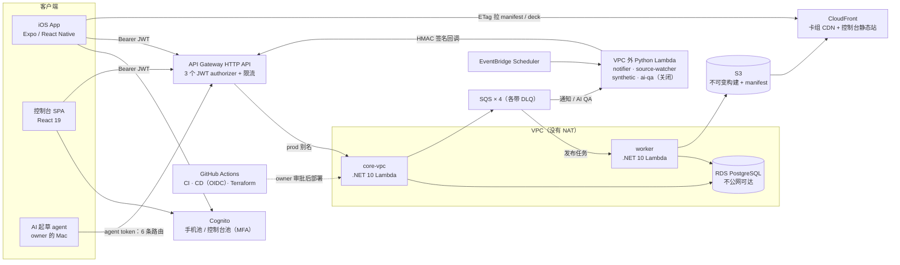

1. **两类客户端**：App 用来学习，控制台用来写卡和发布。两边都用 Cognito 登录，但分属两个用户池，token 不能互用。AI agent 也算一个客户端，它的权限最小。
2. **内容和个人数据分开走**：卡组对所有人都一样，所以做成 S3 上的不可变文件，经 CloudFront 分发，App 用 ETag 拉清单。只有个人进度和管理操作走 API。
3. **API 链路**：先过 API Gateway，按受众验 JWT，再按路由限流；然后进一个 .NET 10 Lambda 单体；数据放在不公网可达的 PostgreSQL 上。
4. **请求路径之外的工作**：慢的、定时的、需要上外网的工作，都不放在请求路径上。发布由 SQS + worker 完成。邮件、核对网页、合成探测由 VPC 外的 Python Lambda 做，结果通过 HMAC 签名的回调交回 core。
5. **改生产只有两条受控的路**：一是 GitHub Actions（OIDC 换临时凭证、owner 审批、自动回滚），二是 owner 带 MFA 的 break-glass。AI agent 只有一个只读 AWS 角色和 6 条 API 路由。

## 5 分钟讲解稿（English）

> "Let me walk you through it by following the data. DeveloperCards is a spaced-repetition app with three free decks: C#, AWS Solutions Architect Associate and Claude Developer Foundations. I'm the only engineer, so every design choice had to be cheap to run and safe for one person to operate. Users are still few, so I'll be clear about which numbers prove something and which don't.
>
> **A card is written and published.** A card starts in the admin console, a React 19 single-page app. Editors sign in through Cognito with PKCE and mandatory MFA. Saves use optimistic concurrency: each save carries the version it read, and a stale one gets a 409 instead of silently overwriting someone. When an editor publishes, the API doesn't build anything. It writes a pending job and puts it on SQS. A worker Lambda claims the job with a conditional update, so a duplicate message can't build twice. It writes the deck to a new, immutable path in S3. Then one SQL statement marks the job done and moves the deck's live pointer, and the worker rebuilds a small manifest.
>
> **The deck reaches the phone.** Builds are never overwritten, so CloudFront can cache them for a year and I never need an invalidation. Only the manifest changes, and it has a 60-second cache. The app checks it with an ETag. It tries a delta patch first, then a chunked package, then a full download, and it checks a SHA-256 before it swaps the file in. Rollback is just moving the pointer back. If there's no network on first launch, built-in 30-card starter packs go through the same installer.
>
> **A review is synced.** When you rate a card, the app schedules the next review on the device, so it works offline. The rating becomes an event with a UUID in an on-device outbox, and only after that is local progress saved. Sync pushes batches of 25. On the server, the event ID is an idempotency key: one SQL statement inserts new events, skips duplicates and merges progress last-writer-wins. That cut database round trips from four to one and halved the handler's median time. A new device pulls the merged progress with keyset pagination instead of replaying every event.
>
> **The backend is deliberately small.** API Gateway has three JWT authorizers split by audience. Behind it is one .NET 10 Lambda inside a VPC, and a private PostgreSQL instance. Every connection gets a 20-second statement timeout and a 60-second idle-in-transaction timeout. There's no NAT gateway. Anything that needs the internet, like email or checking a cited web page, runs in small Python Lambdas outside the VPC and calls back through HMAC-signed routes. Every queue has a dead-letter queue with an alarm.
>
> **How changes reach production.** Main needs a PR and nine passing checks. CD builds without AWS credentials and waits for my approval. Then it verifies the artifact checksums, runs a baseline smoke test, records a restore point and deploys by moving Lambda aliases. If a check that passed before now fails, it rolls back automatically. Terraform has its own pipeline with an allow-list and a privilege guard. The old shared admin key can now only assume roles, and AI agents get a read-only role. For operations I have three SLOs with burn-rate alerts and a synthetic check every fifteen minutes. I also drilled a point-in-time restore: it took about 26 minutes, and the newest restore point was about 8 minutes old.
>
> **Finally, AI.** A headless Claude Code agent drafts cards through a four-tool MCP server. Every quote must appear word for word in a source it actually read, and its token reaches only six routes, so it can draft but never publish. Before letting AI decide anything, I built a seeded-defect eval. It caught about 96% of the injected errors, with a 7.6% false-flag rate. That was proxy evidence, so auto-accept stays off, and a human approves every draft.
>
> What I'd do next: phased rollouts for app updates, a staging environment, and turning on the cross-vendor reviewer once it passes the eval gate. I'm happy to go deeper on any part."

## 按岗位的深挖顺序

**话题地图：4 个方面，17 个话题**

| 方面 | 话题 | 讲什么 |
| --- | --- | --- |
| App 端 | A1 内容分发与离线优先 | 不可变构建 + CDN + ETag，补丁 / 分块 / 全量下载，内置入门包 |
| | A2 学习进度同步 | outbox + 幂等事件 + 一条 SQL 的 LWW 合并 |
| | A3 学习循环与远程配置 | 抽卡 → 学习 → 奖励，FSRS-5，熔断开关 |
| | A4 发布工程与隐私 | EAS Build 和 OTA 两条线、runtimeVersion，Sentry 脱敏，匿名漏斗 |
| Web 控制台与后端 | W1 身份与权限 | 两个用户池、PKCE、网关和后端两层授权 |
| | W2 内容编辑与发布 | 乐观并发、幂等导入、异步发布、回滚 |
| | W3 前端工程质量 | 路由拆分、首屏字节预算测试、严格 CSP |
| | B1 API 与数据层 | Lambda 单体、私有 PostgreSQL、服务端超时、不开 NAT、迁移闸门 |
| | B2 异步与自动化 | SQS + DLQ、Scheduler、薄触发器厚核心 |
| 企业级横切 | E1 身份与最小权限 | 静态 key 只能 AssumeRole，按职责拆角色，OIDC |
| | E2 CI/CD | 审批、哈希校验、smoke、自动回滚 |
| | E3 IaC 治理 | Terraform allow-list、权限 guard、apply 后二次 plan 必须为空 |
| | E4 可观测性与灾备 | SLO burn rate、合成探测、PITR 恢复演练 |
| | E5 供应链与应用安全 | Actions 固定 SHA、审计门禁、缩小攻击面 |
| AI | AI1 草稿 agent 与自治边界 | MCP 工具、逐字引用、能起草不能发布 |
| | AI2 评测与内容核查 | seeded-defect eval、双 AI 交叉核查、出处覆盖率 |
| | AI3 agent 的工程化护栏 | 爆炸半径、独立审查、mutation checks |

**全栈工程师**：A2 → W2 → E2，有时间再讲 W1 或 E3。
- **A2**：同时涉及前端离线、后端幂等和 SQL，还有前后对比数字，最能体现"前后端一起设计"。
- **W2**：写路径的经典企业级问题：并发冲突、异步任务、不可变发布、回滚。
- **E2**：说明你能安全地把代码送上生产：审批、产物校验、smoke、自动回滚。
- **W1 / E3**：安全和基础设施治理。适合面试官继续往深处问的时候讲。

**全栈 + AI agent 工程师**：AI1 → AI2 → E1 / AI3，有时间再讲 A2。
- **AI1**：agent 怎么接工具（MCP），以及"能起草不能发布"这个边界是在哪里强制的。
- **AI2**：先量再放权。讲清 recall、假阳性率，以及 gate 为什么按设计判了 FAIL。
- **E1 / AI3**：agent 的权限靠 IAM 和网关限制，不靠 prompt；用多 agent 审查加 mutation checks 保证代码质量。
- **A2**：证明你不只会接 AI，也能做扎实的全栈。

## App 端

> 范围：iOS App（Expo / React Native + TypeScript）和它直接调用的那段后端。代码基线是 main `3c8d84e`。"线上"指 2026-10-04/05 的只读核查。
> **先把版本说清楚，面试时别说错**：
> - 截至 2026-10-05，App Store 上的公开版本是 **1.9.0**。
> - 按 owner 的发布记录，**2.0.0 (24)** 已提交审核，发布脚本默认手动发布（MANUAL）。审核状态在仓库里查不到。
> - 下文的 FSRS、离线入门包、匿名漏斗只在 2.0.0 里。
> - 匿名问题上报的界面和"公开路由不留 breadcrumb"已经合进 main，但不在 2.0.0 (24) 二进制里。要等 2.0.0 上线后，通过 runtime-2.0.0 的 OTA 才能到用户手里。

### A1. 内容分发与离线优先 (Content delivery & offline-first)

- **一句话**：卡组内容对所有人都一样，所以做成静态文件放在 CDN 上。这样便宜、能长时间缓存、断网也能学；改题只要重新发布，不用发新版 App。
- **怎么设计的**：
  - **发布**：控制台点发布，任务进 SQS（任务机制见 W2）。Worker 把卡组导出成不可变构建（immutable build），路径里带 buildId：`content/decks/{slug}/builds/{buildId}/deck.json`。同时生成分块包（每块 ≤500 张）和相对上一版的增量补丁（delta patch）。这些文件都设一年缓存，并标记 immutable。
  - **指针**：唯一会变的是数据库里的 `live_build_id` 和 `manifest.json`。清单里每副卡组记录 version（就是 buildId）、整文件 sha256、分块包路径和最多 4 条补丁边，缓存 60 秒。Worker 发布成功后自动重建清单。
  - **手机读清单**：用带 ETag 的条件请求（conditional GET），清单没变就返回 304。6 秒内没响应就用本地缓存的清单。Home 先用本地数据显示首屏，再在后台重新检查（stale-while-revalidate）。
  - **安装**：本地版本和清单上的版本不同，就安装。顺序是补丁（最多 4 跳）→ 分块包（3 路并发，逐块校验 sha256，可断点续传）→ 整文件下载并校验 sha256。先写临时文件再替换；任何一步失败就退到下一步。
  - **第一次打开就没网**：JS 包里内置 3 个入门包，每副卡组取前 30 张，version 带 `-starter` 后缀，走同一个安装函数。联网后，在回到前台或进入 Home 时换成完整卡组，每副卡组 5 分钟最多试一次。进度按 stableUid 保留。

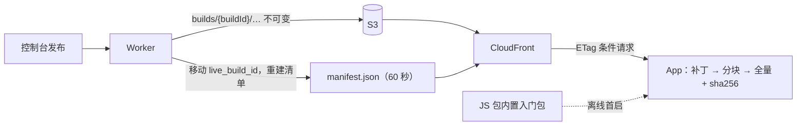

- **为什么这样设计 / 取舍**：
  - 每次发布都是新路径，旧文件永不覆盖，所以 CDN 可以缓存一年，发布时也不用做 CloudFront 失效（invalidation）。回滚就是把指针指回旧构建，再重建清单。
  - 代价：新版本最多要等约 60 秒，而且用户下次进 Home 才看得到，没有推送。内容更新不用过 App Review，但也没有灰度。
  - 分块和补丁是给大卡组准备的。现在每副卡组 ≤441 张，只有 1 块，收益很小；它们一失败就退回全量下载。
  - 入门包是快照：线上改了卡，要手动重跑脚本再发 OTA。只有 3 副目标卡组有入门包。
- **数字**：
  - 线上 3 副免费卡组：C# 217 张，AWS SAA-C03 371 张，CCDV-F 441 张（线上清单，2026-10-05）。
  - C# 的 deck.json 是 397,136 B。清单是 `max-age=60` 加 ETag；构建文件是 `max-age=31536000, immutable`（线上响应头，2026-10-05）。
  - 入门包 3 个 × 30 张，合计约 155 KB；脚本上限 300 KB。
- **面试官可能会问**：
  1. **发错了一版卡组怎么回滚？** 超级管理员调用 rollback 接口，把 `live_build_id` 指回之前一个成功的构建，然后重建清单。手机比较的是"版本是否相等"，不是"是否更新"，所以下次检查时会装回旧版。
  2. **为什么发布后不做 CDN 失效？** 会变的只有清单，它本来就只缓存 60 秒；构建文件每次都是新路径，不存在旧缓存的问题。失效是多出来的一步：生效有延迟，超出免费额度要收费，还多一个失败点。
  3. **下载断了或者文件被篡改怎么办？** 文件先写到临时位置，sha256 对不上就丢掉，不覆盖本地旧版。分块包里已经校验过的块会复用，相当于断点续传。
- **English talking points**：
  - "Deck content is the same for every user, so I publish it as static, immutable files on CloudFront instead of serving it through the API."
  - "Every publish gets a new build path, so files can be cached for a year. The only mutable thing is a small manifest with a 60-second cache."
  - "The app checks the manifest with an ETag. Then it tries a delta patch, then a chunked package, then a full download, and it checks a SHA-256 before it swaps the file in."
  - "If there's no network on first launch, the app has 30-card starter packs built in, and they go through the same installer. Later they're replaced by the full deck, and progress is kept."

### A2. 学习进度同步 (Progress sync)

- **一句话**：用户在地铁上离线刷卡，换设备或重装后进度还要在；网络超时后重发，也不能把一次复习算成两次。
- **怎么设计的**：
  - **先写事件**：打分时先在手机上算好下次复习时间。然后把这次评分作为一个带 UUID（event_id）的事件，写进本地发件箱（outbox，存在 AsyncStorage）。写完之后，再保存本地进度。事件是事实；进度是投影（projection），可以从事件重建。
  - **本地分区**：进度存在 `devcards:u:{sub}:` 下，未登录时用 `anon`。未登录时产生的事件进 `__pending__`。登录时新账号收养这些事件：先复制，后清空，按 event_id 去重。
  - **推送**：打分后 10 秒防抖（debounce）；切到后台立即推送；回到前台时同步。每批 25 条，最多 20 轮，超时 15 秒。服务器确认（accepted 或 duplicate）后才从队列里删。
  - **服务端**：API Gateway 先验 JWT。core-vpc 用**一条 SQL 语句**（多个 CTE）完成全部写入，依次是：
    1. 补用户行；
    2. `insert … on conflict (event_id) do nothing`；
    3. 只对新插入的事件做聚合，每张卡取最新一条事件；
    4. upsert 进度表 `user_progress`。
  - **合并规则（last-writer-wins）**：评分、到期时间、梯级、调度器版本这四列一起决定，谁的复习时间晚就用谁的；复习次数两边相加。客户端时间比服务器快 5 分钟以上会被夹回来；到期时间最远 90 天。
  - **拉取**：读服务端进度表，按 (updated_at, deck_slug, stable_uid) 做键集分页（keyset pagination），每页最多 5000 行。新设备不用重放全部事件。

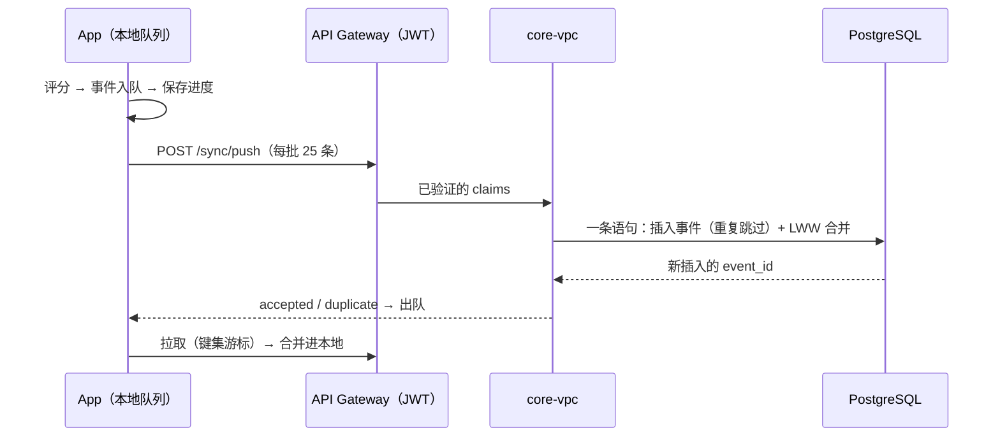

- **为什么这样设计 / 取舍**：
  - 超时后手机不知道服务器写没写成，只能重发。用 event_id 做幂等键（idempotency key），"至少发一次"的效果就等于"恰好一次"。
  - 原来要和数据库往返四次：BEGIN、写用户行、主语句、COMMIT。外面套的这层事务比正事还贵。单条语句本身就是原子的，所以合成了一条。
  - LWW 简单、好解释，但它不是 CRDT：它依赖设备时钟；两个请求时间完全相同时，后到的赢。现在复习量小、冲突少，够用。
  - 诚实边界：
    - 本地写盘失败的事件、离线超过 3000 条时被丢掉的最旧事件、服务器拒收的事件，都会丢，而且只有这台设备知道。
    - 在共享设备上，匿名期的复习会记到下一个登录的人名下。代码注释里写明接受这个风险。
- **数字**：
  - 数据库往返从 4 次降到 1 次。用两种方法确认过：容器的语句日志，以及 TCP 代理。
  - ingest handler 内部 p50 从 37.1 ms 降到 18.8 ms（−49%）。口径：
    - 环境：生产 core-vpc v44（当时 .NET 8、128 MB），批大小 1，合成事件。
    - 改后测了 100 次。基线来自之前一轮交错测量，那一轮共 200 次，批大小 1 和 25 各 100 次。
    - 端到端 p50 约 103 ms，所以用户实际省下约 18 ms。
    - 换到 .NET 10 / 512 MB 后没有重测。
  - 队列每个分区最多 3000 条；服务器每次接收 1–200 条；拉取每页 ≤5000 行，每次同步最多 20 页。
- **面试官可能会问**：
  1. **推送超时，客户端重发，会重复计数吗？** 不会。重发的事件都会被 `on conflict (event_id) do nothing` 跳过，后面的聚合看不到它们。响应里把它们列为 duplicate，客户端照样出队。
  2. **两台设备离线复习了同一张卡，以谁为准？** 以复习时间更晚的那次为准，四列一起换，避免到期时间和梯级来自不同设备；复习次数两边都加。
  3. **为什么同步事件，而不是直接同步进度？** 事件能重建进度，反过来不行；事件还能安全地重发和被收养，而合并两份进度容易出错。抽卡收藏这类小状态则用整份快照同步：收藏取并集，钱包按时间后写者赢。
- **English talking points**：
  - "Every rating becomes an event with a UUID. It's written to an on-device outbox before the local progress is saved."
  - "The server uses that event ID as an idempotency key, so a retry after a timeout never counts a review twice."
  - "The whole ingest, meaning the insert, the aggregation and the last-writer-wins merge, is one SQL statement. That cut database round trips from four to one and halved the handler's median time, from about 37 to 19 milliseconds."
  - "I'm honest about the limits: it's last-writer-wins on the device clock, not a CRDT, and an event that fails to write locally is lost."

### A3. 学习循环与远程配置 (Learning loop & remote config)

- **一句话**：让用户每天愿意回来：抽卡带来期待和新内容，间隔重复（spaced repetition）保证真的记住；某个功能出问题时，不用发版就能关掉。
- **怎么设计的**：
  - **循环**：抽卡 → 得到新卡 → 学习打分 → 排下次复习，同时发奖励抽数 → 再抽。抽卡只从还没拥有的卡里抽（按 stableUid 去重，有保底 pity）；学习只出已拥有的卡。
  - **调度（实际情况）**：
    - 2.0.0 / main 默认用 FSRS-5：一个纯函数，内置在 App 里，用默认权重，目标保持率 0.9，最长间隔 90 天，没有随机抖动。
    - 远程开关 `features.fsrs.enabled=false` 可以退回旧的固定阶梯：1/2/4/8/15/30/60 天。
    - **商店上的 1.9.0 没有 FSRS 代码，用的是固定阶梯。**
    - 选择题按答题结果（correct / partial / wrong）、是否有把握和作答快慢，折算成四档评分。
  - **奖励（economy v2）**：
    - 每张新卡第一次评到 Hard 或以上，+1 抽；有账本保证每张卡只奖励一次。
    - 某副卡组当天到期的卡全部复习完，再 +1 抽，每副卡组每天一次。
    - 钱包上限 60，另有 5 个备用。正确率只影响排期，不影响抽数。
  - **考试模式不绕过抽卡**：设了考试日期后，晚于考前一天的复习会被提前到考前一天，仅此而已。考前总复习（sweep）只复习已拥有、已学过的卡，分 7 天完成，不发新卡抽数。新卡始终只能通过抽卡获得。
  - **远程配置**：
    - 配置是一个放在 GitHub 上的 JSON，每次冷启动拉一次，4.5 秒超时。
    - 拉成功就存为 last-good；失败就用 last-good；从没成功过，就用代码里冻结的默认值。
    - 每个字段单独校验，坏一项只回退那一项。一次会话里开关不会中途改变。
  - **默认值策略**：
    - 已上线功能的熔断开关（kill switch）默认开，例如 FSRS、Sentry、抽卡动画。
    - 涉及隐私或还没准备好的功能默认关，例如问题上报、匿名漏斗、匿名上报。
    - 另外有一个强制更新门槛 `minSupportedVersion`。

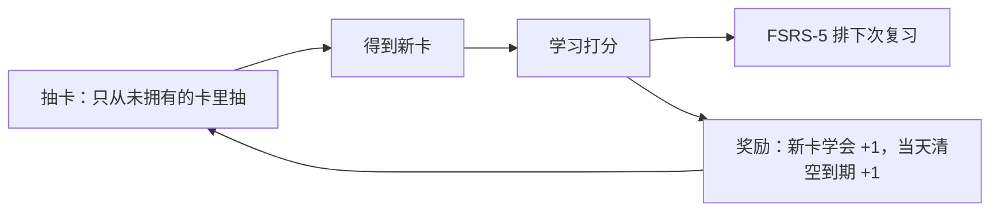

- **为什么这样设计 / 取舍**：
  - **调度放在手机上**：离线时也要马上显示下次间隔。服务器不做调度，只存结果并限制上限。代价有两点：客户端可能被篡改；FSRS 的稳定性和难度没有存到服务器，换设备时要从间隔重新推算。
  - **"学一张赚一抽"会自我限制**：新卡抽数等于学过的新卡数，不会通胀；一直点 Easy 只会害自己。真正的风险是复习越积越多，这一点用提示提醒，不用上限拦。
  - **配置放在 GitHub raw**：零成本，而且和自己的后端分开，后端出事时开关照样能下发。代价是没有签名、没有灰度，一改所有人生效，还要等下次冷启动。审计已经把"迁到自己的 CDN 并加签名"列为待办。
- **数字**：
  - FSRS：新卡第一次评 Hard / Good / Easy，分别排到 2 / 3 / 16 天后，Again 是 10 分钟后；固定阶梯第一次 Good 是 2 天（单元测试）。
  - 钱包 60 + 5 备用；考前总复习分 7 天；远程配置超时 4.5 秒。
  - 线上配置（2026-10-05）：`paywall.hidden=true`，`cardReport.enabled=true`，`anonFunnel.enabled=true`；没有写 `fsrs`，所以按默认值开启。
- **面试官可能会问**：
  1. **FSRS 上线后出问题怎么办？** 在远程 JSON 里把 `fsrs.enabled` 改成 false，用户下次冷启动就回到固定阶梯，不用发版。每个事件都带 `fsrs-5` 或 `ladder-v1` 标签，能分清是哪个调度器排的。
  2. **远程开关真的用过吗？** 用过。Premium 目前不解锁任何内容（线上 3 副卡组都是免费的），所以线上用 `paywall.hidden=true` 把付费墙藏了起来（代码默认值是 false），没有发版。
  3. **备考用户为什么不能直接解锁全部卡？** 抽卡是产品的核心循环，也是新卡唯一的来源；考试日期只影响排期，总复习只复习已学过的卡。审查报告提过"考试模式直接解锁"，这要 owner 拍板，目前没有做。
- **English talking points**：
  - "The core loop is draw, learn, earn: you draw a card you don't own yet, learn it, and the first time you rate it Hard or better you earn the next draw."
  - "Scheduling runs on the device, so it works offline. On the 2.0 build it's FSRS-5 with a 90-day cap, and a remote flag can switch it back to the old fixed ladder."
  - "Exam mode never bypasses the gacha: an exam date only pulls reviews in before the exam, and the final sweep pays no new-card draws."
  - "Feature flags are a JSON file fetched once per cold start, with a last-good cache and frozen defaults, so I can turn a feature off without an App Store release."

### A4. 发布工程与隐私 (Release engineering & privacy)

- **一句话**：一个人维护，也要能快速修 bug，又不能发出收不回来的坏版本；同时要看得到崩溃和流失，却不收集能认出具体用户的数据。
- **怎么设计的**：
  - **两条发布线**：
    - 原生改动（新原生模块、Info.plist）走 EAS Build，再过 App Store 审核。
    - 纯 JS 修复走 EAS Update（OTA），不用等审核。
    - `runtimeVersion` 用 `appVersion` 策略：OTA 只发给版本号相同的二进制，旧二进制不会收到让它崩溃的新 JS。
  - **脚本把关**：
    - `ota.sh` 发布前检查必需的 `EXPO_PUBLIC_*` 变量名，缺了就以退出码 3 退出；runtime 和依赖对不上就拒绝发布，退出码 6。
    - 1.9.0 的热修从 `release/1.9.x` 分支发，2.0.0 的从 main 发；发完把 source map 上传到 Sentry。
    - `asc-release.cjs` 默认设为手动发布（MANUAL），审核通过后由 owner 手动按 Release。
  - **App 内**：回到前台时检查 OTA，10 分钟最多一次。只在 Home / Library / More / Welcome 这几个安全页面重载，绝不在答题中途重载。
  - **Sentry**：
    - 只有同时满足"生产渠道、有 DSN、没被远程关掉"时才开启。
    - 设置 `sendDefaultPii: false`，不截屏。
    - 发送前删掉 user 字段、cookie、查询串和请求体，并把 Bearer、JWT、邮箱、UUID 替换掉。
    - 原生网络 breadcrumb 关闭，因为 RevenueCat 的 URL 里带着用户 sub。
    - main 上还会丢弃任何提到 `/api/v1/public/` 的 breadcrumb（随 runtime-2.0.0 的 OTA 下发）。
  - **匿名漏斗**：
    - 记录 9 个首次使用里程碑，每次安装每个最多记一条。
    - 只带 `{event, cohortDay, eventDay, deckSlug?}`，外加 platform 和 appVersion。
    - 用裸 XHR 发送，不带 Authorization，也不带 trace 头。
    - 服务端这条路由不解析 bearer，表里没有用户列，也没有设备列。
  - **匿名问题上报**：
    - 未登录也能报告卡片有问题，只发 `{deckSlug, stableUid, reason, appVersion}`，不收备注，不带任何 ID。
    - 存成 `user_sub` 为空的一行，数据库约束保证匿名行不能有备注。
    - 同一张卡、同一原因每天最多一条；全局每天最多 100 条。
    - 不触发 AI 复查，所以匿名请求花不了模型预算。
- **为什么这样设计 / 取舍**：
  - runtimeVersion 是兼容钥匙：把依赖新原生模块的 JS 发给旧二进制，第一次 require 就会崩。代价是要同时维护多条 release 分支。
  - **没有分阶段发布**：
    - 仓库里的发布脚本没有设置 App Store 的分阶段发布（phased release），用的是手动发布。
    - OTA 一次推给整个生产渠道（100%）。
    - OTA 回滚只能重新发布上一个好的版本；原生二进制无法回滚，只能靠远程开关、OTA 或强制更新补救。审计已经把这一点列为缺口。
  - **漏斗**：只需要分组计数，所以干脆不带任何标识，删账号时也不用管这张表。代价是重装算一次新安装，也看不到单个用户的使用路径。以前的分析 outbox 存了不加盐的用户哈希（知道 sub 就能算出来），R26 已经下线。
  - **诚实边界**：
    - API Gateway 访问日志仍会记录 IP，保留 30 天；core-vpc 给已登录请求写的日志里带原始 userSub。
    - `cardReport.anonymous` 目前是关的（原因见开头的版本说明）。
- **数字**：
  - main 上、也就是已提交审核的二进制，是 2.0.0 (build 24)，runtime 2.0.0；商店里在用的仍是 1.9.0。OTA 检查 10 分钟最多一次。
  - Sentry：错误 100% 采样，性能 20%，每个会话最多 25 条事件。
  - 漏斗：每批 ≤20 个事件，请求体 ≤8 KB，每个容器每分钟 120 次，全局 24 小时 ≤20,000 行，保留 400 天。
  - 匿名上报：请求体 ≤1 KB，每个容器每分钟 30 次，全局每天默认 100 条（可用环境变量调整，设为 0 即关闭）。
- **面试官可能会问**：
  1. **新加了一个原生模块，能只发 OTA 吗？** 不能。要升版本号（runtime 随之改变），重新构建并过审；之后的 OTA 只发给新 runtime，旧版本用户继续收旧 runtime 的热修。
  2. **OTA 发坏了怎么办？** 重新发布上一个好的版本；严重时用远程开关关掉功能，或者用强制更新门槛。我也会直说现在没有按比例灰度，下一步是先发给一小部分用户，看 Sentry 的崩溃率再放量。
  3. **怎么保证"匿名"真的匿名？** 请求不经过会带 token 的 API 客户端，服务端不解析身份，表里没有身份列；main 上 Sentry 也不留这条请求的 breadcrumb，所以无法按时间把崩溃报告和匿名记录对上。剩下的风险是网关访问日志：它对所有请求都记 IP 和时间，30 天内理论上能按 IP 关联，30 天后过期。
- **English talking points**：
  - "Native changes go through EAS Build and App Review. JavaScript fixes go out as OTA updates, and runtimeVersion makes sure an update only reaches binaries that can run it."
  - "The release scripts refuse to publish if required config is missing or the runtime doesn't match, and the app only reloads an update on a safe screen, never in the middle of a review."
  - "Sentry only runs on production builds, with PII scrubbing and no screenshots. On main it also drops breadcrumbs for the anonymous routes, so a crash report can't be joined to an anonymous event by time."
  - "Funnel events and signed-out card reports carry no user, device or install ID at all. The trade-off is that I can count drop-off, but I can't follow one person."

#### 证据（App 端）

| 说法 | 证据（main `3c8d84e`，另有注明的除外） |
| --- | --- |
| 商店公开版 1.9.0；2.0.0(24) 已提交审核（按 owner 发布记录），手动发布 | iTunes lookup id6756044885（2026-10-05，version 1.9.0）；owner 报告 `user-perspective-review-2026-10-04.md` U1（不在仓库里；§4.3 说明审核状态未核实）；`mobile/app.json:7,39`；`mobile/scripts/release/asc-release.cjs:28`（默认 MANUAL）；`mobile/scripts/release/README.md:50-51` |
| 1.9.0 没有 FSRS / 入门包 / 漏斗，2.0.0 有；匿名上报和 breadcrumb 过滤不在 2.0.0 里 | `git cat-file -e f646731:mobile/src/review/fsrsScheduler.ts`（不存在），`2be3450` 中存在；`starterOffline.ts`、`funnel.ts` 同样如此；`2be3450` 的 `featureFlags.ts` 没有 `cardReport.anonymous`，`sentryPolicy.ts` 没有 `mentionsAnonymousRoute` |
| 单区域，没有 staging | `infra/envs/prod/providers.tf:7`（ap-southeast-2）；`infra/RUNBOOK.md` §12 "Not covered" |
| 构建路径带 buildId，一年 immutable 缓存 | `src_C/Vpc/Authoring/Publish.cs:406-416`；`src_C/Worker/S3/S3DeckUploader.cs:18`；`src_C/Worker/Services/ContentArtifactsGenerator.cs:143-238`；线上 `curl -sI` deck.json（2026-10-05） |
| 指针与清单：一条 SQL 移动 `live_build_id`，Worker 自动重建清单，60 秒缓存，≤4 条补丁边 | `src_C/Worker/Repositories/JobRepository.cs:105-121`；`src_C/Worker/WorkerFunction.cs:206-239`；`src_C/Shared/RecallSmith.Lambda.Db/ManifestBuilder.cs:245-262,438` |
| 回滚 = 移动指针并重建清单；手机按"版本相等"判断；发布不做失效 | `src_C/Vpc/Authoring/DeckRollback.cs:10-12,46`；`mobile/src/content/deckRepository.ts:738-741`；`src_C` 里没有 CreateInvalidation 调用 |
| ETag 条件请求，6 秒超时；Home 先读缓存，后台再检查 | `mobile/src/content/deckRepository.ts:35-38,149,1463-1480`；`mobile/src/screens/HomeScreen.tsx:382-445` |
| 补丁 → 分块 → 全量，sha256 校验，先写临时文件 | `mobile/src/content/deckRepository.ts:46,749-869`；`mobile/src/content/chunkedInstall.ts:5-20,163-198`；`src_C/Worker/Content/ChunkPlanner.cs:10`；`docs/content-delivery-v3.md` |
| 入门包：3 个 × 30 张，`-starter` 后缀，上限 300 KB，5 分钟重试，前台和 Home 触发 | `mobile/scripts/content/build-starter-packs.mjs:4-32`；`mobile/src/content/starter/*.json`；`mobile/src/content/starterOffline.ts:24,27`；`mobile/App.tsx:217`；`mobile/src/screens/HomeScreen.tsx:507`；`mobile/tests/integration/offline-first-run.test.tsx` |
| 线上卡组 217 / 371 / 441 张，清单带 sha256、packagePath、补丁，均为 free | 线上 `curl https://cdn.developercards.app/content/manifest.json`（2026-10-05） |
| 先写事件后写进度，UUID 作 event_id | `mobile/src/sync/progressSync.ts:945,571-588`；`mobile/src/screens/SessionCardScreen.tsx:893-945`（handleRating） |
| 分区 `devcards:u:{sub\|anon}:`、`__pending__`；收养时先复制后清空，进度不迁移 | `mobile/src/review/storage.ts:23-24,64-67`；`mobile/src/sync/progressSync.ts:374,387,590-656` |
| 防抖 10 秒，每批 25 条、最多 20 轮，超时 15 秒；切到后台立即推送 | `mobile/src/sync/progressSync.ts:1505-1566,1737`；`mobile/src/sync/appStateSync.ts:5,17-18`；`infra/modules/api/gateway.tf:26`（sync 路由走 mobile JWT） |
| 一条语句：`on conflict (event_id) do nothing` + LWW upsert；被拒事件按 duplicate 回执 | `src_C/Vpc/Runtime/ProgressEvents.cs:277-293,423-589,614`；`ProgressEventsSingleStatementTests.cs`；`ProgressEventsIntegrationTests.cs` |
| 时钟夹紧 +5 分钟，到期时间 ≤90 天，每次 1–200 条 | `src_C/Vpc/Runtime/ProgressEvents.cs:63,115,179-180,202-205` |
| 拉取用键集分页，每页 5000 行，最多 20 页 | `src_C/Vpc/Runtime/ProgressGet.cs:25,99`；`mobile/src/sync/progressSync.ts:1299` |
| 4 → 1 次往返（VPC 内）；p50 37.1 → 18.8 ms 及其口径 | `docs/low-latency-plan.md`（§B 表格、"下限在哪"一节、"2026-08-19 · PR #10"一节）；`docs/recallsmith-resume-bullets.md` 证据表；`infra/README.md:186`（128 → 512 MB） |
| 队列上限 3000 条，满了丢最旧的 | `mobile/src/sync/progressSync.ts:395,580-581,413` |
| 抽卡状态是快照同步：收藏取并集，钱包和保底按时间后写者赢 | `src_C/Vpc/Runtime/DrawStateSync.cs:10-27` |
| FSRS-5 参数；可退回固定阶梯；调度器标签；状态从间隔重算 | `mobile/src/review/fsrs.ts:1-7,29-34`；`mobile/src/review/fsrsScheduler.ts:50-80,102`；`mobile/src/review/model.ts:53`；`mobile/src/sync/progressSync.ts:136-143` |
| 新卡 2 / 3 / 16 天，Again 10 分钟；阶梯第一次 Good 2 天 | `mobile/tests/unit/fsrsScheduler.test.ts:71-76`；`mobile/tests/unit/fsrsWiring.test.ts:94` |
| 选择题结果（含把握程度、快慢）折算成评分 | `mobile/src/features/gacha/mcq/mcqVerdict.ts` |
| 只从未拥有的卡里抽，有保底 | `mobile/src/features/gacha/draw/poolSelection.ts` |
| 奖励规则：新卡学会 +1、每副卡组每天清空到期 +1，钱包 60+5 | `docs/economy-v2-learn-to-earn-2026-09-19.md` §2；`mobile/src/features/gacha/rewards/rewardResolver.ts:16`；`sessionRewards.ts:39,61-63`；`newCardLedger.ts`；`mobile/src/features/gacha/constants.ts:9-10` |
| 考试日期把复习压到考前一天；总复习分 7 天、不发新卡抽数 | `mobile/src/features/goal/studyGoal.ts:78-93`；`mobile/src/features/gacha/planner/sessionBuilder.ts:112-125`；`mobile/src/features/gacha/constants.ts:14`；`mobile/src/screens/SessionCardScreen.tsx:953` |
| 远程配置：GitHub raw，4.5 秒，last-good，逐字段校验，每次启动只应用一次 | `mobile/App.tsx:108`；`mobile/src/config/remoteConfig.ts:102,127,144-151`；`mobile/src/config/featureFlags.ts:41-55,97,102-205`；`mobile/src/config/forceUpdateGate.ts:43-45` |
| 线上配置值 | 线上 `curl` recallsmith-config.json（2026-10-05） |
| Premium 目前不解锁任何内容 | `docs/home-review-and-launch-copy-2026-09-17.md:287`；线上清单 3 副卡组 tier 均为 free（2026-10-05） |
| "考试模式直接解锁"只是建议，待 owner 拍板 | owner 报告 `user-perspective-review-2026-10-04.md` U5 建议与"需要 owner 拍板"（不在仓库里） |
| 配置没有签名、没有灰度；OTA 一次推给 100% | owner 报告 `enterprise-audit-2026-10-03.md` DR-08、SEC-09、SDLC-06（不在仓库里）；`mobile/scripts/release/ota.sh:84`（`eas update --channel production`，没有 rollout 参数） |
| runtimeVersion = appVersion；双 runtime 规则；退出码 3 / 6；source map 上传 | `mobile/app.json:59-61`；`mobile/scripts/release/ota.sh:1-46`；`mobile/scripts/release/README.md`；`mobile/tests/unit/otaReleaseScript.test.ts`；远端分支 `release/1.9.x` |
| OTA 检查 10 分钟节流，只在安全页面重载 | `mobile/src/updates/otaUpdateCheck.ts:8-10`；`mobile/App.tsx:83,211-219` |
| 手机发版不在 CD 里，由 owner 操作 | `infra/RUNBOOK.md` §12 "Not covered" |
| Sentry 开启条件、采样率、脱敏、关闭原生网络 breadcrumb、丢弃公开路由 breadcrumb | `mobile/src/telemetry/sentryPolicy.ts:9-12,33-40,52-58,89-104,192,222-224`；`mobile/src/telemetry/observability.ts:143-168`；`mobile/tests/unit/sentryPolicy.test.ts` |
| 漏斗：9 个事件，不带任何标识，用裸 XHR 发送 | `mobile/src/telemetry/funnel.ts:1-50`；`mobile/tests/unit/funnel.test.ts` |
| 漏斗服务端：不解析 bearer，各项上限，保留 400 天，表里没有身份列 | `src_C/Vpc/VpcFunction.cs:76-86`；`src_C/Vpc/Analytics/AnonFunnel.cs:31-58`；`src_C/Vpc/Db/Migrations/043_anon_funnel_events.sql:16-27`；`AnonFunnelTests.cs` |
| 匿名上报：只收结构化字段，user_sub 为空、不能有备注，每天去重，上限 100，不触发 AI 复查 | `src_C/Vpc/Reports/AnonymousCardReports.cs:14-45`；`src_C/Vpc/Db/Migrations/046_card_reports_anonymous.sql`；`mobile/src/features/cardReport/cardReportApi.ts:241-243`；`AnonymousCardReportsTests.cs` |
| 访问日志记录 IP，保留 30 天；已登录请求的日志带 userSub | `infra/modules/api/gateway.tf:3-4`；`infra/modules/observability/api_logs.tf:3`；`src_C/Vpc/VpcFunction.cs:97-105` |
| R26 下线了带不加盐用户哈希的 outbox | `README.md:40-41`（R26 说明）；`src_C/Vpc/Db/Migrations/045_retire_content_intelligence.sql` |

## Web 端（控制台）与后端

> 基线：main `3c8d84e`（2026-10-05）。控制台是只给 owner 和 editor 用的内部管理后台，没有外部用户。下面每一题都按数据流的顺序讲。

### W1. 身份与权限 (Identity & Access)

- **一句话**：管理员能安全登录。谁能改哪副卡组，按角色和卡组控制。AI agent 只能起草，碰不到发布和管理。

- **怎么设计的**：
  - **两个 Cognito 用户池**：控制台池强制 TOTP MFA，只能由管理员建号。手机池允许自助注册，不开 MFA。两边的 token 不能互用。
  - **登录**：控制台是静态 SPA，属于 public client，没有 client secret，所以用 Authorization Code + PKCE（S256）。state 和 verifier 放在 sessionStorage，回调时先删除再校验。登录后的跳转地址在写入和读取时各做一次同源检查，防止 open redirect。
  - **刷新 token**：token 放在 sessionStorage。axios 拦截器在过期前 60 秒主动刷新，同一时刻的多个请求共用一次刷新（single-flight）。这样几个请求不会争用同一个 refresh token，用户也就不会被登出。
  - **网关第一层**：API Gateway 有 3 个 JWT authorizer，按受众区分：
    - `console`：控制台池 + SPA client。
    - `agent`：同一个池，接受 SPA client 和 agent client，只挂在 6 条精确路由上。
    - `mobile`：手机池 + 手机 client。

    受众不对的 token 在网关就被拒，不会唤醒 Lambda。
  - **后端第二层（defense in depth）**：
    - token 必须来自控制台池、控制台 client，core-vpc 才承认 `super_admin` 或 `editor` 角色；否则去掉角色，返回 403。
    - 再往下，按卡组查读写权限表 `admin_deck_permissions`。super_admin 能看全部卡组。
    - agent token 访问 6 条以外的路由，返回 403 `AGENT_CLIENT_FORBIDDEN`。
    - 网关和代码各有一份 agent 白名单，CI 脚本检查两份是否一致。
  - **账号管理**：
    - 过去由 `edge-public` Lambda 在控制台里建号。这个函数在线上运行期间，源码一直不在仓库里，下线时才存档到 `archive/`。它已于 2026-10-04 下线。
    - 现在 owner 在 MFA 会话下用 AWS CLI 管账号，新账号默认只进 editor 组。控制台只管卡组权限。

- **为什么这样设计 / 取舍**：
  - 静态站点存不住 secret，PKCE 是 SPA 的标准做法。登录交给 Cognito 托管，我们自己不保存密码。
  - 两层授权：网关挡住大多数错误的 token，也省下 Lambda 算力。某条路由万一配错，后端仍然拒绝（fail closed）。代价是两份白名单靠 CI 对齐，不是同一个来源。
  - 下线 edge-public，是用便利换更小的攻击面：少了一个源码不在仓库、也没有告警的函数。代价是建号要用命令行。
  - 已知缺口：
    - token 能被 JS 读到，只能靠 W3 的 CSP 降低 XSS 风险。
    - 登出不调用 revoke，refresh token 有效 30 天。
    - 账号被禁用后，已经发出的 access token 最多还能用 1 小时。
    - agent token 带着 owner 的用户组，并且存在本机磁盘上。

- **数字**：
  - 控制台 SPA client：access token 1 小时，refresh token 30 天。
  - 网关共 35 条路由：console 5 条，agent 6 条，mobile 8 条，不挂 JWT 的 16 条（health、计费 webhook、OPTIONS 预检、内部 HMAC 回调、两条匿名公开路由）。
  - edge-public 总共只被调用过 8 次，2025-12-25 之后为 0。

- **面试官可能会问**：
  1. **为什么不用 HttpOnly cookie 存 token？** cookie 方案需要一个后端来换 token（BFF），对一个人维护的内部后台，这个成本偏高。我选的是 sessionStorage、严格 CSP 和 1 小时的 access token，也清楚它的 XSS 风险。
  2. **网关已经验过 JWT，后端为什么还要再验？** 这是纵深防御。edge-public 的路由直到 2026-09-26 都没挂 authorizer。路由配错时，后端仍会因为 issuer 或 client 不对而去掉角色。按卡组的权限也只能在业务层判断。
  3. **怎么防止 AI agent 越权？** agent 用单独的 app client。网关只在 6 条精确路由上接受它，后端再按白名单拒绝其他路由（具体是哪 6 条见 AI1）。它不能接受草稿，也不能发布或做管理操作。

- **English talking points**：
  - "The admin console has its own Cognito user pool with mandatory TOTP MFA, separate from the mobile pool."
  - "It's a static single-page app, so it signs in with the authorization code flow plus PKCE. It refreshes the token a minute before expiry, and concurrent requests share one refresh."
  - "Authorization happens twice. API Gateway has three JWT authorizers split by audience. Then the Lambda only honours admin roles from the console pool, and checks per-deck permissions."
  - "AI agent tokens can reach exactly six routes. They can draft cards, but they can never publish or administer."

### W2. 内容编辑与发布 (Content Editing & Publishing)

- **一句话**：编辑可以安全地改卡、批量导入、发布到手机端。不会悄悄覆盖别人的修改，不会重复构建，出了问题能回滚到旧版本。

- **怎么设计的**：
  - **单卡编辑：乐观并发（optimistic concurrency）**
    - 保存时带上读到的 `expectedVersion`。更新语句只在版本号相同时才生效；一行都没更新，就返回 409 `VERSION_CONFLICT`。
    - 编辑页重新读取最新版本，同时保留用户已经输入的内容，并提供"用最新版本重试"。也就是说，仍然是后写者胜，但用户事先知道。
  - **Markdown 批量导入**
    - 按 `stableUid` 对账，预览分四类：create、update、unchanged、conflict。有冲突时，"应用"按钮不能点。
    - 只新增和更新，不删除，因为学习进度是按 stableUid 记的。
    - 每批最多 500 张卡或 900,000 字符。服务端在一个事务里 upsert，用 `is distinct from` 判断内容是否真的变了。
    - 超时、网络错误、429、5xx 按 1/2/4 秒退避重试。已经落库的批次重发后全部是 unchanged，所以重试不会重复写。
  - **异步发布**
    - 先过选择题（MCQ）格式门禁和 AI QA 门禁，再写一行 PENDING 任务，然后发 SQS 消息。SQS 发送失败，就立即把这一行标成 FAILED，防止留下没人处理的孤儿任务。
    - 15 分钟内重复点击，返回原来的 jobId。部分唯一索引保证每副卡组同时只有一个进行中的任务。
  - **构建与切换**
    - worker 用条件 UPDATE 抢任务，把 `deck.json` 写到 `builds/{buildId}/`。这个路径下的内容永不覆盖，缓存一年。
    - 随后一条 SQL 同时把任务标为 SUCCESS、移动 `live_build_id` 指针，然后重建 `manifest.json`（缓存 60 秒，用 ETag 做条件写）。手机端怎么用这些文件，见 A1。
  - **回滚与清理**
    - 只有 super_admin 能回滚：选一个以前成功的构建，输入卡组 slug 确认。移动指针和写审计记录在同一个事务里完成。
    - 卡住的任务由 reaper 标成 FAILED（PENDING 超过 10 分钟，或 PROCESSING 闲置超过 30 分钟）。目前由 super_admin 在控制台手动触发。
  - **AI QA 门禁只是一个钩子**：`AI_QA_ENABLED` 和 `AI_QA_REQUIRED` 两个开关都打开时，它才会拒绝发布。门禁生效时，发布绑定通过质检的那份快照；中途有人改卡，返回 409 `AI_QA_STALE`。生产上两个开关都是 0。

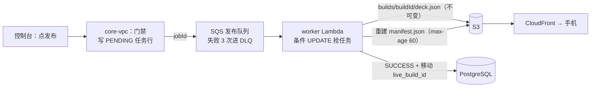

- **为什么这样设计 / 取舍**：
  - **用版本号，不加锁**：编辑冲突很少，乐观并发不用持锁，也不需要实时协作。代价是冲突时只能"带着我的修改覆盖"，没有三方合并。
  - **导入不检查版本**：导入接口忽略 expectedVersion，会覆盖同时进行的单卡编辑。这是已知、已接受的取舍。
  - **异步 + 不可变构建**：
    - 导出很慢，不能卡住网关的 30 秒超时。
    - 构建永不覆盖，所以 CDN 不需要失效，回滚就是移动指针。
    - 代价：前端要轮询任务状态，还需要 reaper；手机端要等清单缓存过期，再加上下一次进 Home，才能看到新版本。
  - **没有严格的 transactional outbox**：靠几道兜底：先写任务行、发送失败就标 FAILED、15 分钟内复用，最后还有 reaper 清理。够用，但不是教科书式的 outbox。

- **数字**：
  - 导入：每批 500 张或 900,000 字符，最多重试 3 次（间隔 1/2/4 秒）。
  - 发布队列：可见性超时 3,700 秒，收到 3 次后进 DLQ。worker 超时 615 秒，并发 2。
  - 2026-09-03 到 10-02（30 天）：生产发布消息 13 条，每条只被接收一次，全部成功。发布 DLQ 从 09-22 建队起一直是 0。流量很低，不能当容量证明。

- **面试官可能会问**：
  1. **两个人同时改一张卡会怎样？** 后保存的人收到 409。页面重新读取最新版本，但保留他的输入。他可以选择用最新版本重试，也就是明确的后写者胜。
  2. **SQS 消息被重复投递，会重复构建吗？** 不会。worker 用条件 UPDATE 从 PENDING 抢任务，只有一个能抢到。FAILED 是终态，不会再被抢。
  3. **怎么回滚一次坏发布？** super_admin 选一个以前成功的构建，输入 slug 确认。系统在一个事务里移动 `live_build_id` 并写审计，然后重建清单。旧构建一直留在 S3 上，不用重新构建。

- **English talking points**：
  - "Card edits use optimistic concurrency. Every save carries the version it read, and a stale version gets a 409 instead of silently overwriting someone."
  - "Markdown import is idempotent. It's keyed by a stable ID and previewed as create, update, unchanged or conflict, and a retried batch simply comes back unchanged."
  - "Publishing is asynchronous. The API writes a pending job and queues it in SQS. A worker writes an immutable build to S3, then flips a pointer and rebuilds the manifest."
  - "Because builds are immutable, a rollback just moves the pointer back, in one transaction with an audit record."

### W3. 前端工程质量 (Frontend Engineering Quality)

- **一句话**：控制台加载快，编辑内容不会丢，失败的写请求不会被自动重放。安全策略在测试里真正执行过。

- **怎么设计的**：
  - **技术栈**：React 19 + TypeScript 5.9 + Vite 7。服务端状态交给 React Query，路由用 react-router 的数据路由。
  - **按路由拆分**：共 18 个页面文件。除登录页和回调页外，16 个页面都用 `lazy()` 懒加载。`ChunkErrorBoundary` 区分两种失败：代码分块加载失败（提示刷新）和渲染崩溃。
  - **React Query 默认值**：缓存 30 秒内视为新鲜（`staleTime`）。读和写都不自动重试，切回窗口时不重新拉取。每次写入后都精确地让相关缓存失效。
  - **首屏预算写成测试**：
    - Vitest 里真实跑一次生产构建，沿静态 import 算出首屏要下载的 JS+CSS 总字节，超过上限就失败。
    - 另一个预算管登录页的实际下载量（包括预取的卡组列表分块），并断言 highlight.js 不在首屏，也不在登录页的预取里。
  - **严格 CSP**：
    - 由 CloudFront response headers policy 下发：`script-src 'self'`，没有 `unsafe-inline` 和 `unsafe-eval`。另加 HSTS、`X-Frame-Options: DENY`（加 `frame-ancestors 'none'`）和 nosniff。
    - 同一份 header 定义，同时给 Terraform、Playwright 和 Python 测试读。
    - Playwright 在本地带着生产 header 跑构建产物，出现任何 CSP 违规，测试就失败。
  - **防丢编辑与部署**：
    - "未保存修改"守卫（`useBlocker`）防止编辑到一半离开页面。
    - 部署时，带 hash 的资源缓存一年，旧分块不删除。`index.html` 不缓存、最后上传，上传后读回线上文件比对 SHA-256。

- **为什么这样设计 / 取舍**：
  - **预算量的是闭包，不是构建报告**：构建报告会被拆包配置误导。这个仓库里复现过：报告显示入口只有 17 kB，浏览器实际下载约 402 kB。
  - **数据路由让首屏多了 55.6 kB**：这是 `useBlocker` 的前提条件。为了不丢编辑，付这点字节值得。
  - **CSP 先在测试里验证**：有了测试，才敢直接强制执行，而不是只上报。代价有三点：
    - 没有 CSP 违规上报端点，线上违规看不到。
    - CSP 只覆盖控制台和落地页，不覆盖 API。
    - 端到端测试只用 Chromium，API 和 Cognito 全部打桩，也没有真实用户性能监控（RUM）。

- **数字**（原始字节，不是 gzip）：
  - 首屏闭包：拆分前 553,688 B，拆分后 308,582 B（−44%）。加了数据路由后，2026-10-05 在 main 上重新构建，测得 370,892 B（比拆分前 −33%），测试上限 377,000 B。所以"−44%"只是当时的数字，测试守住的是上限。
  - 登录页实际下载（含预取）：484,690 B，上限 487,000 B（同一次重测）。
  - CI 在 f7b163e 上的那次运行（之后控制台代码没有改动）：Vitest 162 个文件、1,511 个用例通过；Playwright smoke 16 个通过。

- **面试官可能会问**：
  1. **为什么不用 SSR 或 Next.js？** 这是登录后才能用的内部后台，不需要 SEO。静态 SPA 放在 S3 + CloudFront 上，几乎没有运维成本，也没有可以被攻击的服务器。
  2. **React Query 为什么不自动重试？** 读请求失败通常是被拒绝了，重试只会拖慢错误提示。写请求可能已经落库，自动重放可能重复写入。确实需要重试的地方（导入批次）是显式写的，而且服务端幂等。
  3. **强制执行 CSP，不怕把线上打挂吗？** header 只有一份定义，Playwright 在生产 header 下跑完整的 smoke，有任何违规就失败。所以上线前已经确认，构建产物不需要内联脚本或样式。

- **English talking points**：
  - "The console is a React 19 single-page app with route-level code splitting. Sixteen pages are lazy-loaded."
  - "I turned performance into a test. CI does a real production build and fails if the first-load JavaScript and CSS go over a byte budget."
  - "Splitting cut the first load from about 554 kB to 309 kB. It's about 371 kB today after adding the data router, still under the 377 kB cap."
  - "A strict Content Security Policy is enforced at CloudFront, and Playwright runs against the same production headers, so any violation fails the build."

### B1. API 与数据层 (API & Data Layer)

- **一句话**：一条便宜、一个人就能运维的请求链路。入口先鉴权和限流，业务逻辑集中在一个 Lambda 里，数据放在不公网可达的 PostgreSQL 上。慢查询和危险迁移都有硬性护栏。

- **怎么设计的**：
  - **入口**：API Gateway HTTP API，按"方法 + 路径"选路由，先过 JWT authorizer（见 W1）。
    - 26 条路由有自己的限流桶，其余路由用 stage 默认的 200 rps / burst 400。
    - 所有不挂 JWT 的路由都必须单独限流。Terraform 里有路由守卫，跑 `terraform validate` 时就检查这条规则。它还禁止限流值写 0：2026-09-23 曾因为写了 0，全站返回 429 约 14 分钟。
  - **计算**：
    - 一个 .NET 10 arm64 的 Lambda 单体（monolith），叫 core-vpc：512 MB，超时 90 秒，保留并发 40，开了 X-Ray。
    - 网关调用的是 `prod` 别名。上线就是发布新版本、移动别名；回滚就是把别名指回旧版本。
    - 请求体超过 1 MiB 直接拒绝。
  - **数据**：RDS PostgreSQL 17（db.t4g.micro，单 AZ，不公网可达，静态加密）。
    - 每个容器只有 1 条连接，在 Lambda 初始化（INIT）阶段预热。
    - 每条连接一开始就设好服务端超时：`statement_timeout` 20 秒，`idle_in_transaction_session_timeout` 60 秒。worker 两个都是 600 秒。
  - **出网**：VPC 没有 NAT，VPC 里的 Lambda 没有公网出口，访问 S3 和 SQS 走 VPC endpoint。需要上外网的工作（AI 质检、发邮件、抓网页、删除 RevenueCat 记录）都放在 VPC 外的 Python Lambda 里，结果通过内部回调交回 core。回调的保护措施：
    - 用精确路由，并用 HMAC 签名。
    - 每个调用方有自己的密钥。两条较早的路由在没配专属密钥时，仍可回退到共享密钥。
    - 时间戳只在 5 分钟窗口内有效，签名用常量时间比较。
    - 换密钥时，新旧密钥可以同时生效。
  - **迁移**：
    - 共 46 个 SQL 文件，原则上只做加法（045 删了旧表，文件头标了 destructive）。迁移通过受保护的管理端点执行：调用者必须是 super_admin，还要带迁移密钥。
    - 用 advisory lock 保证同一时间只有一个迁移在跑。每个文件和它的版本记录在同一个事务里提交。
    - 文件头标了 destructive 的迁移，调用时不带 `confirmDestructive=<版本号>`，就在它前面停下。没有 down 迁移，回滚靠前滚（roll forward）。

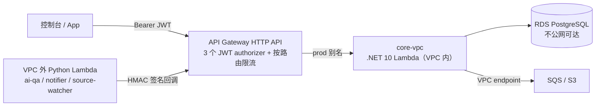

- **为什么这样设计 / 取舍**：
  - **单体 Lambda，不拆微服务**：一个人维护，部署和监控的面最小。代价是所有路由共用冷启动，而且路由在代码里是一长串后缀匹配。
  - **不开 NAT，也不上 RDS Proxy**：
    - 按内部文档估算，NAT 约 $45/月，只为偶尔几次外呼不划算。外呼集中在几个小函数里，攻击面也更小。
    - 代价是新的外呼要绕"队列 + 回调"一圈。
    - 连接数上限约等于容器数：core 40 加 worker 2，低于数据库角色 50 条的上限。
  - **用服务端超时，不只靠客户端超时**：Lambda 超时或被冻结后，留下的孤儿事务原来最长挂 24 小时，并一直占着锁；现在 60 秒就被释放。阈值按 30 天的实测数据设定。
  - 已知缺口：
    - 没有私有子网：子网走 IGW 路由，数据库只靠"不公网可达 + 安全组"两道门。
    - 单 AZ、单区域，没有 staging。045 迁移删了旧表，之后只能前滚。
    - 密钥在部署时注入环境变量，换密钥要重新部署。
    - HMAC 不签 method 和 path，也没有 nonce。
    - 数据库连接加密，但不校验证书。

- **数字**：
  - 截至 2026-10-04 的 30 天：core-vpc 调用 31,209 次，p99.9 为 4.2 秒，最慢 7.4 秒。
  - 每条路由的限流至少是 30 天里最忙一分钟的 100 倍。最忙一分钟不超过 11 个请求，说明流量很低，不能当容量证明。
  - 恢复演练：RTO 约 27 分钟、RPO 约 8 分钟，只演练过一次（详见 E4）。
  - 后端测试 2,928 个（f7b163e 上的 CI），大部分用 Testcontainers 跑真实 PostgreSQL（"大部分"是静态估算）。

- **面试官可能会问**：
  1. **Lambda 连 RDS，不怕连接数打满吗？** 每个容器 1 条连接。core 保留并发 40，加上 worker 2，总数低于数据库角色的 50 条上限。如果并发逼近上限，或者开始出现连接错误，下一步就是加 RDS Proxy。
  2. **VPC 里没有 NAT，怎么调外部 API？** core 不直接出网。它把任务写进队列或待办表，由 VPC 外的小 Lambda 去调用，再通过带 HMAC 签名的内部路由把结果报回来。删除 RevenueCat 客户记录就是这么做的。
  3. **为什么没有 down 迁移？** 迁移原则上只做加法，所以多数时候退回旧代码就等于回滚。破坏性迁移必须显式确认版本号才会执行。代价是像 045 这样删表的迁移跑过之后，别名不能再退回它之前的版本。

- **English talking points**：
  - "The backend is one .NET 10 Lambda behind API Gateway. I deploy by publishing a version and moving a prod alias, so rollback is one alias switch."
  - "The database is a private PostgreSQL instance. Every connection starts with a 20-second statement timeout and a 60-second idle-in-transaction timeout."
  - "There's no NAT gateway. Anything that needs the internet runs in small Lambdas outside the VPC and reports back through HMAC-signed internal routes."
  - "Migrations are additive by default and run through a guarded endpoint with an advisory lock. A destructive one stops unless you confirm its exact version number."

### B2. 异步与自动化 (Async & Automation)

- **一句话**：慢的、定时的、需要上外网的工作都移出请求路径。失败时能看到、能重放，不会被悄悄丢掉。

- **怎么设计的**：
  - **队列**：4 条 SQS 队列，各配一个死信队列（DLQ）。发布和 AI 质检的消息收到 3 次后进 DLQ，通知和 webhook 收到 5 次后进 DLQ。消费者每次只取 1 条消息，每个 DLQ 都有"非空"告警。
  - **定时任务**：EventBridge Scheduler 有 4 个任务：
    - source watch：每小时。
    - automation tick：每 15 分钟。
    - weekly digest：每周一 08:00（新西兰时间）。
    - synthetic check：每 15 分钟。

    被调起的 Lambda 自身不做异步重试。tick 和 digest 投递失败时，Scheduler 最多重投 2 次。
  - **薄触发器，厚核心**：Python Lambda 只负责抓网页、发邮件、转发 tick。所有决定都在 .NET core 里做，双方通过 HMAC 内部路由交互（见 B1）。
  - **source watcher**：
    - 每小时跑一次。每个被卡片引用的网页每 7 天复查一次，检查卡片引用的那句原文是否还在页面上。
    - 网页变了不会自动改卡，只会排队交给人处理。
    - 有 SSRF 防护和 robots 检查，不调用模型。
  - **notifier**：从队列取出邮件，通过 SES 只发给 owner（异常、批次汇总、每周摘要），在同一个容器内按 notificationId 去重。它同时负责转发 tick，以及执行删除 RevenueCat 记录这一步。
  - **对外 webhook**：
    - 用 HMAC-SHA256 对 `timestamp.body` 签名；换密钥期间同时带新旧两个签名。
    - 投递前做 SSRF URL 检查。最多投递 5 次，间隔 30/120/480/900 秒。

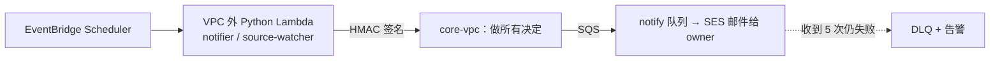

- **为什么这样设计 / 取舍**：
  - **用托管服务，不自建 cron 和队列**：一个人维护，不需要服务器。DLQ 让失败看得见，也能人工重放。
  - **逻辑集中在 core**：密钥、数据库、业务规则只在一个地方，Python 函数可以写得很小、容易审查。代价是多一跳网络，还要管理每条回调的签名密钥。
  - **默认就安全**：Terraform 把定时任务建成 DISABLED，再手工启用。自动化模式分 off、dry_run、live 三档，生产是 `dry_run`；AI 质检开关 `AI_QA_ENABLED=0`。到现在为止，AI 的结论在生产上一次都没有生效过。
  - 已知缺口：
    - 一次定时运行失败了不会补跑，只能等下一次。
    - webhook dispatcher 没有被调用过，也没有外部订阅者。
    - 告警只发到一个邮箱，没有 paging。
    - 自动化真正启用的时间很短，可靠性数字的说服力有限。

- **数字**：
  - 启用期间，截至 10-02（tick、digest、source watch 从 2026-09-27 UTC 起约 5.2 天，synthetic 从 09-29 起约 3.8 天）：
    - Scheduler 投递 995/995 次，Lambda 0 错误、0 限流。
    - synthetic 探测 367/367 次通过。
  - 30 天窗口（09-03 到 10-02）：队列消息 20 条（发布 13、通知 7），每条只被接收一次。4 个 DLQ 从各自建队起一直是 0。
  - source watcher：启用以来（09-27 UTC）调用约 165 次、0 错误；webhook dispatcher 和 ai-qa 在 30 天内都是 0 次调用（2026-10-05 读取）。

- **面试官可能会问**：
  1. **消息被重复投递怎么办？** 发布用条件 UPDATE 抢任务，只有一个能抢到。删除 RevenueCat 记录时，对方返回 404 也算完成。邮件只在同一个容器内按 notificationId 去重，换了容器仍可能重发一封，这是已知边界。
  2. **为什么 source watcher 不直接让 AI 改卡？** 引用的网页变了，不代表卡片错了。它只检查原文还在不在，有变化就排队交给人，避免模型在没人看的情况下改生产内容。
  3. **怎么知道自动化挂了？** 靠 DLQ 告警、心跳缺失告警（每次运行都发一个心跳指标），再加每 15 分钟一次的合成探测。
     - 自动化上线当天（09-27）出过两次误报，两天后合成探测上线时又出过一次。原因都是告警比数据源先上线。
     - 告警创建时动作是关的，所以进入 ALARM 时没有发通知。
     - 之后 RUNBOOK 写明：先部署代码、确认有心跳，再打开告警动作。但告警"一创建就进 ALARM"本身还没修，见 E4。

- **English talking points**：
  - "Anything slow, scheduled or internet-facing runs off the request path on SQS and EventBridge Scheduler. Every queue has a dead-letter queue with an alarm."
  - "The Python Lambdas are thin: they fetch, send or forward. The .NET core makes every decision through signed internal callbacks."
  - "A source watcher re-checks each cited page once a week to see whether the quoted sentence is still there. A change goes to a human, never straight into a card."
  - "The automation is built but deliberately in dry-run mode, so no AI decision has taken effect in production yet."

#### 证据（Web 端与后端）

| 说法 | 文件（main 3c8d84e） |
| --- | --- |
| 两个用户池；控制台池强制 MFA、只能管理员建号；SPA client token 1 小时 / 30 天；super_admin、editor 组 | `infra/modules/identity/cognito.tf` |
| PKCE S256、state 校验、跳转地址两端检查 | `frontend/src/auth/cognito.ts`、`frontend/src/auth/safeRedirect.ts`、`frontend/tests/authRedirectSafety.test.ts` |
| 提前 60 秒刷新、并发共用一次刷新；登出不撤销 | `frontend/src/api/http.ts`、`frontend/src/auth/AuthContext.tsx`、`frontend/tests/authTokenRefresh.test.ts` |
| 35 条路由、3 个 JWT authorizer（agent 受众 = SPA client + agent client）、26 条限流、路由守卫（禁止 0） | `infra/modules/api/gateway.tf`、`infra/modules/api/variables.tf` |
| 控制台绑定（池与 client 不对就去掉角色）；HMAC 签名、5 分钟窗口、新旧密钥 | `src_C/Shared/RecallSmith.Lambda.Common/Auth.cs`、`src_C/env/prod.env.json`、`src_C/Tests/RecallSmith.Lambda.IntegrationTests/AdminConsoleBindingTests.cs`、`.../InternalSignatureStrictTests.cs` |
| agent 只能访问 6 条路由；两份白名单由 CI 对齐 | `src_C/Vpc/AgentClientPolicy.cs`、`infra/scripts/check-agent-routes.py`、`.github/workflows/ci.yml`、`.../AgentClientPolicyTests.cs` |
| 按卡组的权限表 | `src_C/Vpc/Authoring/Helpers.cs` |
| edge-public 下线、改用 CLI 管账号、共 8 次调用；源码在下线时才存档 | `infra/RUNBOOK.md` §14、`archive/edge-public-2025-12-28/README.md` |
| expectedVersion → 409 VERSION_CONFLICT；编辑页冲突恢复 | `src_C/Vpc/Authoring/Cards.cs`、`frontend/src/pages/EditCardPage.tsx` |
| 导入四类预览、500 张 / 900,000 字符、1/2/4 秒重试、事务 upsert、不检查版本 | `frontend/src/lib/deckImport.ts`、`frontend/src/lib/deckImportRunner.ts`、`frontend/src/api/authoring.ts`、`src_C/Vpc/Authoring/CardsImport.cs`、`.../CardsImportTests.cs` |
| 发布门禁、PENDING 行 + SQS、发送失败标 FAILED、15 分钟复用 | `src_C/Vpc/Authoring/Publish.cs`、`.../PublishEnqueueResilienceTests.cs`、`.../PublishMcqGateTests.cs` |
| 每副卡组只有一个进行中的任务（部分唯一索引） | `src_C/Vpc/Db/Migrations/021_decks_live_build_id.sql` |
| AI QA 门禁两个开关、快照绑定；生产开关为 0 / dry_run | `src_C/Vpc/Qa/QaGate.cs`、`src_C/Shared/RecallSmith.Lambda.Db/PublishSnapshot.cs`、`.../AiQaPublishGateTests.cs`、`.../AiQaPublishSnapshotTests.cs`、`src_C/env/prod.env.json`、`services/ai-qa/env/prod.env.json` |
| 队列与 worker 配置（3,700 秒、3 次进 DLQ、615 秒、并发 2）；条件 UPDATE 抢任务；指针切换；进程内重建清单 | `infra/modules/worker/queue.tf`、`infra/modules/worker/function.tf`、`src_C/Worker/Repositories/JobRepository.cs`、`src_C/Worker/WorkerFunction.cs`、`.../WorkerReceiveCountTests.cs` |
| 不可变构建缓存一年；清单 max-age 60、ETag 条件写 | `src_C/Worker/S3/S3DeckUploader.cs`、`src_C/Shared/RecallSmith.Lambda.Db/ManifestBuilder.cs` |
| 回滚：super_admin、只接受 SUCCESS 构建、事务内写审计、slug 确认；reaper 阈值与按钮 | `src_C/Vpc/Authoring/DeckRollback.cs`、`src_C/Vpc/Authoring/PublishReaper.cs`、`frontend/src/components/console/DeckBuildsPanel.tsx`、`.../DeckRollbackTests.cs`、`.../PublishReaperTests.cs` |
| React 19 / TS 5.9 / Vite 7；18 个页面、16 个懒加载；数据路由；ChunkErrorBoundary | `frontend/package.json`、`frontend/src/pages/`、`frontend/src/App.tsx`、`frontend/src/main.tsx`、`frontend/src/components/ChunkErrorBoundary.tsx` |
| React Query 默认值（30 秒、不重试） | `frontend/src/api/queryClient.ts` |
| 首屏预算 377,000 B、登录页预算 487,000 B、553,688 → 308,582 B；highlight.js 不在首屏和预取里（axios 只检查在构建中）；2026-10-05 重测 370,892 B / 484,690 B（用这个测试的方法在本地构建测得） | `frontend/tests/bundleFirstLoad.test.ts` |
| CSP 与安全 header 只有一份定义；Playwright 在生产 header 下检查违规 | `infra/modules/edge/security_headers.json`、`infra/modules/edge/security_headers.tf`、`frontend/tests/e2e/cspGuard.ts`、`frontend/scripts/serve-with-headers.mjs`、`frontend/playwright.config.ts`、`infra/scripts/tests/test_r29_harden.py`、`infra/RUNBOOK.md` §16 |
| 控制台部署：资源缓存一年、不删旧分块、读回 SHA-256 | `frontend/deploy.sh` |
| 测试数（Vitest 1,511、Playwright 16、后端 2,928）及其边界 | `docs/recallsmith-resume-bullets.md`（证据表，CI run 37191434061） |
| core-vpc：dotnet10、arm64、512 MB、90 秒、保留并发 40、X-Ray、prod 别名；请求体 1 MiB 上限 | `infra/modules/api/core_vpc.tf`、`infra/envs/prod/main.tf`、`src_C/Vpc/VpcFunction.cs` |
| RDS PostgreSQL 17.9、db.t4g.micro、单 AZ、不公网可达、加密 | `infra/modules/data/rds.tf` |
| 每容器 1 条连接、SslMode.Require；数据库角色 50 条连接上限；INIT 预热 | `src_C/Shared/RecallSmith.Lambda.Db/Pg.cs`、`src_C/env/prod.env.json`、`src_C/Vpc/Db/AppRole.cs`、`src_C/Vpc/Warmup.cs` |
| 20 秒 / 60 秒（worker 600 / 600）超时；30 天调用 31,209 次、最慢 7.4 秒 | `src_C/Shared/RecallSmith.Lambda.Db/PgSessionTimeouts.cs`、`.../DbSessionTimeoutsTests.cs`、`infra/RUNBOOK.md` §16 |
| 没有 NAT、没有私有子网、VPC endpoint 不在 Terraform 里、NAT 约 $45/月为文档估算 | `infra/modules/data/network.tf`、`docs/backend-architecture-review-2026-09-22.md` |
| 迁移：super_admin + 密钥、advisory lock、单文件事务、destructive 闸门；46 个文件，045 标了 destructive 且已运行 | `src_C/Vpc/Db/Migrate.cs`、`src_C/Vpc/Db/DbSafety.cs`、`src_C/Vpc/Db/Migrations/`（`045_retire_content_intelligence.sql`）、`.../MigrateDestructiveGateTests.cs`、`docs/system-design-zh-2026-10-02.md` |
| 恢复演练 RTO 约 27 分钟、RPO 约 8 分钟（只演练过一次） | `docs/ops/dr-restore-drill-2026-10-04.md`、`infra/RUNBOOK.md` §13 |
| 4 条队列 + DLQ（3/3/5/5）及 DLQ 告警 | `infra/modules/worker/queue.tf`、`ai_qa.tf`、`automation.tf`、`webhooks.tf`；`infra/modules/observability/alarms.tf`、`alarms_r18.tf`、`alarms_r18a.tf` |
| 4 个定时任务（频率、重试次数、建成 DISABLED）；启用时间 09-27 / 09-29 UTC | `infra/modules/worker/automation.tf`、`infra/modules/worker/synthetic.tf`、`docs/ops/2026-10-03-reliability.md` §2 |
| notifier：只发 owner、同一容器内按 notificationId 去重、转发 tick、删除 RevenueCat 记录（404 算完成） | `services/notifier/src/notifier/handler.py`、`services/notifier/src/notifier/revenuecat.py`、`src_C/Vpc/Runtime/RevenueCatDeletions.cs` |
| source watcher：7 天复查、core 做决定、页面变化不改卡、不调用模型 | `services/source-watcher/src/source_watcher/handler.py`、`src_C/Vpc/Automation/SourceWatchRoutes.cs`、`src_C/Vpc/Automation/ChangeImpact.cs` |
| webhook 签名与轮换、SSRF 检查、5 次投递 30/120/480/900 秒 | `services/webhook-dispatcher/src/webhook_dispatcher/signing.py`、`delivery.py`、`urlguard.py` |
| 995/995 投递、367/367 探测（启用期间）；20 条消息、发布 13 条（30 天窗口）；DLQ 为 0 | `docs/ops/2026-10-03-reliability.md` |
| 三次告警误报（09-27 两次、09-29 一次；创建时动作未开，ALARM 未发通知）及 RUNBOOK 上线顺序 | `docs/ops/2026-10-03-pm-tick.md`、`docs/ops/2026-10-03-pm-sourcewatch.md`（改进项）、`docs/ops/2026-10-03-pm-synthetic.md`（改进项 4） |
| source watcher 约 165 次、0 错误；webhook dispatcher 和 ai-qa 0 次调用 | 线上 CloudWatch AWS/Lambda（devcards-ro，2026-10-05 新西兰时间读取）；`docs/recallsmith-resume-bullets.md`（证据表，2026-10-04 读取为 164 次） |

## 企业级横切设计

这一节不讲具体功能，讲一个人维护的生产系统怎样做到像团队一样受控。顺序如下：
1. 谁能动生产（E1）
2. 代码怎么进生产（E2）
3. 基础设施怎么改（E3）
4. 出了问题怎么发现、怎么恢复（E4）
5. 依赖和入口怎么防护（E5）

大部分内容是 2026-10-03 企业级审计之后两天内落地的。

### E1. 身份与最小权限 (Identity and job-scoped access)

- **一句话**：原来 owner、部署脚本和无人值守的 AI agent 共用一把 AdministratorAccess 静态 key。这把 key 一旦泄露，整个 AWS 账号就丢了，而且 CloudTrail 分不清操作是谁做的。
- **怎么设计的**：
  - **静态 key 收窄到只能 `sts:AssumeRole`**：它只挂两条策略：`devcards-operator-base`（AssumeRole，外加查看自己的用户）和 AWS 托管的 `IAMUserChangePassword`，也已经移出 admins 组。
  - **按职责拆成三个角色**：
    - `devcards-agent-readonly`：不要求 MFA，给 Claude 会话和 workflow agent 用。权限是 AWS ReadOnlyAccess 加 8 条 explicit deny，拒绝读取这些内容：解密 SSM/KMS、Secrets Manager、Lambda 配置（环境变量里有注入的 secret）、S3 对象（tfstate、用户内容、CloudTrail）、Cognito 用户记录、带 IP 的 API 访问日志等。
    - `devcards-deployer`：要求 MFA，现在只用于 break-glass。它能做的事：更新、发布、切换指定函数的 alias；读部署用的 `/developercards` SSM 参数（只能经 SSM 解密）；同步两个静态站点并刷新 CloudFront；迁移前打快照。它没有 `iam:PassRole`。
    - `devcards-admin-mfa`：要求 MFA，AdministratorAccess，session 1 小时，用于 Terraform break-glass 和 owner 亲自操作。
  - **CI 不存任何 AWS 凭证**：GitHub OIDC 换 1 小时临时凭证，CD 用 `developercards-gha-prod`，Terraform 用 `developercards-gha-infra`。trust 策略的 `sub` 只接受 `environment:production` 或 `environment:infra-prod`，这两个 environment 都必须由 owner 审批。
  - **CloudTrail 从 session 名就能看出是谁**：`agent-readonly` 是 agent，`owner-admin` 是 owner，`gha-cd-<run>` 是 CD。
  - **轮换脚本**：通过 MFA admin 角色创建新 key，直接写进 credentials 文件，不打印 secret；验证后停用旧 key，一周后再删除。每 90 天轮换一次。

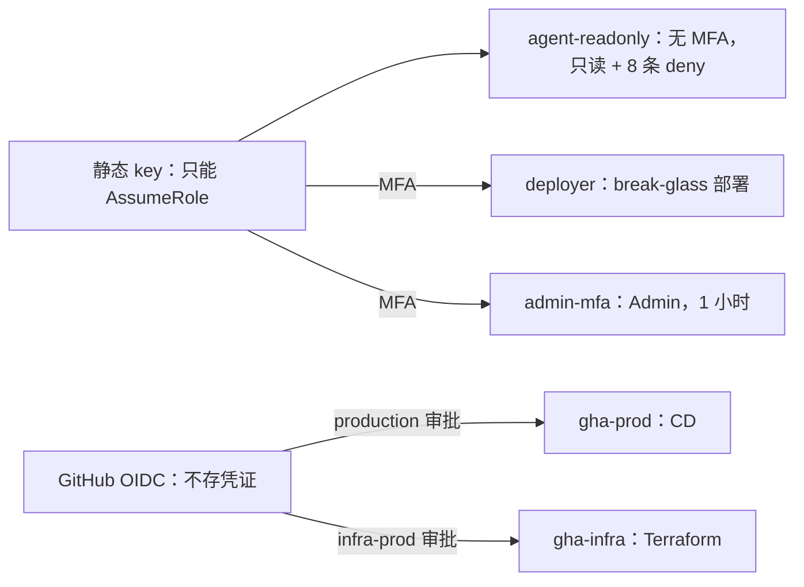

- **为什么这样设计 / 取舍**：
  - **用 explicit deny，而不是自己写一份只读 allow**：ReadOnlyAccess 默认能读 Lambda 环境变量和 S3 对象，而 secret 恰好就在那里；explicit deny 永远优先于 allow。
  - **key 是收窄，不是删除**：它现在仍是 Active。单人单账号的情况下，先把泄露后的影响范围降下来；下一步是 IAM Identity Center。admin 角色本身就是 AdministratorAccess，所以只能叫"按职责拆分"（job-scoped），不能叫严格最小权限。
  - **诚实边界**：agent 和 owner 跑在同一个 macOS 用户下。owner 的 1 小时 session 缓存还在时，同一用户的其他进程理论上能用它。目前的缓解是 1 小时上限，加上用完清 `~/.aws/cli/cache`；要彻底解决，需要单独的 OS 用户或沙箱。
  - OIDC 目前绑的是 environment，不是 workflow 文件。按 `job_workflow_ref` 绑定已经写进 RUNBOOK，但还没做。
- **数字**：
  - agent 只读角色有 8 条 explicit deny。所有 operator 和 CI 角色的 session 上限都是 1 小时（Terraform 定义，线上一致）。
  - 仓库级 Actions secret 为 0 个（2026-10-05 查 GitHub API）。`infra-prod` environment 里有 1 个 environment secret `TF_VAR_ALERT_EMAIL`，存的是告警邮箱，不是凭证。
  - 静态 key 在 2026-10-04 轮换过 1 次：新 key Active，旧 key Inactive、等待删除（IAM 只读查询）。
  - 实测：2026-10-05 用只读角色调用 `lambda:ListVersionsByFunction`，被 explicit deny 拒绝。
- **面试官可能会问**：
  1. **为什么不直接删掉静态 key？** 本机的 break-glass 和 Terraform 还需要一个起点身份。现在它只能 AssumeRole，没有 MFA 时最多拿到只读角色。要完全去掉，得等 IAM Identity Center。
  2. **AI agent 怎么保证只读、读不到 secret？** 靠 IAM，不靠 prompt。只读角色上的 explicit deny 挡住了解密、Lambda 配置、S3 对象和用户记录；它的每次 AWS API 调用（管理事件）都会被 CloudTrail 按 session 名记录下来。边界是它和我跑在同一个 OS 用户下。
  3. **CI 怎么拿到 AWS 权限？** GitHub OIDC 换 1 小时临时凭证。trust 策略只接受指定 repo、指定 environment 的 token，而那个 environment 必须由我审批。仓库里没有任何 AWS secret。
- **English talking points**：
  - "We had one admin access key shared by me, the deploy scripts and the AI agents. I cut it down so it can only assume roles."
  - "Agents get a read-only role with explicit denies on secrets and user data, so the boundary is IAM, not a prompt."
  - "Anything that can change production needs my MFA or a GitHub OIDC token from an approved environment, and sessions last one hour."
  - "CloudTrail session names tell me whether a change came from me, the pipeline or an agent."

### E2. CI/CD (CI/CD with approval, verification and rollback)

- **一句话**：以前直接从笔记本的工作区部署，线上跑的不一定是 CI 测过的那份代码。现在生产只接受 CI 跑绿、owner 审批过、哈希校验通过的产物，部署后出问题会自动回滚。
- **怎么设计的**：
  - **门禁**：main 的 ruleset 要求走 PR，并通过 9 个 required checks（mobile、frontend vitest、Playwright、backend、python、infra、mcp-server、n8n、author-runner），禁止 force-push 和删除分支，没有 bypass。
  - **触发**：main 上的 push 跑完 CI 并成功后，`workflow_run` 启动 CD。PR、fork 或 CI 失败都不会触发。
  - **plan（不用 AWS）**：和"上一次成功的完整部署"做 diff，算出要部署哪些目标（backend、5 个 Python 服务、console、site）。如果只改了 docs、infra 或 mobile，就什么都不部署，也不发审批请求。
  - **build（不给 AWS 凭证）**：打包 Lambda zip、改动的 Python 服务和 console bundle，生成 `SHA256SUMS` 清单。
  - **deploy（environment `production`，等 owner 审批）**：
    1. 拒绝已经过期的 plan。
    2. 先用 build job 通过 job outputs 传来的哈希校验 `SHA256SUMS` 清单本身，再按清单逐个校验文件，文件集合也必须完全一致。
    3. 用 OIDC 取得凭证。
    4. 做一次 baseline smoke。
    5. 记录 restore point：每个要切换的 alias、console 的 `index.html`、site bucket。
    6. 按顺序部署，然后再做一次 smoke。
  - **回滚**：如果部署步骤失败、某项检查部署前通过而部署后失败，或者任务被取消，就自动把 alias、console、site bucket 还原，再刷新 CloudFront。

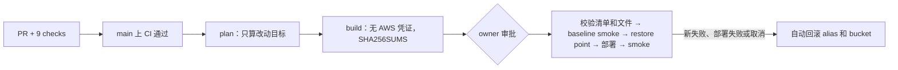

- **为什么这样设计 / 取舍**：
  - **build 和 deploy 分开**：build 要运行第三方 npm、NuGet 代码，所以拿不到 AWS 凭证。deploy 不自己构建，只发布校验过的字节。
  - **smoke 跟 baseline 比**：因为没有 staging，smoke 只能打生产。只有"部署前好、部署后坏"的检查才会触发回滚，这样一个本来就失败的探测不会让每次部署都回滚。
  - **回滚只覆盖可逆的部分**（alias、console、site），不碰数据库。CD 不跑数据库迁移，迁移由 owner 单独执行，并且先打快照。
  - **单人项目，人工把关放在生产审批这一步**：PR 不要求人工审批（ruleset 里 required approval 为 0）。review 靠 AI agent，例如 #741、#747 的独立 review。
- **数字**：
  - 9 个 required checks，0 个 bypass actor（ruleset 24412075，2026-10-05 查 GitHub API）。
  - 2026-10-03 至 10-04（UTC）共 6 次生产部署，全部 success 并标记 `#cd-full`（GitHub Deployments）。生产上还没触发过自动回滚；回滚逻辑只在把 `aws`、`gh`、`curl` 换成桩的测试中验证过。
  - CD 的独立 review（PR #741）：25 条发现，确认 18 条，18 条全部修复。
  - smoke 每项最多试 3 次、间隔 15 秒；deploy job 从审批起 45 分钟超时。
- **面试官可能会问**：
  1. **没有 staging，怎么敢自动部署生产？** 有三层保护：人工审批；部署前的 baseline smoke 和 restore point；部署后 smoke 失败就自动回滚。坦白说 smoke 打的是生产，staging 还没有。
  2. **怎么保证部署的就是 CI 测过的那份？** deploy job 自己不构建，只用 build job 的产物。build job 通过 job outputs 把 `SHA256SUMS` 清单的哈希传过来（不经 artifact 存储）。deploy 先校验清单本身，再按清单逐个校验文件，文件集合也必须完全一致。
  3. **为什么和"上次成功部署"比 diff，而不是只看这次 push？** 被拒绝、回滚或取消的改动不会丢，会留到下一次 plan 里。CD 也永远不会往回部署旧 commit。
- **English talking points**：
  - "Main is protected by a ruleset: every change goes through a PR and nine required CI checks, with no bypass."
  - "When CI passes on main, CD works out which targets changed since the last good deployment and builds them without any AWS credentials."
  - "After I approve, the deploy job verifies the build's checksum manifest and every file in it, runs a baseline smoke test and records a restore point, deploys, then smoke-tests again."
  - "If the deploy fails, or a check that passed before now fails, it rolls back the Lambda aliases and the static sites automatically. The database is not part of that."

### E3. IaC 治理 (Infrastructure-as-code governance)

- **一句话**：Terraform 的权限接近 admin。既要让日常改动审批一下就能上线，又不能让一个合并进来的改动给自己提权，或者改掉审计。
- **怎么设计的**：
  - **PR 里同时提交 Terraform 改动和一份 allow-list**（`*.plan-allow.json`），写明每个资源地址允许什么 action、可以改哪些 key。写改动的 agent 不接触任何凭证。
  - **CI（不用 AWS）做三件事**：
    - 跑 fmt 和 validate。
    - 检查改了 infra 的 PR 一定带 allow-list。
    - `preflight` 拒绝所有在 plan 或 apply 时会执行代码的东西：非 `hashicorp/aws` 的 provider、provisioner、`aws_lambda_invocation`、外部 module。
  - **合并后**，`select` job 挑出这次 push 带来的 allow-list，然后等 owner 在 `infra-prod` 审批。
  - **apply job 走 OIDC，依次执行**：
    1. `plan -out`，保存计划。
    2. `guard` 拒绝提权类改动：改 operator 角色；改 IAM 用户、key、组等身份资源；授予 IAM 角色或策略写权限的策略；对 `*` 的 PassRole/AssumeRole；挂 Admin 类策略；import。
    3. 用 allow-list 对照计划，不一致就不 apply。
    4. apply 刚才保存的那份 plan，而不是重新 plan。
    5. 再跑一次 plan，结果必须是 `PLAN EMPTY`。
  - **break-glass**：`module.operators`（全部 operator/CI 角色和 OIDC provider）、CloudTrail、state bucket、import 和 state 修改，只能在本地用 owner 的 MFA 操作。
- **为什么这样设计 / 取舍**：
  - **为什么要 allow-list**：plan 只有审批之后拿到角色才能生成；而且仓库是公开的，日志不能打印 plan（里面有 Lambda 环境变量和 state 值）。所以 owner 审批的是"应该改什么"，由 pipeline 拿真实 plan 去对照。
  - **apply 保存的 plan，再跑第二次 plan**：保证执行的正好是检查过的内容，同时证明代码和 AWS 一致。
  - **pipeline 不能改自己的角色**，否则一次合并就能拆掉它自己的限制。
  - **诚实边界**：
    - pipeline 角色是 AdministratorAccess 减去 9 条 deny。guard 挡不住两种情况：先建一个 service role，再部署用这个角色运行的代码；或者放宽资源策略。真正的补法是给 Terraform 建的每个角色加 permissions boundary，还没做。
    - 没有每晚自动的漂移检测。
    - Terraform 没有自动回滚，出了问题要提一个带反向 allow-list 的 revert PR 往前修。
- **数字**：
  - 2026-10-04 通过 pipeline 完成 3 次生产 apply，另有 1 次只跑 plan 的运行，用来验证 OIDC 链路。
  - Terraform pipeline 的独立 review（PR #747）：15 条发现，确认并修复 12 条。
  - 原来手工建的资源是用 import 收编进 Terraform 的：`infra/envs/prod` 的两个 imports 文件里现在还有 75 个 import 块（main.tf 另有 3 个；main 3c8d84e）。
- **面试官可能会问**：
  1. **Terraform plan 本身不就是检查吗，为什么还要 allow-list？** 审批的时候 plan 还不存在（要先有凭证才能跑），而且公开日志不能打印它。allow-list 是提前声明的意图，pipeline 自动拿真实 plan 和它比，差一个地址就不 apply。
  2. **pipeline 权限这么大，怎么防止滥用？** 角色上有 explicit deny：不能造凭证、不能改审计、不能改 operator 角色、不能 AssumeRole。guard 在 apply 前再拒绝提权类改动，而且每次 apply 都要我审批。service role 和资源策略还是缺口，下一步是 permissions boundary。
  3. **为什么 apply 之后还要再 plan 一次？** 证明代码和 AWS 一致。如果第二次 plan 不为空，说明有 provider normalisation 或漂移，要单独修。
- **English talking points**：
  - "Every Terraform change ships with an allow-list that says exactly which resources may change, and how."
  - "The pipeline saves the plan, runs a privilege guard, checks the plan against the allow-list, applies that saved plan, and requires a second plan to be empty."
  - "The pipeline can't touch its own role or the audit trail, and it can't change the state bucket's settings or delete old state versions. Those changes are break-glass, done locally with my MFA."
  - "It isn't airtight: a role it creates could still run code, so a permissions boundary is the next step."

### E4. 可观测性与灾备 (Observability and disaster recovery)

- **一句话**：单人运维，不可能一直盯着控制台。系统坏了要能自动发现；数据库也要证明真的能恢复，而不只是"有备份"。
- **怎么设计的**：
  - **SLO**：3 个，都是 28 天窗口：
    - API 可用性 99.5%
    - 同步请求 ≤2 秒的比例 95%
    - 发布任务成功率 95%

    告警按多窗口燃烧率（burn rate）设置：
    - 快烧阈值 14.4：可用性和同步要求 1 小时和 5 分钟窗口同时超过；发布 SLO 只看 1 小时窗口。
    - 慢烧阈值 6：要求 6 小时和 30 分钟窗口同时超过。
    - 快烧告警期间会压住慢烧，一次事故只发一条通知。
  - **静默失败**：自动化 tick 和 source watcher 会发心跳指标，分别 2 小时、3 小时没有心跳就告警。DLQ 有"非空"和"最老消息停留时间"两类告警。
  - **用户被拒**：从 API 访问日志和 core-vpc 日志做 metric filter，建了三个告警：`api-4xx-rate`（3 小时内 ≥50% 的请求是 4xx）、`api-429`、`core-vpc-auth-rejects`。4xx 比例的统计排除了合成探测自己的流量和服务间回调。
  - **合成探测**：每 15 分钟跑 9 项检查，不需要任何账号。包括：health、CDN 的 manifest 和卡组 SHA-256、console、两个"不带 token 必须返回 401"的守卫、两个 Cognito JWKS，以及作为 advisory 的 remote-config。CD 的 smoke 也复用它。
  - **恢复演练**：脚本把 RDS 按 PITR 恢复成生产旁边的一个新实例，用线上 build 的临时副本连上去，对比迁移版本和卡组、卡片总数，写出报告，最后用 EXIT trap 删掉临时资源。
  - **运行时到期守卫**：任何 Lambda runtime 在弃用前 90 天，CI 就会变红。.NET 8 升到 .NET 10 是在 dotnet8 弃用日（2026-11-10）之前主动完成的：先发布 dotnet10 版本，再切换 `prod` alias。这个守卫是同一次改动里加上的，防止下次漏掉。
- **为什么这样设计 / 取舍**：
  - **流量很小，SLO 信号很弱**（每天几十个请求）：所以加了最小事件数 guard，并把探测流量从分母中扣掉。同步和发布这两个 SLO 在当前流量下基本处于休眠（dormant）状态，"没有流量时出故障"靠合成探测来覆盖。
  - **探测不登录**：不需要凭证、不碰用户数据。代价是登录后的路径只验证到"路由存在、守卫有效"。`/health` 不查数据库，数据库宕机要靠 notifier 的错误告警间接发现，最坏约 22 分钟。
  - **有过误报**：三次"失联"误报（09-27 两次、09-29 一次）都是因为告警比数据源先上线。告警创建时动作是关的，所以 ALARM 没有发出通知；RUNBOOK 已写明"先确认有心跳再打开动作"。但"告警一创建就进 ALARM"这个上线顺序问题还没根治。
  - **已知缺口**：告警只发到一个邮箱，没有手机推送；备份只在一个区域、一个账号。.NET 10 迁移不能说成"零停机"，因为可用性没有测过。
- **数字**：
  - **恢复演练**（2026-10-04，只做过 1 次）：
    - 实例 26 分 10 秒可用，应用 26 分 25 秒连上并对比通过（报告取整为 RTO 27 分钟）。
    - 最新可恢复点比请求时刻早 8 分 3 秒，即 RPO。
    - 这个时间不含发现故障和切换的时间。演练成本约 US$0.03。
  - **告警**（2026-10-05 线上只读查询）：55 个 metric alarm 加 5 个 composite，0 个处于 ALARM。其中 10 个 SLO 子告警按设计不带通知，只供 composite 使用。
  - **自动化可靠性**（dry_run 模式）：启用后约 5 天，Scheduler 投递 995 次，Lambda 0 错误；探测启用约 3.8 天，367/367 全部通过（当时每次跑 5 项检查）。
  - **.NET 10**：2,887 个 backend 测试（PR #737 当时的数量）在 net8 和 net10 上都全部通过。两个函数现在都跑在 `dotnet:10.mainline.v74` 上（2026-10-05 的 INIT_START 日志）。
- **面试官可能会问**：
  1. **RTO/RPO 是怎么来的？** 不是估的，是脚本化演练测出来的：恢复约 26 分钟，最新恢复点落后约 8 分钟。但只演练过一次，真实事故还要加上发现和切换的时间。
  2. **流量这么小，burn-rate 告警有意义吗？** 坦白说，同步和发布的 SLO 现在几乎不会触发。所以加了最小事件数 guard 防误报，并用每 15 分钟一次的合成探测覆盖"没流量时出故障"的情况。
  3. **误报怎么处理？** 每次都写复盘。复盘发现三次都是告警先于数据源上线，而且告警创建时动作是关的，所以没有打扰到人。RUNBOOK 已经补了打开动作的顺序，但"告警先于数据源创建"本身还要在流程上修。
- **English talking points**：
  - "I defined three SLOs and alert on burn rate over a long and a short window. A fast-burn alert silences the slow-burn one, so one incident sends one notification."
  - "A synthetic check runs every fifteen minutes without any user account, and the deploy pipeline reuses it as its smoke test."
  - "I scripted a point-in-time restore drill. The restore took about 26 minutes, and the newest restore point was about 8 minutes old."
  - "With this little traffic some SLOs barely fire, and alerts only go to one inbox. Those are known gaps."

### E5. 供应链与应用安全 (Supply chain and application security)

- **一句话**：仓库是公开的，依赖很多，代码大量由 AI agent 写。被污染的依赖、泄露的 secret，或者没人审过的入口，都可能直通生产。
- **怎么设计的**：
  - **GitHub Actions**：所有 `uses:` 都固定到 40 位 commit SHA。Dependabot 每周把 SHA 和版本注释一起更新。CI token 默认只有 `contents: read`。
  - **扫描**：CodeQL default setup 覆盖 Actions、C#、JS/TS、Python。secret scanning 和 push protection 已开启，Dependabot security updates 也已开启。
  - **依赖门禁（放在 required checks 里）**：
    - npm 跑 `npm audit --omit=dev --audit-level=high`，只看生产依赖；mobile 用带 allowlist 的检查脚本。
    - Python 跑 `pip-audit --strict`。
    - .NET 把 NU1903/NU1904（high/critical）设成构建错误。
  - **Mobile**：接受下来的漏洞写进带过期日期的 allowlist，每条都必须标明 `inBundle`。`check-bundle-packages.py` 读取 iOS 和 Android 包的 source map，证明标了"不在包里"的依赖确实没打进 App。
  - **Web 安全头**：见 W3（严格 CSP、HSTS、`X-Frame-Options: DENY` 加 `frame-ancestors 'none'`、nosniff，并由 Playwright 在生产 header 下验证）。
  - **缩小攻击面**：
    - 退役了 `edge-public`。它的源码从没进过仓库，带一个"不验签名的 JWT"fallback，它的角色还能创建 console 账号。
    - 删除了 core-vpc `prod` 上一个公开的 Function URL。这个入口绕过了 API Gateway 的 authorizer、限流和访问日志，只剩 core-vpc 进程内自己验 JWT 这一道。
- **为什么这样设计 / 取舍**：
  - **不强行修掉所有 mobile 漏洞**：mobile 依赖要跟着 Expo SDK 走，硬升级可能需要发新的原生包。所以选择"有期限地接受，并证明不在发布包里"。到 2027-02-01 这些条目过期，CI 会变红，强制复查。
  - **CSP 直接用强制模式（enforce），没有先用 report-only**：白名单从构建产物推出来，再用 Playwright 证明登录和 Sentry 上报都不受影响。代价是新增第三方域名前必须先改 CSP；另外没有 CSP 上报端点。
  - **edge-public 选择删除，而不是接管**：退役前 90 天 0 次调用，三组路由里有两组只返回 501 stub。接管意味着把没审过的代码和一个能建账号的角色带进 CI/CD。
  - **诚实边界**：
    - 还有 50 个 Dependabot alert 没关（console 33 个，全是开发依赖；mobile 17 个）。
    - CodeQL 不在 required checks 里。
    - PR 没有第二个人工 reviewer。
    - GuardDuty 和 Access Analyzer 都还没开。
- **数字**：
  - 40 个 `uses:` 全部固定 SHA（main 3c8d84e）。CodeQL open alert 0 个（2026-10-05）。
  - Mobile：commit 5996b0f 在依赖层面只改了 lockfile，就修掉 71 个 high/critical 中的 62 个。剩下 9 个进 allowlist，2027-02-01 到期。这次修复有没有通过 OTA 到达用户，没有核查。
  - edge-public 一共只被调用过 8 次，退役前 90 天为 0。退役那次 apply 删除了 15 个资源，另有 1 个 forget（保留日志组）。
  - Function URL 删除时间是 2026-10-03 22:49 UTC，同时移除了 `FunctionURLAllowPublicAccess` 权限，操作者是 `devcards-admin-mfa/owner-admin`（CloudTrail 记录）。
- **面试官可能会问**：
  1. **为什么把 Actions 固定到 SHA？** tag 可以被重新指向别的代码，commit SHA 不行。pin 的更新交给 Dependabot，每周一个 PR。
  2. **有已知漏洞还发版，怎么说服安全团队？** 每条都写了理由和过期日，CI 用 source map 证明它不在发布包里。一旦打进包里或者过期，CI 就会变红。
  3. **为什么删掉 edge-public，而不是把它接管过来？** 退役前 90 天它 0 次调用，三组路由里两组只返回 501 stub。接管等于把没审过的代码和一个能建账号的角色带进 CI/CD，删掉的风险和成本都更低。
- **English talking points**：
  - "Every GitHub Action is pinned to a commit SHA, and CodeQL, secret scanning with push protection, and Dependabot are all on."
  - "npm, pip and NuGet audits run inside the required checks, so a new high-severity advisory in a shipped dependency blocks the merge."
  - "For the mobile app, accepted advisories have an expiry date, and CI proves from the source maps that they aren't in the shipped bundle."
  - "I also cut the attack surface: I retired a Lambda whose code had never been reviewed, and closed a public function URL that bypassed the API gateway."

#### 证据（企业级横切设计）

| 结论 | 证据（main 3c8d84e 上的路径；标"线上"的是 2026-10-05 只读查询） |
|---|---|
| 静态 key 只能 AssumeRole；三个角色、MFA、1 小时 session | `infra/modules/operators/main.tf`（`operator_base`、`trust_mfa`、`agent_readonly`、`deployer`、`admin_mfa`）、`infra/modules/operators/variables.tf`、`infra/scripts/operator-cutover.sh`、`infra/RUNBOOK.md` §10；线上：`devcards-admin` 只挂 `IAMUserChangePassword` 和 `devcards-operator-base`，不在任何组；五个角色 MaxSessionDuration 都是 3600 |
| deployer 的权限范围（含 SSM 读取、CloudFront 刷新） | `infra/modules/operators/main.tf`（`data.aws_iam_policy_document.deployer`）、`infra/RUNBOOK.md` §10 表格 |
| agent 只读角色有 8 条 explicit deny | `infra/modules/operators/main.tf`（`agent_readonly_deny` 下 8 个 sid）；线上 `deny-secrets-and-user-data` 8 条 statement |
| CI 用 OIDC，trust 绑定 environment；仓库级 0 个 Actions secret，infra-prod 有 1 个非凭证 environment secret | `infra/modules/operators/main.tf`（`aws_iam_openid_connect_provider.github`、`trust_github_production`、`gha_prod`、`gha_infra`）、`.github/workflows/cd.yml`、`.github/workflows/terraform.yml`、`infra/RUNBOOK.md` §15 Bootstrap 第 2 步；线上 `actions/secrets` total_count = 0，`environments/infra-prod/secrets` = `TF_VAR_ALERT_EMAIL` |
| CloudTrail 按 session 名识别操作者 | `infra/RUNBOOK.md` §10、§12、§15；线上：`DeleteFunctionUrlConfig` 事件的操作者为 `assumed-role/devcards-admin-mfa/owner-admin`；trail `developercards-management` 记录全部管理事件、无数据事件 |
| key 轮换 | `infra/scripts/rotate-operator-key.sh`、`infra/RUNBOOK.md` §10；线上：新 key 2026-10-04 Active，旧 key Inactive |
| 同一 OS 用户、未绑定 `job_workflow_ref`、需要 permissions boundary 等边界 | `infra/RUNBOOK.md` §10 "What this does not stop"、§15 "What it does not stop"；线上 OIDC sub customization `use_default: true` |
| ruleset：PR + 9 个 checks，无 bypass，0 个人工审批 | `.github/workflows/ci.yml`（job `name:` 即 required check 名）、`docs/recallsmith-resume-bullets.md` 证据表；线上 ruleset 24412075 |
| CD 流程：workflow_run、改动检测、无凭证 build、清单哈希经 job outputs 传递再逐文件校验、审批、baseline smoke、restore point、部署失败或新失败或取消即自动回滚 | `.github/workflows/cd.yml`（`manifest_sha256` output、verify 步骤）、`scripts/cd/plan.sh`、`scripts/cd/artifact.sh`（`cmd_verify`）、`scripts/cd/restore-point.sh`、`scripts/smoke.sh`、`scripts/rollback.sh`、`scripts/deploy-preflight.sh`、`infra/RUNBOOK.md` §12 |
| 回滚只在桩测试里验证过；6 次生产部署成功；PR #741 的 18/18 | `scripts/tests/cd-scripts.test.sh`、`docs/recallsmith-resume-bullets.md`；线上 GitHub Deployments（environment `production`） |
| Terraform：allow-list、preflight、select、guard、check-plan、apply 保存的 plan、二次 plan 为空 | `.github/workflows/terraform.yml`、`infra/scripts/tf-pipeline.py`、`infra/scripts/check-plan.py`、`infra/scripts/tests/test_tf_pipeline.py`、`infra/RUNBOOK.md` §2–§5、§15 |
| pipeline 角色 = Admin 减 9 条 deny；`module.operators` 只能 break-glass；state bucket 只禁改设置和删版本 | `infra/modules/operators/main.tf`（`gha_infra`、`gha_infra_deny`，含 `KeepStateHistory`、`KeepStateVersions`）、`infra/RUNBOOK.md` §15 "Break-glass" |
| 3 次生产 apply；imports 文件里 75 个 import 块；PR #747 的 12/15 | 线上 terraform.yml runs 37185288412、37185788377、37190473658（plan-only 37168515931）；`infra/envs/prod/imports.tf`（73）、`imports_r18a.tf`（2）（`main.tf` 另有 3 个）；`docs/recallsmith-resume-bullets.md` |
| SLO 多窗口 burn rate（发布快烧只看 1 小时）、最小事件数 guard、休眠说明 | `infra/modules/observability/slo_r18h.tf`、`infra/RUNBOOK.md` §8 |
| 心跳、DLQ、4xx-rate、429、auth-reject 告警 | `infra/modules/observability/alarms_r18a.tf`、`alarms_r18.tf`、`alarms_r28.tf`、`infra/RUNBOOK.md` §7 "User-facing refusals" |
| 9 项无账号合成探测，每 15 分钟一次；数据库宕机约 22 分钟告警 | `services/synthetic-check/src/synthetic_check/checks.py`、`infra/modules/worker/synthetic.tf`、`services/synthetic-check/README.md`、`infra/RUNBOOK.md` §8 |
| 告警数量；只有一个 email 订阅；备份单区域 | `infra/modules/observability/alerts.tf`；线上 `describe-alarms`：55 个 metric + 5 个 composite，0 个处于 ALARM；线上 RDS 无自动备份复制、AWS Backup 0 个 plan |
| 三次误报复盘（09-27 tick、source-watch；09-29 synthetic）；5 天可靠性统计（探测 3.8 天） | `docs/ops/2026-10-03-pm-tick.md`、`-pm-sourcewatch.md`、`-pm-synthetic.md`、`-pm-p95.md`、`docs/ops/2026-10-03-reliability.md` |
| PITR 演练：26 分 10 秒 / 26 分 25 秒 / RPO 8 分 3 秒 | `infra/scripts/dr-restore-drill.sh`、`docs/ops/dr-restore-drill-2026-10-04.md`、`infra/RUNBOOK.md` §13 |
| runtime 弃用守卫（与 .NET 10 同一次改动加入）；.NET 8 → 10；PR #737 时 2,887 个测试 | `infra/scripts/check-lambda-runtimes.py`（commit 61fe5e9）、`.github/workflows/ci.yml`（job `infra`）、`src_C/global.json`、`infra/RUNBOOK.md` §11、`docs/recallsmith-resume-bullets.md`（PR #737）；线上 INIT_START `dotnet:10.mainline.v74` |
| Actions 固定 SHA（40/40）、Dependabot、只读 token | `.github/workflows/*.yml`、`.github/dependabot.yml`、三个 workflow 的 `permissions: contents: read` |
| CodeQL、secret scanning、push protection | 不在仓库里，是 GitHub 设置；线上 `code-scanning/default-setup`、`security_and_analysis` |
| npm（`--omit=dev`）、pip、NuGet 审计门禁 | `.github/workflows/ci.yml`（frontend、mcp-server、author-runner 的 `npm audit --omit=dev --audit-level=high`；mobile 的 `check-npm-audit.py`；python job 的 `pip-audit`）、`src_C/Directory.Build.props` |
| mobile allowlist 和 bundle 守卫；62/71 | `mobile/npm-audit-allowlist.json`、`infra/scripts/check-npm-audit.py`、`infra/scripts/check-bundle-packages.py`、`infra/RUNBOOK.md` §17、commit 5996b0f |
| CSP、HSTS、XFO、nosniff，以及 Playwright 验证 | `infra/modules/edge/security_headers.json`、`security_headers.tf`、`frontend/tests/e2e/cspGuard.ts`、`frontend/scripts/serve-with-headers.mjs`、`frontend/scripts/check-bundle-dsn.sh`、`infra/scripts/tests/test_r29_harden.py`、`infra/RUNBOOK.md` §16；线上 `curl -sI` 两个站点 |
| 退役 edge-public | `archive/edge-public-2025-12-28/README.md`、`infra/modules/api/edge_public.tf`（`removed` 块）、`docs/delivery/r27-issues/EDGE.plan-allow.json`、`infra/RUNBOOK.md` §14 |
| 关闭 core-vpc 的公开 Function URL | 不在 main 上：CloudTrail `DeleteFunctionUrlConfig`（core-vpc，qualifier prod）和 `RemovePermission`（`FunctionURLAllowPublicAccess`），2026-10-03T22:49Z；线上 `list-function-url-configs core-vpc` 为空；owner 报告 `user-perspective-review-2026-10-04.md` §4.1；进程内验签见 `src_C/Shared/RecallSmith.Lambda.Common/JwtVerifier.cs` |
| 剩余缺口：50 个 Dependabot alert，GuardDuty 和 Access Analyzer 未开 | 线上 GitHub `dependabot/alerts`（frontend 33 个，全为 development scope；mobile 17 个）；线上 `guardduty list-detectors` 和 `accessanalyzer list-analyzers` 都为空（ap-southeast-2） |

## AI 设计

> 先说清楚边界：现在线上真正在跑、而且起作用的 AI 只有两样，一是 AI 起草，二是内容核查的结果。所有"AI 替人做决定"的部分都已经建好，但处于关闭状态（`AI_QA_ENABLED=0`、`AUTOMATION_MODE=dry_run`）。

### AI1. AI 草稿 agent 与自治边界 (Drafting Agent & Autonomy Boundary)

- **一句话**：让 AI 按官方文档批量起草带出处的卡片，省掉 owner 自己写卡的时间。同时在设计上保证 AI 只能起草，不能自己发布；要不要发布，由服务端和人来决定。
- **怎么设计的**：
  - **第一步，领任务**：owner 的 Mac 上有个 launchd 任务，每小时跑一次 author-runner。它从服务端的 authoring queue 领任务（一次领一个，带 lease；一次运行默认最多 3 个），然后启动 headless Claude Code（`claude -p` 加 `author-cards` skill）。它只用 owner 的订阅登录：启动时发现用的是 API key 或云厂商模型，就直接判失败。
  - **第二步，用工具**：agent 的核心工具来自一个 TypeScript MCP server，共 4 个：
    - `read_source`：读取原文，切成可引用的 chunk。
    - `find_similar_cards`：用 trigram 相似度查重。
    - `lint_card`：检查格式和出处规则。
    - `submit_draft`：提交草稿。

    除此之外，它只能起 verifier 子 agent，以及读几个格式和 skill 文件。
  - **第三步，在信任边界上做校验**：`submit_draft` 调 API 之前，MCP server（是工具代码，不是模型）核对两件事：
    - 卡上的 URL 必须是本次会话里 `read_source` 读过的源。
    - quote 必须在某个 chunk 里逐字出现，只忽略空白差异。

    任何一张不合格，整批拒收。同一张卡重复提交是幂等的，按卡内容的 SHA-256 判断。skill 里另有一个 verifier 子 agent，它只能看到卡片和对应的原文片段，用来判断原文是否支持这张卡。
  - **第四步，控制权限**：agent 的 token 只能访问 6 个路由：3 个给 MCP（列卡组、查重、提交草稿），3 个给 runner 的心跳、领取和完成。这个限制检查两次：一次是 API Gateway 的 JWT authorizer，一次是后端 Lambda 的白名单；CI 脚本保证两份清单一致。发布、审核决定和其他管理接口都会被拒绝（后端返回 403）。
  - **第五步，由人决定**：草稿进入控制台的人工审核队列，人可以接受、修改后接受或拒绝。自动接受要过两关：跨厂商 reviewer（在 Bedrock 上调 GPT-5.5 的 Lambda），以及服务端的 eval gate。
  - **线上真实状态（2026-10-05）**：
    - **在跑**：起草 agent、4 个 MCP 工具、6 路由限制、人工审核队列。
    - **已部署但关闭**：reviewer Lambda（30 天 0 次调用）和自动接受（`dry_run`）。
    - **从未通过**：eval gate，没有任何 GPT-5.5 运行记录。
    - **为什么还关着**：这个 AWS 账号还没拿到 Bedrock 上的模型访问权限，owner 10-04 的记录是申请被拒。GPT-5.5 的 IAM 授权已经配好，缺的是账号层面的模型 allowlisting；owner 也没批准直连 API 的费用。没有 reviewer 就跑不了 gate，gate 不过，服务端就不允许切到 live。

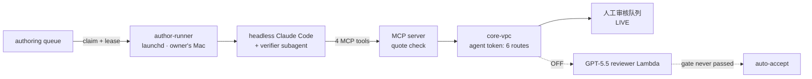

- **为什么这样设计 / 取舍**：
  - **安全边界放在工具代码、服务端和权限上，不放在 prompt 里**：prompt 里写一句"不要发布"，或者 UI 上少一个按钮，都不算安全边界。
  - **reviewer 选跨厂商**：起草用的是 Claude，如果评审也用 Claude，两边的盲点是相关的，同一类错误会一起漏掉。代价是要多接一个供应方，现在就卡在 Bedrock 访问上。
  - **失败时一律转人工**：reviewer 不可用、模型没测过、gate 被撤销，都会退回人工审核。撤销最新的 gate 就是一键 kill switch，下一个请求就会回到 `dry_run`。
  - **起草放在 Mac 上**：用的是订阅额度，模型的边际成本为零，VPC 也不需要出网。代价是 Mac 睡眠时会错过运行（lease 到期后任务回到队列），而且没法横向扩展。
- **数字**：
  - 结构：4 个工具；6 个路由；每批最多 20 张草稿；查重阈值 0.3，≥0.6 判为疑似重复。
  - eval gate 门槛（服务端根据报告里的计数重新计算）：
    - seeded recall ≥0.90（CI 下界 ≥0.85）；
    - auto-accept precision ≥0.97（CI 下界 ≥0.93）；
    - 至少 120 张 would-accept 卡，至少跑 2 次。
    - 到目前为止通过 0 次。
  - 每日花费上限：AI QA $10/天。
  - runner：10-01 到 10-04 本机日志有 76 次启动，只领到 2 个任务，说明队列基本是空的。
- **面试官可能会问**：
  1. **agent 能不能绕过你直接发布？** 不能。发布接口不在它 token 能访问的 6 个路由里，网关和后端各拦一次。草稿之后怎么处理，完全由服务端决定。
  2. **reviewer 都没上线，质量靠什么保证？** 靠三层：MCP 工具层在提交前校验逐字引用；只看原文的 verifier 子 agent；最后每张草稿都经过人工审核。
  3. **什么时候打开自动接受？** 要等跨厂商 reviewer 通过服务端的 eval gate（precision ≥0.97，至少 120 张）。另外我会先把每日上限降到 $1–2，再加一个月度上限，然后才考虑打开。
- **English talking points**：
  - "The drafting agent is headless Claude Code with a small MCP server. It has four tools: read a source, find similar cards, lint a card, and submit a draft."
  - "It can draft, but it can never publish. Its token reaches only six API routes, and both the gateway and the backend check that."
  - "Every quote must appear word for word in a source the agent actually read. If it doesn't, the MCP server refuses the batch before anything reaches the API."
  - "Auto-accept is built but switched off. It can turn on only after a reviewer from a different vendor passes an eval gate that the server recomputes itself. Until then, a human approves every draft."

### AI2. 评测与内容核查 (Evals & Content Verification)

- **一句话**：学习者信任的是"答案是对的"。所以在让 AI 做任何决定之前，先量出它有多可靠；同时把线上卡片的事实和出处补齐，并且持续自动核对。
- **怎么设计的**：
  - **Seeded-defect eval**：
    - 在真实卡片里人为注入 7 类缺陷：错误答案、多个正确选项、答案泄露、题干歧义、过时事实、限定词不匹配、出处不支持。
    - 每张缺陷卡都配一张没动过的对照卡（mirrored control），来自同一个卡组、同样题型、长度相近。这样模型没法靠长度这类表面特征猜，有专门的测试检查这一点。
  - **harness 直接调用生产 reviewer 的代码**：prompt、schema、解析都是同一份，所以除了 provider，量的就是将来要上线的那条代码路径。每次运行都记录数据集的 sha256，至少跑 2 遍。
  - **防止调优污染**：prompt 调优用 dev/holdout 拆分。holdout 被分析过之后，那次结果就标成"偏乐观"。最终测量放在 qa-v3 prompt 从没见过的 seeded-v3 上。
  - **双 AI 交叉核查**：对 61 张没有来源记录的线上 AWS 卡，两个独立的 AI 核查员分别对照官方文档：
    - 两人都判正确：只补出处。
    - 两人指出同一个问题：由做核查的 AI 会话在官方页面上再确认一遍，然后做最小修改。
    - 两人意见不一致：不改，留给 owner。
  - **出处回填和持续核对**：
    - AI 辅助给卡片补 URL 和逐字引用。
    - 新增的引用先用 source-watcher 的同一套代码重新抓取、核对，再由 owner（或经 owner 批准的 supervisor）在控制台导入并发布。
    - 之后由 source-watcher（见 B2）每 7 天复查一次，确认引用还在页面上。这一步不用模型。
- **为什么这样设计 / 取舍**：
  - **对外讲假阳性率（7.6%），不讲 precision**：0.927 的 precision 是在缺陷比例约 50% 的数据上算出来的；真实缺陷比例按 10% 估算，precision 只有约 0.58。所以 AI QA 适合"提醒人"，不适合"替人决定"。
  - **这次运行是 proxy 证据**：用的是通过 CLI 调用的 Claude Opus 5，不是生产 provider。所以上线 gate 按设计判了 FAIL，原因是 provider 不对，不是指标不够。另外，部分类别的标签是模型辅助生成的，没有经过人工校准。
  - **交叉核查只改有把握的地方**：两个核查员都同意、并且官方页面能证实，才会改。代价是慢，而且有 4 张卡还挂着没处理。
  - **有出处不等于做过事实核查**：`quote_present` 只能证明引用还在页面上，证明不了它支持答案。
- **数字**：
  - **Eval**（seeded-v3）：
    - 226 张卡（113 张缺陷、113 张对照）× 2 次 = 452 次评审。
    - recall 0.956（216/226，pooled Wilson 95% CI 0.92–0.98）。
    - 对照卡误报率 7.6%（17/225）。
    - 按标价估算约 $19；实际走订阅，没有产生账单。
  - **核查**：61 张 → 48 张补出处，9 张修正事实错误（只改答案细节，不改正确选项和题干），4 张有分歧未改。
  - **出处覆盖率**（2026-10-05 线上 deck.json）：
    - AWS 从 20/371 升到 366/371（98.7%），其中 355 张带逐字引用。
    - CCDV-F 从 109/441 升到 434/441（98.4%），其中 424 张带逐字引用。
  - **source-watcher**：从 2026-09-27 UTC（新西兰时间 09-28）启用以来，约 165 次运行，0 错误（CloudWatch，2026-10-05 读取）。
- **面试官可能会问**：
  1. **96% recall 很高了，为什么还不上线？** 这次用的不是生产 provider，gate 按设计判了失败。而且自动接受要过另一道更严的 gate（precision ≥0.97，至少 120 张 would-accept 卡），那道从来没测过。
  2. **怎么防止 eval 被调优污染？** 原计划只用 dev 集调 prompt，后来发现 holdout 的对照卡也被看过，我就把那次结果标成偏乐观，最终换到一个从没见过的新数据集上测。对照卡和缺陷卡在表面特征上做了平衡，并有测试守着。
  3. **两个 AI 核查员一起错了怎么办？** 它们只负责指出问题，改不改由官方页面决定，每一处修改都在官方原页面上再确认过（这一步也是 AI 会话做的）。有分歧的不改。没有人类专家把 61 张全部审过，这一点我会如实说。
- **English talking points**：
  - "Before letting AI make any decision, I measured it. I built a seeded-defect eval: I inject seven kinds of errors into real cards and mix them with matched, untouched control cards."
  - "The harness calls the exact production reviewer code, so the prompt, schema and parsing are what would ship. Only the model provider was a stand-in."
  - "On an unseen set, the model caught about 96% of the seeded errors, with a 7.6% false-flag rate on the control cards. It was proxy evidence, so the rollout gate still failed, and that was by design."
  - "On live content, two independent AI checkers reviewed 61 cards against the AWS docs. Both flagged the same nine factual errors; each was re-checked on the official page and fixed, and AWS citation coverage went from 5% to about 99%."

### AI3. agent 的工程化护栏 (Guardrails for AI-Assisted Delivery)

- **一句话**：一个人用很多 AI agent 写代码、做运维，需要做到两点：agent 出错或被注入时，造成的伤害有上限；重要改动在合并前都被独立检查过，关键步骤都要人批准。
- **怎么设计的**：
  - **AWS 权限**：详见 E1。agent 只能拿到只读角色（8 条显式 deny，挡住密钥、解密、Lambda 环境变量、S3 对象、用户记录、访问日志里的 IP 等）；能改生产的角色都要 owner 的 MFA，session 只有 1 小时；CloudTrail 能按角色分辨是谁在操作。
  - **API 和凭证**：agent 的 token 只能访问 6 个路由（见 AI1）。agent 会读不可信的网页，所以 MCP server 永远不返回 token 目录的路径，Claude Code 的设置也禁止读这个目录。在自动化运行里，agent 只能抓白名单域名。
  - **隔离开发**：每个 issue 交给一个 coding agent，在独立的 git worktree 里实现。push、开 PR、merge 的权限只在 driver 手里。
  - **独立审查**：重要改动（比如 CD、Terraform 流水线）合并前，几个独立的 review agent 分别从安全、失败模式、可运维性几个角度审查，再做一轮对抗式验证。确认是真问题的全部修完。
  - **Mutation checks**：对关键守卫，我会故意把代码改坏，确认测试一定会变红。
  - **人工审批门**：
    - main 必须走 PR，并通过 9 个 CI 检查，任何人都不能绕过（见 E2）。
    - 常规的生产部署和 Terraform apply 都要 owner 在 GitHub environment 里批准；本地 break-glass 要 MFA。
    - 生产内容的导入和发布由 owner（或经 owner 批准的 supervisor）在控制台操作。

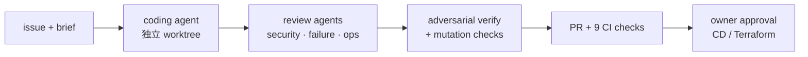

- **为什么这样设计 / 取舍**：
  - **把 agent 当作权限很小的外包，而不是管理员**：约束放在 IAM、网关和后端里，不靠 prompt。
  - **诚实的缺口**：静态 key 还在、agent 和 owner 是同一个 macOS 用户、admin 角色不是最小权限，这三点见 E1。所以整体只能叫 job-scoped，不能叫 least-privilege。
  - **没有第二个人类 reviewer**：main 要求的人工 approval 数是 0，代码审查由 AI agent 做。所以我要求自己能手动解释并修改任何一部分。
  - **多 agent 审查要花时间和 token，但确实抓到了真问题**，比如"一个叫 `main` 的 tag 能绕过部署门"和"re-run 会把部署往回滚"。
- **数字**：
  - CD 流水线（PR #741）：审查出 25 个问题，确认 18 个，全部修复；20 处故意改坏，每处都让脚本测试变红。
  - Terraform 流水线（PR #747）：15 个问题，确认并修复 12 个；16 处故意改坏，每处都变红。
  - main 上带 AI co-author trailer 的非 merge 提交占 87%（1,225/1,406，main 3c8d84e）。
- **面试官可能会问**：
  1. **agent 被 prompt injection 了怎么办？** 我没有 injection 测试集，所以不会说"测过"。我靠的是限制爆炸半径：只读 AWS 角色、6 个路由、不能发布、读不到 token、自动化运行时只能抓白名单域名。
  2. **87% 的提交有 AI 参与，你怎么保证自己懂这些代码？** 交给 agent 的 issue 都带 brief 和验收脚本，重要改动再经过独立审查和 mutation checks。计划和生产操作都由我批准，我也能手动讲清任何关键部分，比如同步用的那条 SQL、回滚的顺序。
  3. **为什么不把静态 key 全部换成 OIDC？** 常规部署和 Terraform 已经走 GitHub OIDC，CI 里没有存任何凭证。本地剩下的 key 只能 assume role。下一步是上 IAM Identity Center，再给 agent 单独的 OS 用户。
- **English talking points**：
  - "I treat AI agents like contractors with very small permissions, not like admins."
  - "Agents get a read-only AWS role that explicitly denies secrets and user data. Anything that changes production needs my MFA or my approval in GitHub."
  - "Each task runs in its own git worktree, and for important changes separate review agents attack the change before it merges. On the CD pipeline they found 25 issues; 18 were real, and all 18 were fixed."
  - "For the important guards, I break the code on purpose and check that the test turns red."

#### 证据（AI 设计）

| 结论 | 证据（main 3c8d84e，另注明的除外） |
| --- | --- |
| 4 个 MCP 工具；MCP server 在提交时做逐字引用校验（空白归一）；任一失败整批拒收；每批 ≤20；按 SHA-256 幂等 | `tools/mcp-server/src/server.ts`、`tools/mcp-server/src/grounding.ts` |
| trigram 查重（有 pg_trgm 就用数据库，否则用进程内同分 fallback），阈值 0.3 / 0.6 | `tools/mcp-server/src/server.ts`（find_similar_cards）、`src_C/Vpc/Authoring/CardSimilarity.cs`、`src_C/Vpc/Authoring/Trigram.cs`、`src_C/Vpc/Db/Migrations/029_pg_trgm.sql` |
| verifier 子 agent；预授权 4 个 MCP 工具、子 agent 和少量只读文件 | `.claude/skills/author-cards/SKILL.md`、`tools/author-runner/src/claude.ts`（`CLAUDE_ALLOWED_TOOLS`） |
| launchd 每小时运行；一次领一个、默认最多 3 个；只用订阅（apiKeySource none）；lease / hold | `tools/author-runner/README.md`、`tools/author-runner/launchd/app.developercards.author-runner.plist.template` |
| 76 次启动，领到 2 个任务（10-01 至 10-04） | 本机日志 `~/Library/Logs/DeveloperCards/author-runner.log`（不在仓库，2026-10-05 读取） |
| token 只能访问 6 个路由，两处检查，CI 保持同步 | `src_C/Vpc/AgentClientPolicy.cs`、`infra/modules/api/gateway.tf`、`infra/scripts/check-agent-routes.py`、`.github/workflows/ci.yml` |
| `AUTOMATION_MODE=dry_run`、`AI_QA_ENABLED=0`、每日 $10 上限、来源域名白名单 | `src_C/env/prod.env.json`、`services/ai-qa/env/prod.env.json` |
| eval gate 门槛、服务端重算、以最新一行为准、撤销即 kill switch、只允许 GPT-5.5 | `src_C/Vpc/Automation/EvalGate.cs`、`src_C/Vpc/Automation/AutomationMode.cs` |
| reviewer Lambda、schema `extra="forbid"`、bedrock-mantle 调 GPT-5.5、访问被拒时转人工、紧急停止 | `services/ai-qa/README.md`、`services/ai-qa/src/ai_qa/schema.py`、`services/ai-qa/src/ai_qa/openai_mantle_client.py`、`infra/modules/worker/ai_qa.tf`、`infra/RUNBOOK.md` §7 |
| GPT-5.5 的 IAM 授权已配置并生效 | `infra/modules/identity/roles_r18.tf`（`BedrockMantleOpenAiInference`）、`infra/envs/prod/main.tf`；线上 `developercards-ai-qa-role` 策略（devcards-ro，2026-10-05） |
| 盲审和影子一致率 | `docs/system-design-zh-console.md` §4、`frontend/src/lib/automationVerdictSeen.ts` |
| ai-qa 30 天 0 次调用；source-watcher 启用以来约 165 次运行、0 错误；启用时间 09-27 14:28Z | 线上 CloudWatch AWS/Lambda，2026-10-05（devcards-ro 只读）；`docs/ops/2026-10-03-reliability.md` §2 |
| Bedrock 访问被拒；owner 未批 API 费用；没有 GPT-5.5 运行记录 | 仓库外 owner 报告 `user-perspective-review-2026-10-04.md` §2.4；`services/ai-qa/README.md`（Rollout、allowlisting）；`docs/recallsmith-resume-bullets.md` 证据表 |
| eval 设计：7 类缺陷、镜像对照（未注入缺陷的真实卡）、调用生产代码、表面特征平衡 | `evals/README.md`、`evals/tests/test_seed_v3.py`、`evals/src/dc_evals/score.py` |
| 96% / 7.6% / 452 次 / ~$19；proxy 判 FAIL；10% 缺陷比例下 precision ≈0.58 | `evals/reports/2026-09-27-claude-cli-claude-opus-5-qa-v3-seeded-v3.md` |
| dev/holdout 拆分；污染说明；seeded-v3 是没见过的数据 | `evals/reports/tuning-2026-09-27/README.md` |
| 61 张 → 48 / 9 / 4；9 处由 AI 会话在官方页面复核后修正 | `docs/delivery/r29-content/REPORT.md` §2–3、`docs/delivery/r29-content/verify-applied.json`、commit 01dcb67 |
| 覆盖率 AWS 5%→98.7%、CCDV-F 25%→98.4% | `docs/delivery/r29-content/REPORT.md` §1、`backfill-applied.json`；线上 deck.json build 20261004T090438Z-a9045c68 / 20261004T090733Z-cd557635（2026-10-05 用 curl 读取） |
| source-watcher：每小时调度、每页 7 天复查、`quote_present` | `services/source-watcher/src/source_watcher/normalize.py`、`src_C/Vpc/Automation/SourceWatchRoutes.cs`、`infra/modules/worker/automation.tf` |
| agent 只读角色 8 条 deny；MFA 加 1 小时 session；同一 macOS 用户的缺口 | `infra/modules/operators/main.tf`、`infra/RUNBOOK.md` §10 |
| 凭证防护 | `tools/mcp-server/src/credentialGuard.ts`、`.claude/settings.json` |
| worktree 隔离；合并权限只在 driver 手里 | `docs/delivery-wave-1.6-plan-2026-09-19.md` |
| 独立审查和 mutation checks（25→18、15→12；20 / 16 处故意改坏） | PR #741（8c74419）、PR #747（3b1c829）、`scripts/tests/cd-scripts.test.sh`、`docs/delivery/r29-issues/HARDEN-route-guard-test.sh` |
| main：PR + 9 个检查、无人可绕过、0 个人工 approval | GitHub ruleset 24412075（线上，2026-10-05 复读）、`docs/recallsmith-resume-bullets.md` |
| 常规生产部署和 Terraform 由 owner 批准；生产内容写操作由 owner 或经批准的 supervisor 执行 | `.github/workflows/cd.yml`、`.github/workflows/terraform.yml`、GitHub environments `production` / `infra-prod`（线上）、`infra/RUNBOOK.md` §12、§15、`docs/delivery/r29-content/REPORT.md` §6 |
| 87% 提交带 AI trailer | `git log --no-merges` on main 3c8d84e（1,225/1,406） |

## 诚实的边界与下一步

- **用户少、流量低**：30 天 core-vpc 调用 31,209 次，最忙一分钟不超过 11 个请求。所有可靠性数字都不能当容量证明；同步和发布两个 SLO 在当前流量下基本处于休眠状态。
- **单区域、单 AZ、没有 staging**：smoke 只能打生产。备份只在一个区域、一个账号。恢复演练只做过一次。045 迁移之后数据库只能前滚。
- **AI 自动决策没有上线**：`AI_QA_ENABLED=0`，`AUTOMATION_MODE=dry_run`。Bedrock 的模型访问还没获批，跨厂商 reviewer 0 次调用，eval gate 0 次通过。96% recall 是 proxy 证据，不是生产 provider 测出来的。
- **发布和配置没有灰度**：App Store 不用分阶段发布，OTA 一次推给 100% 用户。远程配置没有签名，也没有灰度。商店上仍是 1.9.0，FSRS、离线入门包、匿名漏斗要等 2.0.0 过审才到用户手里。
- **安全和流程还有缺口**：
  - 静态 key 仍在（只能 AssumeRole），agent 和 owner 跑在同一个 OS 用户下。
  - Terraform 建的角色还没有 permissions boundary；没有私有子网。
  - 告警只发一个邮箱，没有 paging；GuardDuty 和 Access Analyzer 都没开。
  - PR 没有第二个人类 reviewer；还有 50 个 Dependabot alert 没关。

**English（正面地说）**：
- "It's a real production system with a small user base, so I designed for correctness and recoverability first, and I'm explicit about what my numbers can and can't prove."
- "Everything runs in one region without staging. The deploy pipeline makes up for that with approval, baseline smoke tests and automatic rollback, and staging is the next step once traffic justifies the cost."
- "The AI reviewer is built and wired in, but I keep it off until it passes an eval gate the server recomputes. I'd rather ship that late than let an unmeasured model change production content."
- "My next steps are phased rollouts for app updates, a signed config, a permissions boundary for Terraform-created roles, IAM Identity Center, and paging beyond email."

## 自测 10 题

1. 为什么卡组走 CDN 静态文件而不走 API？发布后为什么不用做 CloudFront 失效？回滚怎么做？
2. 同步推送超时后重发，服务端怎么保证不重复计数？那条 SQL 做了哪几件事？
3. 两台设备离线复习了同一张卡，以谁为准？LWW 的边界是什么？
4. 原生改动和纯 JS 修复各走哪条发布线？runtimeVersion 防的是什么？OTA 发坏了怎么办？
5. 控制台为什么用 PKCE、token 放哪里？网关已经验过 JWT，后端为什么还要再验？
6. 两个人同时改一张卡会怎样？SQS 重复投递会不会重复构建？
7. Lambda 连 RDS 的连接数怎么控制？VPC 里没有 NAT，怎么调外部 API？
8. CD 怎么保证部署的就是 CI 测过的产物？什么情况下自动回滚，回滚不包括什么？
9. AI agent 为什么不能发布？这个边界是靠 prompt 还是靠什么强制的？
10. 96% recall 为什么还不打开自动接受？为什么你对外讲假阳性率，而不讲 precision？
