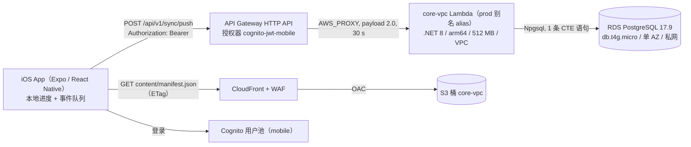

# DeveloperCards 系统设计学习手册 · 第一篇：手机端与它依赖的后端

> 代码基线：main `c0f3ac7`（2026-10-02，R26 合并之后：Snowflake 与 analytics outbox 已下线，迁移 045 已由 owner 运行）。
> 文中每个关于代码的事实都带 `路径:行号` 证据；点开就能对照。行号对应上面的 commit，之后代码变动可能让行号漂移。

## 怎么用这份手册

这一篇只讲**手机端**，以及手机直接依赖的那条后端链路：API Gateway → core-vpc Lambda → PostgreSQL / S3 / CloudFront。共 21 题，按三天分组：

| 天 | 题目 | 主题 |
| --- | --- | --- |
| Day 1 | Q1–Q8 | 整体架构、技术栈与发布形态、App 冷启动（cold start）、远程配置、内容分发、离线首启、本地存储与缓存 |
| Day 2 | Q9–Q16 | 一次评分的全过程、FSRS 调度、离线事件队列、同步触发、API 鉴权与路由、服务端幂等写入、增量拉取、多设备冲突 |
| Day 3 | Q17–Q21 | 登录与匿名数据、账号删除、隐私设计、冷启动与无 NAT 出网、发布与回滚 |

每题都是同一个结构，建议这样读：

1. 先只读 **一句话答案**，试着用自己的话复述。
2. 再读 **展开解释**，顺手点开一两个代码证据。
3. **为什么这样设计** 和 **代价与边界** 是面试追问最多的地方，最好能脱稿说出来。
4. **优化思考** 是建议，不是现状；面试时说"如果规模到 X，我会……"。
5. 最后不看答案做 **自测题**。

## 这份手册是怎么核实的

- 程序检查：每题小节齐全；每个 `路径:行号` 的文件存在、行号不越界（`check.py`）。
- 独立核验：每组由一个没看过写作过程的核验者逐条对照代码；它提出的问题再由另一个"反驳者"对照代码尝试推翻，只有推翻不了的才修改；修改后由第三个新上下文核对是否改对。
- 没能在代码里确认的说法统一标成"（未在代码中核实）"，并汇总在文末。

## Day 1 · 全局、启动、内容与本地数据

### Q1 这个产品是什么？一次学习请求从手机到数据库经过哪些组件？

**一句话答案（面试可直接说）**：DeveloperCards 是单人维护的开发者间隔重复（spaced repetition）闪卡 iOS App。打分先写本地，同步层批量发给 API Gateway（HTTP API），JWT 授权器（JWT authorizer）验完身份后交给 VPC 里的 .NET Lambda「core-vpc」，它用一条 SQL 写进 RDS PostgreSQL；卡片内容不走 API，从 S3 + CloudFront 下载。

**展开解释**：

1. 产品：手机端 + React 控制台 + .NET Lambda 后端，单人维护（`README.md:3-9`）；只做 iOS（`mobile/src/content/faq.ts:28`）。
2. 手机端：打分立即存本地进度，事件进 AsyncStorage 队列，eventId（UUID）做幂等键（idempotency key）（`mobile/src/sync/progressSync.ts:28-33`）；打分后防抖（debounce）10 秒（`mobile/src/sync/progressSync.ts:1737`），每批 25 条、最多 20 轮，发到 `/api/v1/sync/push`，超时 15 秒（`mobile/src/sync/progressSync.ts:1505-1516`、`mobile/src/sync/progressSync.ts:1557`）。
3. 主机：默认 `https://api.developercards.app`，网络失败时回退 execute-api 原始域名（`mobile/src/config/hosts.ts:11-12`、`mobile/src/api/apiClient.ts:195-218`）；401 时刷新 token 重放一次（`mobile/src/api/apiClient.ts:151-157`）。
4. 网关：`ANY /api/v1/sync/{proxy+}` 用 mobile 授权器（`infra/modules/api/gateway.tf:26`），校验手机用户池的 issuer 与 audience（`infra/modules/api/gateway.tf:204-214`）；限流（throttling）burst 40 / rate 20（`infra/modules/api/gateway.tf:95`）；集成到 prod 别名（alias），超时 30 秒（`infra/modules/api/gateway.tf:148-156`）。
5. Lambda：dotnet8、arm64、512 MB、超时 90 秒、保留并发（reserved concurrency）40、在 VPC 内（`infra/modules/api/core_vpc.tf:7-30`）。优先用网关已验证的 claims（`src_C/Shared/RecallSmith.Lambda.Common/Auth.cs:276-279`）；请求体超 1 MiB 拒绝（`src_C/Vpc/VpcFunction.cs:107`）；后缀路由交给 `ProgressEvents`（`src_C/Vpc/VpcFunction.cs:466-469`）。
6. 数据库：一条 CTE 语句插入 `user_progress_events`（`on conflict (event_id) do nothing`）并 upsert `user_progress`，不包显式事务（`src_C/Vpc/Runtime/ProgressEvents.cs:313-324`、`src_C/Vpc/Runtime/ProgressEvents.cs:436-444`、`src_C/Vpc/Runtime/ProgressEvents.cs:508`）；R26 后不再写 analytics outbox（`src_C/Tests/RecallSmith.Lambda.IntegrationTests/AnalyticsOutboxRetiredTests.cs:11-12`）。RDS：postgres 17.9、db.t4g.micro、单可用区（Single-AZ；可用区即 Availability Zone, AZ）、不公网（`infra/modules/data/rds.tf:22-28`、`infra/modules/data/rds.tf:36`、`infra/modules/data/rds.tf:44`）。
7. 内容：清单 `content/manifest.json` 走 ETag 条件请求（`mobile/src/content/deckRepository.ts:35`、`mobile/src/content/deckRepository.ts:1463-1480`）；CloudFront 挂 WAF，用 OAC（Origin Access Control）读 S3（`infra/modules/edge/cdn.tf:99`、`infra/modules/edge/cdn.tf:117-122`），桶 `core-vpc`（`infra/envs/prod/main.tf:102`）。

**为什么这样设计**：内容与写入分路（static content via CDN, personal writes via API；不是数据库主从读写分离，RDS 没开 Multi-AZ 也没有只读副本，`infra/modules/data/rds.tf:36`）——内容人人相同，放 CDN 便宜、可缓存、可离线；写路径只有个人进度，量小。网关先验 JWT，非法请求不唤醒 Lambda。手机端路由都在单体（monolith）core-vpc 里，单人运维部署面小。数据库只在私网。

**代价与边界**：VPC 内 .NET 冷启动（cold start）慢（128 MB 时约 3.7 秒，`infra/modules/api/core_vpc.tf:11`）；单可用区无自动故障转移（failover）；并发 40 是硬上限；Lambda 超时 90 秒而网关 30 秒断开，可能"客户端已失败、函数仍在写库"；每容器连接池（connection pool）默认 1（`src_C/Shared/RecallSmith.Lambda.Db/Pg.cs:48-49`）。后缀匹配可能误匹配，内部路由已改精确匹配（`src_C/Vpc/VpcFunction.cs:500-502`）。

**怎么验证**：`mobile/tests/unit/apiClientFallback.test.ts`、`mobile/tests/unit/hosts.test.ts`、`src_C/Tests/RecallSmith.Lambda.IntegrationTests/AuthBearerTests.cs`、`src_C/Tests/RecallSmith.Lambda.IntegrationTests/ProgressEventsIntegrationTests.cs`；`terraform validate` 会跑路由守卫（`infra/modules/api/gateway.tf:113-128`）。

**优化思考**：
- 建议：RDS 连接数逼近上限或出现连接超时时，可以加 RDS Proxy。代价：月费增加、多一跳延迟。
- 建议：需要承诺可用性或经历一次可用区故障后，可以开 Multi-AZ。代价：实例费约翻倍（未在代码中核实）。
- 建议：路由继续增长或发生一次误匹配事故时，可以把 `EndsWith` 链改成表驱动精确路由。代价：一次重构，需回归全部路由测试。

**自测题**：

1. 为什么进度走 API，卡片内容走 CloudFront？

答案
内容人人相同、读多写少，适合 CDN 缓存和 ETag，离线还能用本地缓存；进度是个人私有写入，需要 JWT 身份和数据库，只能走 API Gateway → core-vpc → RDS。

2. 一次 push 在服务端卡了 20 秒，会重复计数吗？

答案
客户端 15 秒中止（`mobile/src/sync/progressSync.ts:1557`），事件留在队列下次重推；就算第一次已写库，`user_progress_events` 以 event_id 冲突即忽略（`src_C/Vpc/Runtime/ProgressEvents.cs:444`），不会重复。

### Q2 手机端为什么选 Expo / React Native？原生二进制（EAS Build）和 OTA 更新（EAS Update）各管什么，runtimeVersion 起什么作用？

**一句话答案（面试可直接说）**：一个人、只做 iOS、控制台也是 React，所以选 Expo 托管工作流（managed workflow）的 React Native，原生工程不入库、构建时生成（Expo 称为 prebuild，即 Continuous Native Generation, CNG），签名交给 EAS。二进制管原生代码和原生配置，要过审核；OTA 只换 JS 包和资源，不用等审核。runtimeVersion 是两者的兼容钥匙，这里等于 App 版本号，OTA 只发给同 runtime 的二进制。

**展开解释**（仓库没有选型文档，动机部分由代码事实推出）：

1. 技术栈：expo ~54.0.20、react-native 0.81.5、react 19.1.0（`mobile/package.json:29`、`mobile/package.json:45-46`），引擎 Hermes（`mobile/app.json:3`）；控制台同为 React 19（`README.md:29`）。不提交 `ios/`、`android/`（`mobile/.gitignore:40-41`），原生改动用配置插件（config plugin）声明（`mobile/app.json:11-25`）。
2. 二进制（EAS Build）：原生模块如 Sentry、Skia、RevenueCat、Reanimated（`mobile/package.json:26-27`、`mobile/package.json:49-50`），bundle id、buildNumber、Info.plist（`mobile/app.json:31-40`）。`production` profile 商店分发、channel production（`mobile/eas.json:70-76`），`ios-build.sh` 调 `eas build`（`mobile/scripts/release/ios-build.sh:49`）；证书与 ASC 密钥存在 EAS（`mobile/scripts/release/README.md:20`）。
3. OTA（EAS Update）：JS 包与内联资源，例如入门卡包 JSON（`mobile/src/content/starter/index.ts:3-4`）。`ota.sh` 发到 channel production（`mobile/scripts/release/ota.sh:84`）；`EXPO_PUBLIC_*` 打包时内联（`mobile/src/config/hosts.ts:6-8`），所以先核对必需变量名（`mobile/scripts/release/ota.sh:23`、`mobile/scripts/release/ota.sh:37-47`）。
4. runtimeVersion：策略 `appVersion`，当前 2.0.0（`mobile/app.json:59-61`、`mobile/app.json:7`）。原因：带新原生模块的 JS 发给旧二进制，第一次 `require` 就崩（`docs/delivery/r16-issues/B01-native-foundation.md:7`）。因此有双 runtime 规则：2.0.0 从 main 发，1.9.0 热修（hotfix）从 `release/1.9.x` 发；runtime 低于 1.9.0 却依赖 Sentry 时以退出码 6 拒绝（`mobile/scripts/release/ota.sh:5-8`、`mobile/scripts/release/ota.sh:27-30`）。
5. App 内：回前台检查更新，10 分钟节流（throttle），只在 Home/Library/More/Welcome 重载（`mobile/src/updates/otaUpdateCheck.ts:8-10`、`mobile/src/updates/otaUpdateCheck.ts:48-85`）；冷启动检查用 expo-updates 默认策略（未在代码中核实），`app.json` 只配了 url（`mobile/app.json:62-64`）。同步请求带 `updateId`，后端知道客户端跑哪个 OTA（`mobile/src/sync/progressSync.ts:1523-1524`）。

**为什么这样设计**：单人维护，一套 TypeScript 覆盖 App 与控制台；JS 修复绕过审核排队；不维护原生工程，减少配置漂移。

**代价与边界**：原生改动必须构建加审核；多 runtime 并存要维护 release 分支；`staging-internal-release` 也在 production channel（`mobile/eas.json:55-58`），内部包会收到生产 OTA；裸 `eas update` 会发出空的 `EXPO_PUBLIC_*`（`mobile/scripts/release/README.md:33`）；OTA 不能改变 App 核心用途（App Store 规则，未在代码中核实）。

**怎么验证**：`mobile/tests/unit/otaUpdateCheck.test.ts`（节流、延迟到安全页）、`mobile/tests/unit/otaReleaseScript.test.ts`（缺变量退出 3、守卫退出 6、双 runtime 规则 `mobile/tests/unit/otaReleaseScript.test.ts:477-486`）、`mobile/tests/unit/releasePlumbing190.test.ts`；手动跑 `DRY_RUN=1 mobile/scripts/release/ota.sh "msg"`。

**优化思考**：
- 建议：某次 OTA 让崩溃率上升时，可以改分阶段发布（staged rollout），按 Sentry 崩溃率决定继续或回滚；EAS Update 支持按百分比 rollout（未在代码中核实），本仓库的发布命令目前是全量发（`mobile/scripts/release/ota.sh:84`）。代价：多一段观察期。
- 建议：版本号常变而原生依赖没变、用户被无谓切到新 runtime 时，可以改用 fingerprint 策略。代价：runtime 变化不再一眼可见。
- 建议：内部测试需要隔离时，可以给 `staging-internal-release` 单独 channel。代价：测试 OTA 要多发一次。

**自测题**：

1. 新增一个原生模块后，能只发 OTA 吗？

答案
不能。旧二进制没有这个模块，JS 一 `require` 就崩。要改版本号（即改 runtimeVersion）、重新 EAS Build 并过审，之后的 OTA 只发给新 runtime。

2. 用户答题时 OTA 下载完了，会立即重载吗？

答案
不会。更新标为 pending，只有当前路由在安全列表时才 `reloadAsync`，否则等下次回前台再判断（`mobile/src/updates/otaUpdateCheck.ts:53-61`、`mobile/src/updates/otaUpdateCheck.ts:75-83`）。

### Q3 App 冷启动时按什么顺序做了哪些事？哪些必须联网、哪些不需要？

**一句话答案（面试可直接说）**：冷启动不等网络：模块加载时配好登录、错误上报和统计，首屏 Splash 只读本地引导状态就跳转；远程配置、会话刷新、同步、内容清单都并行尽力而为，失败就用本地缓存或内置入门卡包。

**展开解释**：

1. 原生层先加载 JS 包（内置或已下载的 OTA；expo-updates 行为，未在代码中核实）。
2. 模块顶层（全本地）：Amplify（只读 `EXPO_PUBLIC_*`，`mobile/src/auth/amplify.ts:10-12`）、token 刷新器、OTA 检查器（`mobile/App.tsx:81-83`），通知、错误上报、Sentry、漏斗（`mobile/App.tsx:98-150`）；Sentry 开关读缓存配置（`mobile/src/telemetry/observability.ts:128-137`）。
3. 首次渲染：强制更新门（force-update gate，下文简称强更）初值 null，App 直接渲染（`mobile/src/config/forceUpdateGate.ts:25-29`）；初始页 Splash（`mobile/App.tsx:241`）读本地引导阶段后跳转（`mobile/src/screens/SplashScreen.tsx:13-21`）。
4. 并行副作用：远程配置网络优先、4.5 秒超时、失败读 last-good（`mobile/src/config/remoteConfig.ts:144-151`），再应用开关、必要时盖强更遮罩（`mobile/src/config/forceUpdateGate.ts:41-59`、`mobile/App.tsx:301`）；登录 `init()` 调 `fetchAuthSession`，离线时保留会话、回前台重试（`mobile/src/auth/authStore.ts:234-252`），拿到 token 立刻同步（`mobile/src/auth/authStore.ts:211-215`）；本地偏好、漏斗、前台监听（`mobile/App.tsx:196-223`）。
5. Home 分两段（stale-while-revalidate，先用旧数据、后台再校验）：第 1 段读缓存清单（没有缓存时才当场请求 CloudFront，`mobile/src/content/deckRepository.ts:545-547`）和已装卡组，先出首屏（`mobile/src/screens/HomeScreen.tsx:379-383`）；第 2 段在后台经 `loadDeckUpdates` → `checkManifestForUpdates` → `loadManifestPreferRemote` 用 ETag 条件请求重新校验 CloudFront 清单并刷新（`mobile/src/screens/HomeScreen.tsx:431-436`、`mobile/src/features/gacha/home/deckActionResolver.ts:135-136`、`mobile/src/features/gacha/home/deckActionResolver.ts:433`、`mobile/src/content/deckRepository.ts:460-463`、`mobile/src/content/deckRepository.ts:1463-1480`），失败就保留首屏（`mobile/src/screens/HomeScreen.tsx:441-443`）；两处都没有清单时用已装卡组（`mobile/src/features/gacha/home/deckActionResolver.ts:150-154`）。首装无网时用入门卡包（至少 30 张，`mobile/scripts/content/build-starter-packs.mjs:30`），联网后每 5 分钟最多试一次换完整卡组（`mobile/src/content/starterOffline.ts:23-27`、`mobile/src/content/starterOffline.ts:135-173`）。
6. 回前台：同步（隔 60 秒以上）、刷新登录、升级入门包、查 OTA（`mobile/src/sync/appStateSync.ts:5`、`mobile/App.tsx:212-220`）。

必须联网：进度推拉、登录与刷新 token、下载完整卡组、新配置、OTA。不需要：首屏与引导、已装卡组的学习打分、入门卡包、开关默认值。

**为什么这样设计**：旧实现导航前全屏转圈，离线要等满超时；强更"很少触发，等待却人人都有"（`mobile/src/config/forceUpdateGate.ts:17-23`）。同步层也是离线优先（`mobile/src/sync/progressSync.ts:26-29`）。

**代价与边界**：配置到达前，应被拦的用户可短暂使用（`mobile/src/config/forceUpdateGate.ts:31-33`）；开关在启动内从默认切到远端一次，读得早的组件拿到默认值；Sentry 启动时按上次缓存的配置决定是否初始化（`mobile/src/telemetry/observability.ts:128-137`）；本次启动拉到 sentry=false 会当场关闭客户端（`mobile/src/telemetry/observability.ts:214-217`、`mobile/src/telemetry/observability.ts:89-95`），sentry=true 要到下次冷启动才开启（`mobile/src/config/featureFlags.ts:24-25`）。

**怎么验证**：`mobile/tests/unit/forceUpdateGate.test.tsx`（`mobile/tests/unit/forceUpdateGate.test.tsx:60` 首次渲染为 null）、`mobile/tests/integration/offline-first-run.test.tsx`（`mobile/tests/integration/offline-first-run.test.tsx:465` 无网首跑、`mobile/tests/integration/offline-first-run.test.tsx:499` 联网升级）、`mobile/tests/unit/appStateSync.test.ts`、`mobile/tests/unit/starterUpgradeTriggers.test.ts`。手动：飞行模式全新安装走完引导。

**优化思考**：
- 建议：JS 初始化明显变长时，可以把入门卡包改懒加载——它现经 `mobile/App.tsx:58` 静态导入随启动解析（上限 300 KB，`mobile/scripts/content/build-starter-packs.mjs:32`），Home 已用动态导入（`mobile/src/screens/HomeScreen.tsx:80-84`）。代价：首次离线打开多一次异步加载。
- 建议：需要更快下发开关时，可以回前台限频重取配置（审计项 MSHELL-06，`docs/release-1.7.0-optimization-plan-2026-09-26.md:522`，未实现）。代价：多一次请求，开关会中途变化。

**自测题**：

1. 离线冷启动，而配置曾要求强更，会被拦吗？

答案
会，稍晚而已：读到 last-good，`minSupportedVersion` 仍高于当前版本，盖遮罩（`mobile/src/config/remoteConfig.ts:144-151`、`mobile/src/config/forceUpdateGate.ts:49-59`）；升级后自然解除。

2. 首屏为什么不等登录结果？

答案
Splash 只看本地引导阶段；`init()` 不被等待，数据按 userSub 分区在本地，登录结果到了再切分区并同步（`mobile/src/auth/authStore.ts:174-175`、`mobile/src/auth/authStore.ts:211-215`）。

### Q4 远程配置和功能开关（feature flags）怎么工作？默认值、拉取失败时怎么办、为什么放在 GitHub 而不是自己的后端？

**一句话答案（面试可直接说）**：一个放在 GitHub 仓库的 JSON，冷启动拉一次（4.5 秒超时），成功就存成 last-good，失败用 last-good，从没成功过就用代码里的冻结默认值；每个字段单独校验，坏字段只回退那一项。放 GitHub 是零成本、与自家后端解耦的捷径，审计已列为待迁移项。

**展开解释**：

1. 来源：`raw.githubusercontent.com` 上的 `recallsmith-config.json`（`mobile/App.tsx:108`），分 `ios`（强更）和 `features`（开关）两块（`mobile/src/config/remoteConfig.ts:19-51`）。
2. 拉取：带 `cache-control: no-cache`、不加时间戳（重新验证而非穿透源站），超时 4.5 秒（`mobile/src/config/remoteConfig.ts:100-117`）；仅 2xx 且是对象才缓存（`mobile/src/config/remoteConfig.ts:119-127`），键 `recallsmith:remote-config:last-good:v1`（`mobile/src/config/remoteConfig.ts:17`）；网络优先、缓存其次（`mobile/src/config/remoteConfig.ts:144-151`）。
3. 默认值：`DEFAULT_FEATURE_FLAGS` 冻结在代码里（`mobile/src/config/featureFlags.ts:38-55`）。紧急关闭开关（kill switch）默认开，如 `ceremony.seamOfLight`、`sentry`、`fsrs`；新功能默认关，如 `cardReport`、`anonFunnel`。
4. 合并：`applyRemoteFeatures` 逐字段 `typeof` 校验，数值查范围（`maxPerRun` 非负整数、`relatedCount` 0..5，`mobile/src/config/featureFlags.ts:132-135`、`mobile/src/config/featureFlags.ts:162-168`）；快照不变不通知（`mobile/src/config/featureFlags.ts:202`）；组件用 `useSyncExternalStore` 读（`mobile/src/config/featureFlags.ts:216-218`）。
5. 时机：每次启动只写一次，会话中不重取（`mobile/src/config/featureFlags.ts:92-97`）；在强更门提前返回之前应用，所以 null 配置会重置为默认（`mobile/src/config/forceUpdateGate.ts:44-46`）；强更只升不降（`mobile/src/config/forceUpdateGate.ts:49-52`）。
6. 运维：改 JSON 推到该仓库，下次冷启动生效（`docs/delivery/r20-issues/V11-notes.md:100-102`）。

**为什么这样设计**：代码没写选 GitHub 的理由，以下为推断：零成本零运维；与自家后端解耦，后端出事时开关仍可下发（如 2026-09-23 限流事故让请求全部 429，`infra/modules/api/gateway.tf:227-229`）；git 历史即变更记录与回滚。审计把它列为 P2，计划迁到 `cdn.developercards.app`（`docs/release-1.7.0-optimization-plan-2026-09-26.md:508`、`docs/release-1.7.0-optimization-plan-2026-09-26.md:846`）；`mobile/src/config/featureFlags.ts:94` 注释写 S3，与实际不符（`docs/release-1.7.0-optimization-plan-2026-09-26.md:313`）。

**代价与边界**：依赖个人账号；仓库可读，不放秘密；GitHub 侧缓存时长不受控（未在代码中核实）；无灰度发布（gradual rollout / canary），一改全员生效；无签名，只靠 TLS；新值要等冷启动。

**怎么验证**：`mobile/tests/unit/featureFlags.test.ts`（`mobile/tests/unit/featureFlags.test.ts:160` 坏字段独立回退、`mobile/tests/unit/featureFlags.test.ts:314` 加载器返回 null 时重置）、`mobile/tests/unit/featureFlagsSentry.test.ts`、`mobile/tests/unit/remoteConfig.test.ts`（`mobile/tests/unit/remoteConfig.test.ts:87` 非 2xx 不缓存、`mobile/tests/unit/remoteConfig.test.ts:118` 断网用 last-good）、`mobile/tests/unit/forceUpdateGate.test.tsx`。手动：`curl -s <配置 URL> | jq .features`。

**优化思考**：
- 建议：GitHub 访问不稳或账号有风险时，可以按审计计划 G48 迁到 S3 + CloudFront 短 TTL（目前 `mobile/App.tsx:108` 仍是 GitHub）。代价：要发 OTA 改地址，多一步发布和权限。
- 建议：需要先给少量用户开新功能时，可以按安装 ID 哈希做百分比灰度并加 `minAppVersion`。代价：配置和测试变复杂。
- 建议：担心配置被篡改时，可以给 JSON 签名、App 内验签（signature verification）。代价：密钥管理。

**自测题**：

1. 远端把 `mistakeBook.relatedCount` 写成 9、`mcq.enabled` 写成字符串 `"true"`，结果如何？

答案
9 超出 0..5、`"true"` 不是布尔值，两项各自回退默认（3 和 true），其他合法字段照常生效（`mobile/src/config/featureFlags.ts:124-127`、`mobile/src/config/featureFlags.ts:162-168`）。

2. 为什么 kill switch 默认开、新功能默认关？

答案
默认值就是拿不到配置时的行为。已上线能力（FSRS、Sentry、仪式渲染）离线首装也要正常，远端明确写 false 才关；涉及隐私或未就绪的新功能（问题上报、匿名漏斗）拿不到配置时必须关闭（`mobile/src/config/featureFlags.ts:48-54`）。

### Q5 一副卡组（deck）是怎么从后台发布、最后到手机上的？

**一句话答案（面试可直接说）**：控制台发布只插一行 PENDING 任务、把 jobId 投进 SQS；Worker 把卡片导出成以 buildId 命名的不可变构建（immutable build）放到 S3，再移动 `live_build_id` 指针、重建清单（manifest）；手机经 CloudFront 拉清单，版本不同就按"补丁 → 分块包 → 全量"安装。

**展开解释**：
1. 入队：`POST /api/v1/authoring/publish`（`src_C/Vpc/VpcFunction.cs:202-205`）先过 MCQ 与 AI QA 门禁（`src_C/Vpc/Authoring/Publish.cs:341-354`），15 分钟内有活动任务就返回旧 jobId（`src_C/Vpc/Authoring/Publish.cs:369-397`）。buildId = UTC 时间戳 + 4 字节随机数（`src_C/Vpc/Authoring/Publish.cs:78-84`），免费卡组的 S3 键为 `content/decks/{slug}/builds/{buildId}/deck.json`（付费卡组为 `premium/...`，写入 premium 桶；两个前缀均为默认值）（`src_C/Vpc/Authoring/Publish.cs:35-36`、`src_C/Vpc/Authoring/Publish.cs:406-416`），Worker 按键的第一段选桶（`src_C/Worker/S3/S3DeckUploader.cs:45-60`）。插入 PENDING 行后发 SQS，失败即标 FAILED（`src_C/Vpc/Authoring/Publish.cs:418-477`）；部分唯一索引保证每副卡组只有一个活动任务（`src_C/Vpc/Db/Migrations/021_decks_live_build_id.sql:29-31`）。
2. 队列与抢占：可见性超时（visibility timeout）3700 秒，收 3 次进死信队列（DLQ）（`infra/modules/worker/queue.tf:7-16`）；Worker 超时 615 秒、并发 2、batch_size 1（`infra/modules/worker/function.tf:11-15`、`infra/modules/worker/function.tf:45-54`）。条件 UPDATE 抢占 PENDING，重投递时 PROCESSING 超 11 分钟、否则超 15 分钟才接管（`src_C/Worker/Repositories/JobRepository.cs:19-28`）。
3. 构建：deck.json 的 version 强制等于 buildId（`src_C/Worker/Services/PublishJobProcessor.cs:97-102`），`/builds/` 下对象写一年 immutable 缓存头（`src_C/Worker/S3/S3DeckUploader.cs:18`、`src_C/Worker/S3/S3DeckUploader.cs:89-92`）；免费卡组再尽力生成每块 500 张的分块包（chunked package）和增量补丁（delta patch），补丁不比全量小就不传（`src_C/Worker/Content/ChunkPlanner.cs:10`、`src_C/Worker/Services/ContentArtifactsGenerator.cs:228-234`）。
4. 切换：一条 SQL 同时置 SUCCESS 并移动 `live_build_id`（`src_C/Worker/Repositories/JobRepository.cs:108-122`），随后进程内重建清单（`src_C/Worker/WorkerFunction.cs:113-116`）：指针优先、草稿剔除、每 slug 最多 4 条补丁边、`max-age=60`、IfMatch 条件写（`src_C/Shared/RecallSmith.Lambda.Db/ManifestBuilder.cs:249-264`、`src_C/Shared/RecallSmith.Lambda.Db/ManifestBuilder.cs:308-321`、`src_C/Shared/RecallSmith.Lambda.Db/ManifestBuilder.cs:438-440`）。CloudFront 以源站访问控制（OAC）读 S3（`infra/modules/edge/cdn.tf:90-124`）。
5. 手机：带 ETag 的条件请求（conditional GET），6 秒超时退回缓存（`mobile/src/content/deckRepository.ts:149`、`mobile/src/content/deckRepository.ts:1424-1498`）。无定时轮询，Home 每次聚焦时后台重验（`mobile/src/screens/HomeScreen.tsx:431-443`、`mobile/src/screens/HomeScreen.tsx:475-479`），免费卡组有更新每会话自动装一次（`mobile/src/features/gacha/home/deckActionResolver.ts:513-535`）。安装顺序见 `mobile/src/content/deckRepository.ts:749-870`，先写临时文件再覆盖（`mobile/src/content/deckRepository.ts:942-944`）。

**为什么这样设计**：路径带 buildId 永不覆盖，CDN 可长缓存且不用失效（发布链路无失效调用，失效只见于控制台等站点的部署脚本，如 `frontend/deploy.sh:30`）；唯一可变的是指针和清单，回滚就是挪指针（`src_C/Vpc/Authoring/DeckRollback.cs:11`、`src_C/Vpc/Authoring/DeckRollback.cs:91`）。异步队列让 API 不被导出耗时拖住；内容更新不经 App Review。

**代价与边界**：新版本要等清单缓存过期加下次 Home 聚焦才可见，无推送；分块包和补丁尽力而为，失败时退回全量（`src_C/Worker/Services/ContentArtifactsGenerator.cs:10-14`）；只留 4 条补丁边；`builds/` 当前版本对象无过期规则（`infra/modules/data/buckets.tf:86-94`），存储随发布增长。

**怎么验证**：`src_C/Tests/RecallSmith.Lambda.IntegrationTests/ManifestBuilderTests.cs:105`、`src_C/Tests/RecallSmith.Lambda.IntegrationTests/ManifestBuilderTests.cs:175`、`src_C/Tests/RecallSmith.Lambda.IntegrationTests/ManifestBuilderTests.cs:292`、`src_C/Tests/RecallSmith.Lambda.IntegrationTests/PublishEnqueueResilienceTests.cs:127`、`src_C/Tests/RecallSmith.Lambda.IntegrationTests/WorkerReceiveCountTests.cs`、`mobile/tests/unit/deckContentV3.test.ts`、`mobile/tests/unit/manifestConditionalGet.test.ts`、`mobile/tests/unit/chunkedInstall.test.ts`。

**优化思考**：
- 建议发布后只对 `content/manifest.json` 做 CloudFront 失效。触发条件：需要紧急下架，或作者反馈发布后久等不见。代价：超额按路径计费，多一个失败点。
- 建议清理"非 live 且超过 N 天"的旧构建。触发条件：内容桶达到数 GB，或单卡组构建上百个。代价：须保留回滚和补丁链用的构建，删错则回滚失效。

**自测题**：
1. 为什么 deck.json 能缓存一年，manifest.json 只缓存 60 秒？

答案
deck.json 路径含 buildId，内容永不变；manifest.json 是唯一可变的指针，缓存时长决定新版本多久可见。

2. SQS 发送失败为什么要立刻把任务标为 FAILED？

答案
否则会留下等不到 Worker 的 PENDING 行。15 分钟内重复点发布只会续用这个孤儿 jobId（`src_C/Vpc/Authoring/Publish.cs:369-397`）；之后部分唯一索引会让该卡组的新发布返回 409 PUBLISH_IN_PROGRESS（`src_C/Vpc/Authoring/Helpers.cs:102-107`），直到超级管理员手动调用 `POST /api/v1/admin/publish/reap`，把创建超过 10 分钟的 PENDING 行标成 FAILED（`src_C/Vpc/Authoring/PublishReaper.cs:11-36`、`src_C/Vpc/VpcFunction.cs:226`）。

### Q6 第一次打开、完全没网时 App 怎么还能学习？

**一句话答案（面试可直接说）**：JS 包里内置了 3 个入门包（starter pack），每个是线上构建按顺序截取的前缀；没网时把它写成临时 JSON，用 `file://` 地址走和线上完全相同的安装函数装进去；联网后在回到前台或 Home 聚焦时换成正式版本，进度因 stableUid 不变而保留。

**展开解释**：
1. 包的来源：脚本从线上 live 构建截取前缀，至少 30 张且覆盖第一课要用的 5 张非 MCQ 卡，三包合计 ≤300 KB，version 为 `<buildId>-starter`，totalCards 记完整卡组张数（`mobile/scripts/content/build-starter-packs.mjs:4-11`、`mobile/scripts/content/build-starter-packs.mjs:29-32`、`mobile/src/content/starter/aws-saa-c03.starter.json:6-7`）。静态 require 打进 JS bundle，可随 OTA 更新（`mobile/src/content/starter/index.ts:3-4`、`mobile/src/content/starter/index.ts:36-40`）。
2. 触发：Library、Draw 和第一课的 Session 在"本地没有卡组且清单拿不到或下载失败"时调用 `ensureStarterDeckInstalled`（`mobile/src/screens/LibraryScreen.tsx:187-212`、`mobile/src/screens/DrawScreen.tsx:430-433`、`mobile/src/screens/SessionCardScreen.tsx:566-575`）；Home 没有清单时改用本机安装元数据拼货架（`mobile/src/features/gacha/home/deckActionResolver.ts:148-154`）。
3. 安装：写到 `cacheDirectory`，调用 `installDeckAndInvalidate(slug, fileUri, pack.version, null)`，最后删临时文件（`mobile/src/content/starterOffline.ts:58-78`）。安装器对无 `?` 的短 URL 用 `FileSystem.downloadAsync`，清单缺失只记日志，sha256 为 null 则跳过，slug、stableUid、version 校验和元数据写入照常执行（`mobile/src/content/deckRepository.ts:704-705`、`mobile/src/content/deckRepository.ts:851-870`、`mobile/src/content/deckRepository.ts:898-954`）。
4. 升级：App 回到前台、Home 获得焦点都调 `upgradeStarterDecks`（`mobile/App.tsx:214-217`、`mobile/src/screens/HomeScreen.tsx:501-505`）；只处理 version 以 `-starter` 结尾的卡组，每 slug 5 分钟最多试一次（`mobile/src/content/starterOffline.ts:27`、`mobile/src/content/starterOffline.ts:135-173`）。后缀保证永远不等于线上 buildId，安装器不会误判已是最新（`mobile/scripts/content/build-starter-packs.mjs:15-16`、`mobile/src/content/deckRepository.ts:739-742`）。
5. 进度不丢：进度键只含 slug（`mobile/src/review/storage.ts:86-89`），完整卡组装上后缺的卡按 stage 0 补齐（`mobile/src/review/storage.ts:333-343`）。

**为什么这样设计**：首次打开最容易流失。`deckRepository.ts` 是冻结模块，入门包复用它唯一的安装入口，校验自动生效，不用维护第二条安装路径（`mobile/src/content/starterOffline.ts:5-9`）；包在 JS 里，刷新只要 OTA。

**代价与边界**：包是快照，线上改卡后要人工重跑脚本再 OTA（`mobile/scripts/content/build-starter-packs.mjs:19-20`）；只有 3 个卡组有包，其他卡组离线仍报错；`file://` 安装依赖 iOS `downloadAsync` 复制本地文件，仅有注释为据；三份 JSON 约 155 KB 常驻包体。

**怎么验证**：`mobile/tests/integration/offline-first-run.test.tsx:465`（全程无网走完第一课）、`mobile/tests/integration/offline-first-run.test.tsx:499`（联网后替换且保留进度）、`mobile/tests/unit/starterPacks.test.ts:40`、`mobile/tests/unit/starterPacks.test.ts:59`、`mobile/tests/unit/starterPacks.test.ts:67`、`mobile/tests/unit/starterUpgradeTriggers.test.ts:16`。

**优化思考**：
- 建议在 CI 比对入门包与线上 live 构建。触发条件：目标卡组每周多次发布，或包里出现线上已删的卡。代价：CI 要联网读 CDN，可能误报。
- 建议把升级也挂到网络恢复事件上。触发条件：数据显示用户久留学习页、替换明显滞后。代价：新增原生依赖，需要防抖。

**自测题**：
1. 为什么入门包的 version 必须加 `-starter` 后缀？

答案
若与线上 buildId 相同，安装器判定已是最新，完整卡组永远替换不了入门包。

2. 离线学了 5 张卡，联网升级后进度会丢吗？

答案
不会。进度按 slug 和 stableUid 存，包内卡片原样复制自线上构建，升级后只给新增的卡补 stage 0。

### Q7 手机本地数据存在哪里、怎么按用户隔离？匿名用户登录后数据怎么办？

**一句话答案（面试可直接说）**：按人区分的数据都在 AsyncStorage 的 `devcards:u:{sub}:` 前缀下，未登录用 `anon`；卡组文件按 Cognito sub 分目录。匿名期的复习事件进 `__pending__` 分区，登录时由新账号收养（adopt）并推送；进度投影（projection）不迁移，靠服务端合并后拉回重建；抽卡状态合并进账号（收藏并集、抽数累加）。

**展开解释**：
1. 存储位置（分区，partition）：
   - 进度投影与每日统计：`devcards:u:{sub|anon}:deck-progress:{slug}` 等（`mobile/src/review/storage.ts:13-24`、`mobile/src/review/storage.ts:64-67`、`mobile/src/review/storage.ts:86-96`）；其他子系统用 `getUserScopedKey` 共用同一前缀（`mobile/src/review/storage.ts:69-81`）。
   - 同步状态：事件队列、游标、远端缓存都在同一前缀下（`mobile/src/sync/progressSync.ts:154-190`、`mobile/src/sync/progressSync.ts:373-375`），队列上限 3000、溢出丢最旧并计数（`mobile/src/sync/progressSync.ts:389-414`）。
   - 卡组内容：`<documentDirectory>devcards-decks-v2/<userKey>/<slug>.json`，元数据键含 userKey，userKey 取 Amplify 会话的 sub（`mobile/src/content/deckRepository.ts:248-280`、`mobile/src/content/deckRepository.ts:1399-1402`）。清单缓存和设备 ID 是全局键（`mobile/src/content/deckRepository.ts:36`、`mobile/src/sync/progressSync.ts:197`）。
2. 谁决定分区：登录后 `setActiveUserSub` 写 `devcards:auth:activeUserSub:v1`，并直接刷新存储层内存值、绕过 1.5 秒 TTL（`mobile/src/auth/authStore.ts:174-175`、`mobile/src/sync/progressSync.ts:738-774`、`mobile/src/review/storage.ts:26-28`、`mobile/src/review/storage.ts:39-42`）。`progressScope` 只给内存缓存当键（`mobile/src/review/progressScope.ts:3-9`）。
3. 匿名到登录：无 token 时事件写 `__pending__`（`mobile/src/sync/progressSync.ts:377-387`、`mobile/src/sync/progressSync.ts:884-893`）；换人时先复制到账号队列（按 eventId 去重）、再清空 pending、再触发同步（`mobile/src/sync/progressSync.ts:613-656`、`mobile/src/sync/progressSync.ts:850-877`）。投影明确不迁移（`mobile/src/sync/progressSync.ts:601-604`）。抽卡状态的收养（`mobile/src/sync/drawStateSync.ts:274-297`、`mobile/src/auth/authStore.ts:177-181`）：收藏取并集、保底计数取较高值（`mobile/src/features/gacha/draw/drawStateStore.ts:377-398`），钱包和每包抽数在上限内累加（`mobile/src/features/gacha/rewards/rewardWallet.ts:225-228`、`mobile/src/features/gacha/rewards/deckWallet.ts:600-606`），再合并新卡账本（`mobile/src/features/gacha/rewards/newCardLedger.ts:250-259`）和错题本；每项合并后清掉对应的 anon 键，但钱包的已发放标记和每包抽数池的引导标记留在 anon 分区，防止之后的匿名期重复发放（`mobile/src/features/gacha/rewards/rewardWallet.ts:244-255`、`mobile/src/features/gacha/rewards/deckWallet.ts:621-630`）。卡组目录随 userKey 变，匿名期装的文件对新账号不可见，需重装（据 `mobile/src/content/deckRepository.ts:259-280`、`mobile/src/content/deckRepository.ts:586-588` 推断）。

**为什么这样设计**：同一设备换账号不串号（`mobile/src/review/storage.ts:17-21`）；服务端按 event_id 幂等写事件（`src_C/Vpc/Runtime/ProgressEvents.cs:436-444`），整批移交不会重复计数；投影可重建，没必要合并两份投影。代码假设个人设备上匿名复习者就是登录者（`mobile/src/sync/progressSync.ts:593-600`）。

**代价与边界**：共享设备上匿名复习会记到下一个登录者名下，代码写明接受此风险；首轮同步完成前，账号分区进度可能为空；身份来自三处（activeUserSub 键、Amplify 会话、authStore），离线初始化时 authStore 标为匿名却保留存储分区（`mobile/src/auth/authStore.ts:239-252`），可能短暂不一致；多账号设备重复下载卡组。

**怎么验证**：`mobile/tests/unit/progressSyncPendingAdoption.test.ts:184`、`mobile/tests/unit/progressSyncPendingAdoption.test.ts:240`、`mobile/tests/unit/progressSyncPendingAdoption.test.ts:252`、`mobile/tests/unit/gachaUserScope.test.ts:84`、`mobile/tests/unit/drawStateAdoption.test.ts:77`、`mobile/tests/unit/deckCache.test.ts:128`。

**优化思考**：
- 建议把三处身份推导收敛到一个模块。触发条件：Sentry 出现"登录后短暂看到空进度"，或多账号用户增多。代价：要改冻结的 `deckRepository.ts` 并补迁移测试。
- 建议登录时把 anon 目录的卡组文件移进账号目录。触发条件：用户抱怨登录后卡组要重下。代价：要重做付费门禁和版本校验。

**自测题**：
1. 为什么 adopt 要"先复制、后清空"？

答案
中途崩溃只会留下重复，重复被 eventId 去重和服务端 `on conflict (event_id) do nothing` 吸收；反过来会永久丢事件。

2. 匿名期的进度投影为什么不直接拷进账号分区？

答案
投影不是事实，合并两份投影易出错；事件可幂等移交，经服务端合并再拉回即可得到一致投影。

### Q8 本地缓存（卡组缓存、进度投影 projection）与真实数据源的关系是什么？读路径怎么保证快？

**一句话答案（面试可直接说）**：真实数据源有两条：内容来自 Postgres 导出的不可变构建，进度来自复习事件（本地队列到服务端 `user_progress_events`）。手机上的卡组文件、内存 deckCache、AsyncStorage 里的 deck-progress 都是可重建的派生副本；读路径只碰本地文件和内存，网络只做后台重验。

**展开解释**：
1. 内容链：本地卡组文件按 buildId 版本化；`resolveDeckBySlug` 每次整份读文件再 JSON.parse，大卡组约 0.6 MB（`mobile/src/content/deckCache.ts:3-6`、`mobile/src/content/deckRepository.ts:633-635`）。`deckCache` 按"scope::slug"做记忆化（memoization）：并发共享一个 Promise，TTL 10 分钟，最多 4 条，null 和失败不缓存（`mobile/src/content/deckCache.ts:19-20`、`mobile/src/content/deckCache.ts:43-83`）；安装统一走 `installDeckAndInvalidate`，成败都清缓存（`mobile/src/content/deckCache.ts:96-109`）。`useDeckSnapshot` 已封装好但暂无页面使用（`mobile/src/content/useDeckSnapshot.ts:1-4`）。免费卡组读取不等 `/entitlements`（`mobile/src/content/deckRepository.ts:611-625`）。
2. 进度链：评分先写事件、后存投影（`mobile/src/screens/SessionCardScreen.tsx:892-944`），代码明说队列是事实日志、进度只是投影（`mobile/src/sync/progressSync.ts:519-520`）。服务端按 event_id 去重写事件，`user_progress` 是服务端投影（`src_C/Vpc/Runtime/ProgressEvents.cs:436-444`、`src_C/Vpc/Runtime/ProgressEvents.cs:538-548`）。拉取先把所有卡组的行写进远端缓存，再合并进已装卡组（`mobile/src/sync/progressSync.ts:1398-1446`）；游标只在 cacheAllOk 时推进（`mobile/src/sync/progressSync.ts:1448-1459`），但挡不住缓存写失败，见"代价与边界"；后装的卡组用 `applyCachedRemoteProgress` 补（`mobile/src/sync/progressSync.ts:1836-1864`）。
3. 读得快：Home 先用缓存清单和本地文件渲染，再后台重验（stale-while-revalidate）（`mobile/src/screens/HomeScreen.tsx:378-444`）；事件队列有写穿透（write-through）内存缓存，评分时不再重新解析整个队列（3000 条时约 4.5 ms），写盘仍 await（`mobile/src/sync/progressSync.ts:442-450`、`mobile/src/sync/progressSync.ts:511-531`）；同版本 24 小时内不重写 deck-meta（`mobile/src/review/storage.ts:436-458`）。

**为什么这样设计**：离线优先，读不能依赖网络；派生数据可重建，可以放心缓存；单人运维，不必为手机维护服务端读模型。

**代价与边界**：入队写失败会被 writeQueue 吞掉（只作废缓存），recordReviewEvent 照常返回 eventId，界面察觉不到，随后照常保存投影，这次评分服务端永远不知道（`mobile/src/sync/progressSync.ts:540-547`、`mobile/src/sync/progressSync.ts:968-969`、`mobile/src/screens/SessionCardScreen.tsx:896-923`、`mobile/src/screens/SessionCardScreen.tsx:944`），"零丢失"只对写成功成立；setRemoteCache 吞掉 setItem 失败、getRemoteCache 出错只返回 {}，cacheAllOk 仍为 true（`mobile/src/sync/progressSync.ts:1024-1046`、`mobile/src/sync/progressSync.ts:1419-1424`），所以缓存写失败时游标照样推进：已装卡组仍直接合并这批行，不受影响；丢的是未安装卡组的远端缓存，之后装上时 `applyCachedRemoteProgress` 补不回这些行，只能等服务端这些行再次更新，或游标清空后全量重拉补回（自愈只在一个远端缓存键都没有时才清游标，`mobile/src/sync/progressSync.ts:1064-1081`）；deckCache 只在安装和 reload 时失效，退役清理只清抽卡缓存（`mobile/src/content/deckRepository.ts:1338`），推断已退役卡组最多还能读 10 分钟；拉取合并直接调 `resolveDeckBySlug`，不走缓存（`mobile/src/sync/progressSync.ts:1431`）。

**怎么验证**：`mobile/tests/unit/deckCache.test.ts:64`、`mobile/tests/unit/deckCache.test.ts:83`、`mobile/tests/unit/deckCache.test.ts:148`、`mobile/tests/unit/useDeckSnapshot.test.tsx:50`、`mobile/tests/unit/progressSyncQueueRace.test.ts:170`、`mobile/tests/unit/deckMetaUpsert.test.ts:94`、`mobile/tests/unit/multiDeviceSync.sim.test.ts:324`。

**优化思考**：
- 建议拉取合并改走 deckCache。触发条件：用户装了 4 副以上大卡组，性能追踪显示同步时掉帧。代价：要保证新装文件与缓存一致。
- 建议退役和门禁清理也让 deckCache 失效。触发条件：下架卡组后仍有用户能打开。代价：会打破 deckRepository 不依赖 deckCache 的边界，可改用回调注册。

**自测题**：
1. 为什么评分要先写事件再写投影？

答案
事件能重建投影，反之不行。中途被杀进程时，"有事件无投影"可由下次同步修复，"有投影无事件"服务端永远不知道。

2. deckCache 为什么不缓存 null？

答案
缺失多是暂时的，缓存 null 会让刚装好的卡组在 TTL 内读不到；失败同理，应允许重试。

## Day 2 · 学习、调度与同步

### Q9 用户给一张卡打分（Again/Hard/Good/Easy）的那一刻，代码里按顺序发生了什么？

**一句话答案（面试可直接说）**：先在内存里算出这张卡的新排期，再把这次评分作为"事实"事件写进本地队列并等它落盘，拿到 eventId 就用 10 秒防抖（debounce）挂一个后台同步定时器，然后才整体覆盖保存本地进度"投影"（projection）；网络请求不在评分的关键路径上，定时器 10 秒后才真正触发。

**展开解释**：

1. 防护：没有当前卡、上一次评分还在处理、答案没翻开等情况直接返回 `mobile/src/screens/SessionCardScreen.tsx:844-848`，随后 `setReviewing(true)` 防连点 `mobile/src/screens/SessionCardScreen.tsx:852`。学习检查（learning check）只认 again/hard 两档 `mobile/src/screens/SessionCardScreen.tsx:174-176`。
2. 纯计算：`buildRatedSessionState` 调 `scheduleWithFsrs`（错题本专注模式用 `scheduleFocusReview`），套上考试日上限，把新的 `CardProgress` 替换进整副牌的数组，并挑出下一张 `mobile/src/features/gacha/session/sessionReviewHelpers.ts:85-113`。
3. 先写事实：`await recordReviewEvent(...)` `mobile/src/screens/SessionCardScreen.tsx:896-917`。它生成 UUID 作 eventId、盖上 schedulerVersion `mobile/src/sync/progressSync.ts:944-966`，在队列锁里追加并等待 `AsyncStorage.setItem` `mobile/src/sync/progressSync.ts:571-588`。未登录时写进 `__pending__` 分区 `mobile/src/sync/progressSync.ts:891-893`。
4. 拿到 eventId 才调 `scheduleProgressSync('rating')` `mobile/src/screens/SessionCardScreen.tsx:918-920`，默认 10 秒后执行 `mobile/src/sync/progressSync.ts:1737`。
5. 错题本记录是不等待的（fire-and-forget）`mobile/src/screens/SessionCardScreen.tsx:924-938`。
6. 再写投影：`await saveDeckProgress(deck, 整个数组)` `mobile/src/screens/SessionCardScreen.tsx:944`，这是整键覆盖，键为 `devcards:u:{sub 或 anon}:deck-progress:{slug}` `mobile/src/review/storage.ts:645-655`、`mobile/src/review/storage.ts:64-67`、`mobile/src/review/storage.ts:86-89`。
7. 之后才是奖励结算、明日负载预测、试用卡数越线时弹升级框 `mobile/src/screens/SessionCardScreen.tsx:974-987`、会话 store、提醒、换下一张或跳 SessionSummary `mobile/src/screens/SessionCardScreen.tsx:947-1032`。例外：新手课（starter lesson）最后一张卡会等 `completeStarterLesson` 完成后改跳 Draw 领首包并提前 return，不进 SessionSummary `mobile/src/screens/SessionCardScreen.tsx:989-997`。两条路径最后都由 `finally` 解锁 `mobile/src/screens/SessionCardScreen.tsx:1033-1035`。

**为什么这样设计**：事件是事实、进度是投影（projection）。两次写之间被杀时，已入队的事件可以在下次同步时重建进度；反过来，进度存了而事件没有，服务器就永远不知道这次复习 `mobile/src/screens/SessionCardScreen.tsx:892-895`。界面只读本地存储，离线也能连续刷卡 `mobile/src/sync/progressSync.ts:26-29`；防抖把连续评分合成一次推送 `mobile/src/sync/progressSync.ts:41-42`。

**代价与边界**：`recordReviewEvent` 抛错时只打 `console.warn`，仍然保存投影 `mobile/src/screens/SessionCardScreen.tsx:921-923`，这时进度前进了、事件却丢了。每次评分至少串行两次磁盘写（队列 + 整副牌进度），牌越大写得越重。

**怎么验证**：`mobile/tests/integration/session-card-mistakes.screen.test.tsx:409-414` 用 `invocationCallOrder` 断言"事件 → 错题本 → 保存进度"的顺序；`mobile/tests/integration/session-card.screen.test.tsx`（评分到 SessionSummary、奖励参数）；`mobile/tests/integration/fsrs-review-flow.test.ts`（入队事件的 schedulerVersion 与 progressAfter）。

**优化思考**：

- 当单副牌达到数千张、低端机评分出现卡顿时，可以把进度改成按卡分键或 SQLite 单行更新。代价：一次存储迁移和回滚方案。
- 当出现"另一台设备少了复习"的反馈时，建议把 `recordReviewEvent` 失败上报 Sentry，而不只打 `console.warn`。代价：少量埋点。

**自测题**：

1. `recordReviewEvent` 什么时候返回 null？这时还会安排同步吗？

答案
缺 deckSlug 或 stableUid 时返回 null（`mobile/src/sync/progressSync.ts:940`）。handleRating 只在拿到 eventId 时调度同步（`mobile/src/screens/SessionCardScreen.tsx:918-920`），但仍会保存投影。

2. 如果 app 在事件落盘之后、`saveDeckProgress` 之前被杀，会怎样？

答案
事件已在队列里，本地进度是旧的，这张卡还会再出现。已登录时下次同步先推送，回前台等原因还会拉取（`mobile/src/sync/progressSync.ts:1606-1624`），服务器结果合并回本地，投影即恢复；未登录要等登录收养之后。

### Q10 复习调度算法为什么放在手机上？FSRS-5 是什么、和原来的固定阶梯（ladder）有什么区别，开关和上限是什么？

**一句话答案（面试可直接说）**：调度是纯函数，要离线可用、评分时要即时显示下次间隔，所以放在手机上；服务器只存结果并封顶 90 天。FSRS-5 用稳定性（stability）和难度（difficulty）两维记忆状态加实际经过天数，算出让回忆概率（retrievability）保持 0.9 的间隔；旧阶梯只按档位查固定天数表。

**展开解释**：

- 阶梯：固定间隔 `[1,2,4,8,15,30,60]` 天 `mobile/src/review/model.ts:53`。again 降两档、10 分钟后重来；hard 连续 3 次降一档、间隔乘 0.7；good 升一档；easy 升两档 `mobile/src/review/model.ts:114-136`。不看实际隔了多久。
- FSRS-5（Free Spaced Repetition Scheduler）以纯函数内置（vendored）：默认权重、目标保持率（desired retention）0.9、最大间隔 90 天、无随机抖动（fuzz）、只做长期调度 `mobile/src/review/fsrs.ts:3-7`、`mobile/src/review/fsrs.ts:29-34`。可回忆概率（retrievability）随天数衰减 `mobile/src/review/fsrs.ts:46-49`，间隔取它降到 0.9 的整天数，夹在 [1, 90] `mobile/src/review/fsrs.ts:51-55`。
- 适配层 `scheduleWithFsrs` 按真实经过天数计算 `mobile/src/review/fsrsScheduler.ts:110-113`；again 保留 10 分钟重学步 `mobile/src/review/fsrsScheduler.ts:124-126`；学习检查用 initState(hard) `mobile/src/review/fsrsScheduler.ts:108-109`、明天到期 `mobile/src/review/fsrsScheduler.ts:128`；仍写 stage 等阶梯字段给旧客户端和服务器 `mobile/src/review/fsrsScheduler.ts:4-8`。记忆状态只在 `fsrsAnchorAt === lastReviewedAt` 时可信，否则从间隔和失败次数推导 `mobile/src/review/fsrsScheduler.ts:58-84`。
- 开关：`features.fsrs.enabled` 默认 true `mobile/src/config/featureFlags.ts:53`，显式 false 才关 `mobile/src/config/featureFlags.ts:87-90`，关后走阶梯 `mobile/src/review/fsrsScheduler.ts:102`；远程配置每次启动只应用一次 `mobile/src/config/featureFlags.ts:92-97`、`mobile/src/config/forceUpdateGate.ts:45`。
- 上限：适配层再按 90 天视界封顶 `mobile/src/review/fsrsScheduler.ts:132`、`mobile/src/review/model.ts:70`，服务器入库再夹一次 `src_C/Vpc/Runtime/ProgressEvents.cs:202-205`，外层还有考试日上限 `mobile/src/features/gacha/session/sessionReviewHelpers.ts:89`。事件带 `fsrs-5` 或 `ladder-v1` 标签 `mobile/src/sync/progressSync.ts:142-144`。

**为什么这样设计**：离线优先，界面只读本地 `mobile/src/sync/progressSync.ts:26-29`；选择题判分后立刻预览排期，复用同一个调度器 `mobile/src/screens/SessionCardScreen.tsx:1083-1090`；单人运维，省掉每次评分的服务器计算。

**代价与边界**：稳定性/难度由 `scheduleWithFsrs` 写进 CardProgress `mobile/src/review/fsrsScheduler.ts:151-152`，随事件的 progressAfter 原样发给服务器 `mobile/src/sync/progressSync.ts:1553`；但服务器只从 progressAfter 读 nextReviewAt、lastSeenRevision、stage 三项 `src_C/Vpc/Runtime/ProgressEvents.cs:182-185`、`src_C/Vpc/Runtime/ProgressEvents.cs:207-210`、`src_C/Vpc/Runtime/ProgressEvents.cs:242`，事件表没有这两列，所以不入库 `src_C/Vpc/Runtime/ProgressEvents.cs:436-442`，拉取结构也没有 `mobile/src/sync/progressSync.ts:77-94`，换设备只能近似推导。权重用默认值；客户端可被篡改，服务器只能夹上限。

**怎么验证**：`mobile/tests/unit/fsrs.test.ts`（对齐 ts-fsrs 参考向量）；`mobile/tests/unit/fsrsScheduler.test.ts:71-76`（新卡 hard/good/easy 为 2/3/16 天，again 10 分钟）；`mobile/tests/unit/fsrsScheduler.test.ts:277-292`（开关关闭时与阶梯逐项相等）；`mobile/tests/integration/fsrs-review-flow.test.ts:102-149`（1、3、9 天 vs 阶梯 1、2、4 天）。

**优化思考**：

- 当用户累计数千条评分、实测保持率明显偏离 0.9 时，可以离线拟合个人权重再下发。代价：需要可回放事件、算力和回滚开关。
- 当多设备用户变多、出现"换设备后间隔跳变"的反馈时，建议在服务器端把 progressAfter 里已有的稳定性/难度入库，并在拉取时返回；客户端上传不用改。代价：一次迁移和更复杂的合并规则。

**自测题**：

1. 把 `features.fsrs.enabled` 改成 false，手机什么时候切回阶梯？已存的 FSRS 状态呢？

答案
下次冷启动（`mobile/src/config/featureFlags.ts:92-97`）。阶梯评分更新 lastReviewedAt 但保留 fsrs 字段，锚点对不上，以后重开 FSRS 时视为过期、从间隔重新推导（`mobile/src/review/fsrsScheduler.ts:50-57`）。

2. 一张新卡第一次答 Good，FSRS 和阶梯分别安排几天后？

答案
FSRS 是 3 天（`mobile/tests/unit/fsrsScheduler.test.ts:71-76`）；阶梯从 stage 0 升到 1，对应 2 天（`mobile/src/review/model.ts:53`、`mobile/src/review/model.ts:131-133`）。

### Q11 离线时评分记录怎么保证不丢？本地事件队列（outbox）的写入顺序、容量上限、丢弃策略和"什么情况下仍会丢"的诚实边界是什么？

**一句话答案（面试可直接说）**：每次评分作为带 UUID 的事件，在一把全局 Promise 锁里追加进按用户分区的 AsyncStorage 队列并等待落盘；服务器按 eventId 幂等，确认后才删。写盘失败、超过 3000 条、服务器拒收这三种情况仍会丢，且用户看不到。

（代码里叫 progress queue，与 R26 下线的服务端 analytics outbox 无关。）

**展开解释**：

1. 键：`devcards:u:{sub}:sync:progressQueue:v1` `mobile/src/sync/progressSync.ts:158-160`、`mobile/src/sync/progressSync.ts:373-375`；未登录用保留分区 `__pending__` `mobile/src/sync/progressSync.ts:387`。
2. 写入顺序：进锁 → 读队列（进程内缓存，冷启动只解析一次）→ 追加 → 超上限切掉最旧的 → 先更新缓存再等待 `setItem` → 记丢弃数 `mobile/src/sync/progressSync.ts:571-588`、`mobile/src/sync/progressSync.ts:540-547`。锁是一条 Promise 链，防止"确认删除"和"新评分追加"互相覆盖 `mobile/src/sync/progressSync.ts:549-565`。
3. 删除：每批前 25 条、最多 20 轮 `mobile/src/sync/progressSync.ts:1505-1511`，只删 accepted 和 duplicate 的 id `mobile/src/sync/progressSync.ts:1560-1563`。锁不跨网络请求，重复推送由服务器 `on conflict (event_id) do nothing` 吸收 `mobile/src/sync/progressSync.ts:567-570`、`src_C/Vpc/Runtime/ProgressEvents.cs:444`。
4. 容量：每分区 3000 条，丢最旧的，丢弃数另存一个键 `mobile/src/sync/progressSync.ts:395`、`mobile/src/sync/progressSync.ts:412-432`。登录时收养 pending 事件"先复制后清空"，崩溃只会重复不会丢（写盘失败另见下文），同样受 3000 上限 `mobile/src/sync/progressSync.ts:606-611`、`mobile/src/sync/progressSync.ts:637-644`。

**为什么这样设计**：队列是事实日志，故意不做延迟写（write-behind），"已确认却丢失"的窗口设为零 `mobile/src/sync/progressSync.ts:515-529`；上限防止 AsyncStorage 无限膨胀 `mobile/src/sync/progressSync.ts:400-401`。

**代价与边界（仍会丢的情况）**：

- `setItem` 被拒：只清缓存，事件丢失，`recordReviewEvent` 照样返回 eventId `mobile/src/sync/progressSync.ts:533-546`。收养时同理：写用户队列失败而清空 pending 成功，这批被收养的事件也会丢，因为 `writeQueue` 吞掉异常、不抛错 `mobile/src/sync/progressSync.ts:540-547`、`mobile/src/sync/progressSync.ts:640-644`。
- 离线评分超过 3000 次：最旧的被丢；计数只经 `getProgressSyncDebugState` 暴露 `mobile/src/sync/progressSync.ts:1795-1831`，除测试外没有界面调用它（grep 核实）。
- 服务器拒收的事件（如 TOO_LONG、BAD_EVENT_TIME）放进 duplicateEventIds 回执，客户端随即删除，只留服务器 warn 日志 `src_C/Vpc/Runtime/ProgressEvents.cs:277-283`。
- 一直不登录：事件停在 `__pending__`，共享设备上可能被别人收养 `mobile/src/sync/progressSync.ts:594-600`。卸载 App 也会清空（平台行为，未核实）。
- 每次追加仍序列化整个队列，写入成本随深度线性增长 `mobile/src/sync/progressSync.ts:515-517`。

**怎么验证**：`mobile/tests/unit/progressSyncQueueRace.test.ts`（删除与追加并发）；`mobile/tests/unit/progressSyncDropCounter.test.ts`（超上限丢最旧并计数）；`mobile/tests/unit/progressSyncPendingAdoption.test.ts`（含收养中途崩溃）。

**优化思考**：

- 当离线深度常超过约 1000 条、评分写入出现卡顿时，可以把队列改成分段键或 SQLite 追加表，每次只写新增一条。代价：旧键迁移，锁语义重做。
- 当出现"另一台设备少了复习"的反馈时，建议把丢弃数和写盘失败上报 Sentry 或放进调试菜单。代价：少量埋点。

**自测题**：

1. 为什么锁不覆盖"取出 → 推送 → 删除"全过程？

答案
持锁跨网络会让评分等请求。重复推送是安全的（eventId 是服务器幂等键），丢掉没推过的事件才不安全（`mobile/src/sync/progressSync.ts:567-570`）。

2. 触发 3000 条上限时丢哪一条？怎么知道发生过？

答案
丢最旧的（`mobile/src/sync/progressSync.ts:580-581`）。丢弃数持久化在 `sync:droppedEvents:v1`，由 `getProgressSyncDebugState` 的 droppedCount 读出（`mobile/src/sync/progressSync.ts:412-414`、`mobile/src/sync/progressSync.ts:1823-1825`）。

### Q12 什么时候触发同步？前后台切换、网络恢复、并发同步怎么防重入（reentrancy guard）？

**一句话答案（面试可直接说）**：同步只由事件触发：评分后 10 秒防抖、进后台立即推、回前台立即同步（60 秒节流），及登录、抽卡之后；没有网络恢复监听和失败重试。一个定时器加"在跑/待补跑"两个标志（`_inFlight`/`_pending`），把并发调用合并成"当前这次 + 最多一次补跑"。

**展开解释**：

1. 统一入口 `scheduleProgressSync`：每次先清旧定时器再设新的，reason 以最后一次为准 `mobile/src/sync/progressSync.ts:1756-1762`。默认延迟：rating 10 秒，pending_flush 300 毫秒，app_foreground/draw_committed/manual/token_set/user_changed 为 0，其他 650 毫秒 `mobile/src/sync/progressSync.ts:1736-1754`；没有 token 就不排 `mobile/src/sync/progressSync.ts:1718-1721`。
2. 前后台：`background` 立即推送；`inactive`（控制中心、通知栏）不做事；`active` 首次必触发，之后 60 秒内最多一次 `mobile/src/sync/appStateSync.ts:5-28`，挂在 `mobile/App.tsx:211-213`。
3. 其他触发：设置 token `mobile/src/sync/progressSync.ts:730-731`、`mobile/src/auth/authStore.ts:215`；换号 `mobile/src/sync/progressSync.ts:773`；收养 pending `mobile/src/sync/progressSync.ts:652`；抽卡提交后延迟 5500 + 1000 毫秒 `mobile/src/screens/DrawScreen.tsx:634`、`mobile/src/features/gacha/draw/ceremonyTimings.ts:50-53`；Home 登录态变化 `mobile/src/screens/HomeScreen.tsx:512`。
4. 网络恢复：`mobile/package.json` 没有 NetInfo 类依赖，`mobile/src` 也没有网络监听（grep 核实）。失败只记 lastError、不重排 `mobile/src/sync/progressSync.ts:1662-1673`；`apiJson` 只在网络错误时换备用地址重试一次 `mobile/src/api/apiClient.ts:195-218`。
5. 防重入：`runSyncNow` 在第一个 await 之前检查并设置 `_inFlight`，单线程 JS 下不会被打断；运行中再来的调用只设 `_pending`，结束时补排一次 pending_flush `mobile/src/sync/progressSync.ts:1639-1646`、`mobile/src/sync/progressSync.ts:1677-1681`。抽卡状态同步有自己的 `_inFlight`，在 `finally` 里跟着跑 `mobile/src/sync/drawStateSync.ts:305-313`、`mobile/src/sync/progressSync.ts:1694-1700`。拉取另有 2 秒节流和 reason 白名单 `mobile/src/sync/progressSync.ts:208`、`mobile/src/sync/progressSync.ts:1606-1616`。
6. 账号删除：`syncGuard` 的模块级开关让所有入口失效 `mobile/src/sync/syncGuard.ts:15-27`，删除前最多等在途请求 20 秒 `mobile/src/sync/stopSyncForDeletion.ts:15`、`mobile/src/sync/stopSyncForDeletion.ts:37-50`；`syncActivity` 只镜像抽卡同步的在途状态 `mobile/src/sync/syncActivity.ts:1-15`。

**为什么这样设计**：省流量。回前台最能说明"别的设备可能写过"，比按屏幕聚焦触发稀疏 `mobile/src/sync/progressSync.ts:1591-1599`；只让一处决定何时联网 `mobile/src/sync/progressSync.ts:1683-1686`。

**代价与边界**：恢复联网后若用户不评分、不切前后台，队列就一直等。运行中到来的触发会丢掉原 reason，变成 pending_flush，它不在拉取白名单里：只有补跑本身 `pushed === 0` 且距上次拉取满 2 秒才拉取 `mobile/src/sync/progressSync.ts:1573-1575`、`mobile/src/sync/progressSync.ts:1606-1616`。上次拉取时间在拉取结束时写入 `mobile/src/sync/progressSync.ts:1319`，补跑在上一轮结束时按 300 毫秒排上 `mobile/src/sync/progressSync.ts:1677-1681`，所以上一轮刚拉取过（白名单 reason，或它自己 `pushed === 0`）时，补跑通常只推送不拉取；只有上一轮没拉取（比如 rating 且推送了事件）时，补跑才可能因 `pushed === 0` 去拉取。连续评分间隔都小于 10 秒时推送一直后延。

**怎么验证**：`mobile/tests/unit/appStateSync.test.ts`（后台推送、忽略 inactive、60 秒节流）；`mobile/tests/unit/progressSyncPullTriggers.test.ts`（拉取白名单）；`mobile/tests/unit/accountDeletionSyncGuard.test.ts`（删除期间静默）。`_pending` 合并没有直接测试（`mobile/tests` 下 grep `pending_flush` 无结果）。

**优化思考**：

- 当出现"恢复联网后另一台设备迟迟看不到"的反馈时，可以加网络恢复监听，队列非空就同步。代价：NetInfo 是原生依赖，要发新二进制。
- 当 lastError 里瞬时 5xx 或超时占比高时，可以加有上限的指数退避（exponential backoff）重试。代价：请求变多，且要配合 syncGuard。

**自测题**：

1. 用户拉下控制中心再收起，会触发同步吗？

答案
拉下时是 inactive，被忽略；收起回到 active 时，若离上次前台同步不足 60 秒也不触发（`mobile/src/sync/appStateSync.ts:21-27`）。

2. 一次同步正在跑，期间又来了 3 次触发，一共跑几次？

答案
当前这次加最多 1 次补跑：定时器到点时若还在跑只设 `_pending`，结束后统一补排一次 pending_flush（`mobile/src/sync/progressSync.ts:1639-1646`、`mobile/src/sync/progressSync.ts:1677-1681`）。

### Q13 手机发出的一个 API 请求，经过 API Gateway 到 core-vpc 是怎么被鉴权和路由的？token 过期怎么办？

**一句话答案（面试可直接说）**：手机带 Cognito access token 作 Bearer 调 API；API Gateway 按"方法+路径"选路由，手机路由挂专用 JWT 授权器（JWT authorizer）先验签，通过后把 claims 随事件交给 core-vpc，core-vpc 优先信任这些 claims 再按路径分发。token 过期时，回前台主动刷新，遇 401 强制刷新并重放一次，refresh token 也失效才转为未登录。

**展开解释**：
1. 客户端：`apiJson` 默认先打主域名，网络错误时换 execute-api 备用域名重试一次；备用域名成功后会粘住（`activeBase`），之后的请求直接走备用域名，直到它失败才清空、下次回到主域名（`mobile/src/config/hosts.ts:11-12`、`mobile/src/api/apiClient.ts:195-219`）；有 token 就加 `Authorization: Bearer`（`mobile/src/api/apiClient.ts:116-119`），默认超时 12 s（`mobile/src/api/apiClient.ts:96`）。
2. 网关（API Gateway HTTP API）：路由键是 `$request.method $request.path`（`infra/modules/api/gateway.tf:134`）。`ANY /api/v1/sync/{proxy+}`、`ANY /api/v1/user/{proxy+}`、`GET /api/v1/me` 等挂 `mobile` 授权器（`infra/modules/api/gateway.tf:26-33`），只认手机用户池 issuer 和手机 app client（`infra/modules/api/gateway.tf:204-214`）；`$default`、`ANY /{proxy+}` 挂控制台授权器（`infra/modules/api/gateway.tf:18-19`），所以手机 token 打到未列出的路径会被网关拒绝。同步路由限流 burst 40 / rate 20（`infra/modules/api/gateway.tf:95`）。集成为 AWS_PROXY、payload 2.0、指向 core-vpc 的 prod 别名、超时 30 s（`infra/modules/api/gateway.tf:148-156`）。
3. core-vpc：先读 `requestContext.authorizer.jwt.claims`，没有才用随包的 JWKS 在进程内验签（`src_C/Shared/RecallSmith.Lambda.Common/Auth.cs:244-267`、`src_C/Shared/RecallSmith.Lambda.Common/Auth.cs:276-305`、`src_C/Shared/RecallSmith.Lambda.Common/JwtVerifier.cs:44-47`）。然后 OPTIONS 直接 200、正文超 1 MiB 拒绝、agent 策略（`src_C/Vpc/VpcFunction.cs:87-90`、`src_C/Vpc/VpcFunction.cs:107`、`src_C/Vpc/VpcFunction.cs:111-112`），再走 `EndsWith` 后缀匹配，push/pull 在 `src_C/Vpc/VpcFunction.cs:466-474`；内部 HMAC 路由用 `RouteMatcher` 逐段精确匹配防绕过（`src_C/Vpc/VpcFunction.cs:500-502`、`src_C/Shared/RecallSmith.Lambda.Common/RouteMatcher.cs:7-28`）；都不中回 404（`src_C/Vpc/VpcFunction.cs:545`）。处理函数调 `RequireUser`：token 被拒 401，无 sub 403（`src_C/Shared/RecallSmith.Lambda.Common/Auth.cs:458-470`）。
4. 过期：手机 access token 60 分钟、refresh token 90 天（`infra/modules/identity/cognito.tf:174`、`infra/modules/identity/cognito.tf:185`、`infra/modules/identity/cognito.tf:188-192`）。主动：回前台调 `refreshAuthOnForeground`（`mobile/App.tsx:214-215`、`mobile/src/auth/freshToken.ts:64-73`）。被动：带 token 的请求遇 401，调注入的刷新器（forceRefresh），拿到不同的新 token 就重放一次（`mobile/src/api/apiClient.ts:147-157`、`mobile/src/auth/freshToken.ts:75-77`）。并发刷新共用一个 promise（`mobile/src/auth/freshToken.ts:21-23`）；网络错误保持会话（`mobile/src/auth/freshToken.ts:29-31`）；Amplify 不再给 token 才 `markSessionExpired`，转匿名（`mobile/src/auth/freshToken.ts:37-41`、`mobile/src/auth/authStore.ts:281-293`），之后的打分进 `__pending__` 分区等下次登录（`mobile/src/sync/progressSync.ts:891-893`）。

**为什么这样设计**：网关验签，坏 token 不触发 Lambda、进不了 VPC；core-vpc 所在 VPC 没有 NAT 出网，公钥只能随包（`src_C/Shared/RecallSmith.Lambda.Common/JwtVerifier.cs:44-47`）；进程内验签留作纵深防御（defense in depth）。单人运维，一个 Lambda 内代码分发最省事。

**代价与边界**：后缀匹配对顺序敏感，新路由可能被旧后缀吞掉；网关与代码各有一份授权名单，要手工保持一致（`infra/modules/api/gateway.tf:12-16`）。只重放一次，刷新失败即登出。网关拒绝时回网关自己的 401 正文，不是 Lambda 信封（仓库文档：`docs/delivery/r16-issues/E08-gateway-and-cognito.md:17`）。

**怎么验证**：`mobile/tests/unit/apiClientRefresh.test.ts`、`mobile/tests/unit/freshToken.test.ts`、`mobile/tests/unit/apiClientFallback.test.ts`；服务端 `src_C/Tests/RecallSmith.Lambda.IntegrationTests/AuthBearerTests.cs`（过期 401、网关 claims 优先）、`src_C/Tests/RecallSmith.Lambda.IntegrationTests/JwtVerifierTests.cs`。手动：不带 token `curl -i https://api.developercards.app/api/v1/me`，应得 401。

**优化思考**：
- 建议把 `EndsWith` 链换成精确路由表。触发：路由继续增长或出现一次后缀遮蔽事故。代价：重写加回归测试，指标标签要兼容。
- 可以在 token 快到期时预刷新。触发：日志里"401 后重放"占比明显（如 >1%）。代价：多些 Cognito 调用。
- 若要即时封号，可加短 TTL 拒绝名单。触发：出现需立刻踢人的滥用。代价：每请求多一次查表。

**自测题**：
1. 手机 token 调 `GET /api/v1/admin/decks` 会怎样？

答案
该精确路由挂 agent 授权器（控制台用户池），issuer/audience 对不上，网关直接 401，不进 core-vpc（`infra/modules/api/gateway.tf:58`、`infra/modules/api/gateway.tf:192-202`）。

2. 为什么 401 只重放一次，且只对带 token 的请求？

答案
防止刷新失败时死循环和放大流量；没带 token 的 401 是"需要登录"，刷新也没用（`mobile/src/api/apiClient.ts:147-150`）。

### Q14 同步推送（push）在服务端怎么做到"重复推送无害"且"一次往返写完"？讲清 event_id 幂等、单条 SQL 里的各个 CTE 分别做什么（R26 之后是 6 个 CTE）。

**一句话答案（面试可直接说）**：每次打分在手机上生成 UUID 作 event_id，服务端把它当事件表主键，`INSERT … ON CONFLICT (event_id) DO NOTHING RETURNING` 只让新事件进入后续计算，重发不会重复计数（幂等，idempotency）；整次写入是一条含 6 个 CTE（Common Table Expression）的 SQL，一次往返，单语句天然原子。

**展开解释**：
1. 来源：`recordReviewEvent` 生成 `Crypto.randomUUID()` 并先写本地队列（`mobile/src/sync/progressSync.ts:945`、`mobile/src/sync/progressSync.ts:968`）；每批 25 条、最多 20 轮调 `POST /api/v1/sync/push`（`mobile/src/sync/progressSync.ts:1505`、`mobile/src/sync/progressSync.ts:1511`、`mobile/src/sync/progressSync.ts:1516`）。
2. 校验：要求登录、只收 POST、每批 1–200 条（`src_C/Vpc/Runtime/ProgressEvents.cs:80-83`、`src_C/Vpc/Runtime/ProgressEvents.cs:113-115`）；eventId 必须是 UUID（`src_C/Vpc/Runtime/ProgressEvents.cs:133-139`）。有合法 id 却被拒的也放进 `duplicateEventIds`，否则老客户端队列卡死（`src_C/Vpc/Runtime/ProgressEvents.cs:277-280`）。
3. 6 个 CTE（`src_C/Vpc/Runtime/ProgressEvents.cs:422-590`）：
   - `ensure_user`：upsert `users` 父行；外键在语句末尾检查，CTE 先后无关（`src_C/Vpc/Runtime/ProgressEvents.cs:423-434`、`src_C/Vpc/Runtime/ProgressEvents.cs:326-334`）。
   - `ins`：插入 `user_progress_events`，冲突跳过，RETURNING 只给出真正新插入的行（`src_C/Vpc/Runtime/ProgressEvents.cs:435-453`）；event_id 是主键（`src_C/Vpc/Db/Migrations/001_init.sql:144`）。
   - `agg`：按（用户, deck, 卡）数新事件 `inc`、取最大事件时间（`src_C/Vpc/Runtime/ProgressEvents.cs:454-461`）。
   - `last_row`：`DISTINCT ON` 每卡取 `event_time desc, event_id desc` 的一行，并 join 按 event_id 去重的梯级 VALUES 列表（`src_C/Vpc/Runtime/ProgressEvents.cs:462-492`、`src_C/Vpc/Runtime/ProgressEvents.cs:412-420`）。
   - `merged`：把计数和最新一行拼成每卡一行（`src_C/Vpc/Runtime/ProgressEvents.cs:493-506`）。
   - `upsert`：写投影表 `user_progress`，冲突时次数相加、"只增"列取 greatest、结论四列按后写者胜整体决定（`src_C/Vpc/Runtime/ProgressEvents.cs:507-585`，见 Q16）。
   最后只返回新插入的 id（`src_C/Vpc/Runtime/ProgressEvents.cs:586-589`）。
4. 响应：`acceptedEventIds` 为新插入，`duplicateEventIds` 为其余加被拒（`src_C/Vpc/Runtime/ProgressEvents.cs:606-611`）；客户端两者都出队（`mobile/src/sync/progressSync.ts:1560-1563`）。重发事件在 `ins` 就被吞掉，`agg`/`upsert` 看不到，次数不会多加。
5. R26 后不再有 outbox CTE（`src_C/Vpc/Db/Migrations/045_retire_content_intelligence.sql:4-5`），测试断言 SQL 不含 `analytics_event_outbox`（`src_C/Tests/RecallSmith.Lambda.IntegrationTests/ProgressEventsSingleStatementTests.cs:434-435`）。

**为什么这样设计**：超时后手机无法确认是否已提交，只能重发，幂等让"至少一次"等效于"恰好一次"。BEGIN/upsert/COMMIT 原本各是一次跨 VPC 往返，实测语句 19.9 ms、外壳却要 30.6 ms，故并成一条（`src_C/Vpc/Runtime/ProgressEvents.cs:313-324`）。

**代价与边界**：event_id 全局唯一而非按用户，别的用户用同一 id 会被当重复吞掉（`src_C/Tests/RecallSmith.Lambda.IntegrationTests/ProgressEventsIntegrationTests.cs:205-234`）。次数相加使合并本身不幂等，幂等全靠 event_id 去重（`src_C/Tests/RecallSmith.Lambda.IntegrationTests/ProgressMergeTests.cs:125`）。被拒事件以"重复"名义被客户端删掉，只留 warn 日志（`src_C/Vpc/Runtime/ProgressEvents.cs:281-284`）。绑定参数随批量线性增长：每条事件 23 个在事件 VALUES 行（`src_C/Vpc/Runtime/ProgressEvents.cs:349-373`），另加 2 个在梯级 VALUES 列表（按 event_id 去重，`src_C/Vpc/Runtime/ProgressEvents.cs:412-420`），再加 5 个批级参数（`src_C/Vpc/Runtime/ProgressEvents.cs:335-344`）；200 条一批约 5005 个绑定参数。

**怎么验证**：`src_C/Tests/RecallSmith.Lambda.IntegrationTests/ProgressEventsIntegrationTests.cs`（重放 9 次计数不变、跨批重复不重算、全局幂等）、`src_C/Tests/RecallSmith.Lambda.IntegrationTests/ProgressEventsSingleStatementTests.cs`（恰好一条语句、无 BEGIN/COMMIT、并发不死锁）、`src_C/Tests/RecallSmith.Lambda.IntegrationTests/ProgressEventsPerEventTests.cs`、`src_C/Tests/RecallSmith.Lambda.IntegrationTests/AnalyticsOutboxRetiredTests.cs`。它们用 Testcontainers 起 Postgres（`src_C/Tests/RecallSmith.Lambda.IntegrationTests/IntegrationTestBase.cs:7`），需本机 Docker。

**优化思考**：
- 事件表只增不删。建议在行数到千万级或 `statementMs` p99 明显上升时按时间分区或归档到 S3。代价：主键要含分区键，event_id 全局唯一要另行保证。
- 若发现跨用户 event_id 冲突，可把幂等键改为 (user_sub, event_id)。代价：主键迁移、`ON CONFLICT` 目标变化。
- 若耗时随批量线性上涨，可用数组参数加 `unnest` 代替逐行 VALUES。代价：重写 SQL 与预编译语句测试。

**自测题**：
1. push 超时未收到响应，客户端原样重发，服务器会怎样？

答案
若第一次已提交，第二次 `ins` 全部冲突、不返回行，`agg`/`upsert` 无输入，次数不变；响应把这些 id 列入 `duplicateEventIds`，客户端出队。

2. 去掉 BEGIN/COMMIT 后为何仍"要么全成要么全不成"？

答案
单条语句本身原子；所有 CTE（含没被引用的 `ensure_user`）都在这条语句里执行完，外键在末尾检查（`src_C/Vpc/Runtime/ProgressEvents.cs:321-334`）。

### Q15 同步拉取（pull）怎么做增量？手机拿到服务端进度后怎么和本地合并？

**一句话答案（面试可直接说）**：拉取读投影表 `user_progress`（每卡一行），不读事件流；服务器按 (updated_at, deck_slug, stable_uid) 做键集分页（keyset pagination），每页最多 5000 行并返回游标（cursor）；手机最多连拉 20 页，每页先整页写入本地缓存，再并入本地（远端最后复习时间更新就采用；时间相同但 due 不同则采用远端 due 和梯级），缓存全部成功才推进游标。

**展开解释**：
1. 何时拉：前台、抽卡提交、手动、换 token、换用户，或本轮没推出事件；两次至少隔 2 s（`mobile/src/sync/progressSync.ts:1606-1616`、`mobile/src/sync/progressSync.ts:208`）。请求同时带新游标和旧毫秒游标，兼容回滚的服务端（`mobile/src/sync/progressSync.ts:1335-1340`）。
2. 服务端：`limit` 夹到 1..5000（`src_C/Vpc/Runtime/ProgressGet.cs:26`）；有 cursor 用行比较 `(updated_at, deck_slug, stable_uid) > (…)`，优先于 `sinceMs`（`src_C/Vpc/Runtime/ProgressGet.cs:73-87`），按同一元组升序（`src_C/Vpc/Runtime/ProgressGet.cs:99`），索引 `idx_progress_user_keyset` 支撑（`src_C/Vpc/Db/Migrations/012_sync_keyset_index.sql:19-20`）。游标精确到微秒：同批 push 共享一个 `now()`，毫秒取整会重发或漏行（`src_C/Vpc/Runtime/ProgressGet.cs:37-42`）。`hasMore` 即行数等于 limit，非空页都给 `nextCursor`（`src_C/Vpc/Runtime/ProgressGet.cs:106-119`），格式是 base64url 的 JSON（`src_C/Vpc/Pagination/KeysetCursors.cs:92-100`）。
3. 客户端每页：先把所有 deck 的行写入按用户分区的远端缓存（`mobile/src/sync/progressSync.ts:1398-1425`），再只合并已安装 deck 里存在的卡（`mobile/src/sync/progressSync.ts:1427-1446`）；缓存全成功才推进游标，否则停止（`mobile/src/sync/progressSync.ts:1448-1462`）。游标被 400 拒绝就清掉改用 `sinceMs`（`mobile/src/sync/progressSync.ts:1349-1369`）；上限 20 页（`mobile/src/sync/progressSync.ts:1299`）。
4. 合并（merge）：同卡多行按 (updatedAt, lastReviewedAt, nextReviewAt, srsStage, uid) 全序选一行，与顺序无关（`mobile/src/sync/progressSync.ts:1123-1135`）；due 再夹 90 天（`mobile/src/sync/progressSync.ts:1155-1157`）；远端时间更新则采用复习时间、due、梯级（`mobile/src/sync/progressSync.ts:1230-1242`）；时间相同但 due 不同只采用 due 和梯级（`mobile/src/sync/progressSync.ts:1245-1259`）；内容修订降级后本地日程优先（`mobile/src/sync/progressSync.ts:1226-1235`）；本地没有的卡直接补（`mobile/src/sync/progressSync.ts:1265-1281`）。

**为什么这样设计**：拉投影，新设备不用重放事件；键集分页比 offset 稳定；先缓存后推进游标保证至少应用一次，重复行由合并吸收。`sinceMs` 逐字保留，因为已上架旧版依赖它（`src_C/Vpc/Runtime/ProgressGet.cs:88-97`）。

**代价与边界**：`updated_at` 是事务开始时的 `now()`（`src_C/Vpc/Runtime/ProgressEvents.cs:526`、`src_C/Vpc/Runtime/ProgressEvents.cs:583`）。从代码推断：并发写入若提交顺序与 `now()` 相反，游标可能越过晚提交、时间戳更小的行，要等该卡再更新才补上（未见测试覆盖）。缓存所有 deck 占存储；单次上限 20×5000 行，余下留到下次（`mobile/src/sync/progressSync.ts:1293-1297`）。

**怎么验证**：`mobile/tests/unit/progressSyncPullPagination.test.ts`（三页排水、坏游标自愈、20 页上限）、`mobile/tests/unit/progressSyncPullTriggers.test.ts`、`mobile/tests/unit/multiDeviceSync.sim.test.ts`、`mobile/tests/unit/revisionDemotionSync.test.ts`；服务端 `src_C/Tests/RecallSmith.Lambda.IntegrationTests/ProgressEventsIntegrationTests.cs` 的 `ProgressGet_EchoesNullStageForRowsWrittenBefore013`。运行：`cd mobile && npm run test:unit`。

**优化思考**：
- 若出现"另一台设备看不到某次复习"且查明是并发提交，可以让游标回退一个小窗口（如 1 s）靠合并幂等吸收重复，或改用单调序列号。代价：多拉少量重复行，或一次迁移。
- 若本地存储告警，可只缓存已安装 deck，安装时按 `deckSlug` 拉（服务端已支持，`src_C/Vpc/Runtime/ProgressGet.cs:67-71`）。代价：安装时多一次请求。

**自测题**：
1. 为什么游标用微秒而不用返回的 `updatedAtMs`？

答案
同批 push 的行共享一个 `now()`；毫秒边界与真实值差几微秒就会整批重发或跨页漏行（`src_C/Vpc/Runtime/ProgressGet.cs:37-42`）。

2. 某页写缓存失败，为什么不推进游标？

答案
推进后这些行再也拉不到；不推进则下次重拉，合并对重复行幂等（`mobile/src/sync/progressSync.ts:1448-1462`）。

### Q16 两台设备同时复习同一张卡、或手机时钟不准时会怎样？last-writer-wins 的具体规则、时钟夹紧（clamp）和已知会丢数据的情形。

**一句话答案（面试可直接说）**：每张卡的结论（评分、due、梯级、调度器版本）按客户端复习时间做后写者胜（last-writer-wins, LWW）：同批平局看 event_id，跨请求平局后到者赢；次数总是相加，事件都留在事件表。客户端时间超前 5 分钟以上被夹到"服务器现在 + 5 分钟"，落后则不校正。

**展开解释**：
1. 时间来源：`event_time` 依次取客户端 `eventTimeMs`、`reviewedAtMs`；缺失、非正或无法解析的值被 `OptionalMs` 当作没有，两者都没有可用值才退回服务器当前时间（`src_C/Vpc/Runtime/ProgressEvents.cs:159-162`、`src_C/Vpc/Runtime/ProgressEvents.cs:670-686`）；客户端发的是打分时的本机时间（`mobile/src/sync/progressSync.ts:898`、`mobile/src/sync/progressSync.ts:1542-1543`）。
2. 规则：批内 `last_row` 按 `event_time desc, event_id desc` 取一行（`src_C/Vpc/Runtime/ProgressEvents.cs:491`）；跨请求 `upsert` 以 `excluded.last_reviewed_at >= 现值` 决定结论四列（`src_C/Vpc/Runtime/ProgressEvents.cs:538-576`），相等时后到者赢（`src_C/Vpc/Runtime/ProgressMerge.cs:29-37`）。次数相加，复习时间与修订号取 greatest（`src_C/Vpc/Runtime/ProgressEvents.cs:531-536`、`src_C/Vpc/Runtime/ProgressEvents.cs:578-581`）。四列共用一个条件，免得梯级与 due 来自不同设备（`src_C/Vpc/Runtime/ProgressEvents.cs:550-565`）。
3. 夹紧：事件时间上限为服务器 now + 5 min（`src_C/Vpc/Runtime/ProgressEvents.cs:179-180`）；due 夹在事件时间到其后 90 天之间（`src_C/Vpc/Runtime/ProgressEvents.cs:188-191`、`src_C/Vpc/Runtime/ProgressEvents.cs:202-205`），拉取端再夹一次（`mobile/src/sync/progressSync.ts:1155-1157`）。没有下限；缺失、非正或无法解析的 `eventTimeMs`/`reviewedAtMs` 退回服务器当前时间。例外是 0 到 1 之间的小数（如 `0.5`）：`OptionalMs` 先过了 `d > 0` 再向下取整成 0，于是会走到 `BAD_EVENT_TIME` 拒绝分支；代码注释说这个分支"走不到"，并不完全对（`src_C/Vpc/Runtime/ProgressEvents.cs:164-170`、`src_C/Vpc/Runtime/ProgressEvents.cs:678-679`）。
4. 已知会丢数据的情形（前三条丢的是结论，事件行仍在；最后一条是事件本身丢失）：
   - 同一毫秒分两次推送（事件行仍在）：取决于到达顺序（`mobile/tests/unit/multiDeviceSync.sim.test.ts:631-673`）。
   - 时钟慢（事件行仍在）：最新复习时间偏小，输给别的设备更早的复习，随后拉到远端行覆盖本地日程（由 `src_C/Vpc/Runtime/ProgressEvents.cs:538-548` 与 `mobile/src/sync/progressSync.ts:1230-1242` 推断）。
   - 时钟快超 5 分钟（事件行仍在）：同批事件夹到同一边界，平局由随机 UUID 决定（`src_C/Vpc/Runtime/ProgressEvents.cs:475-484`）；本地 `lastReviewedAt` 在"未来"（`mobile/src/review/model.ts:142`），该设备不再采用远端结果（推断）。
   - 事件本身丢失（非时钟原因，服务器从未收到，事件表里没有）：客户端队列超过 3000 条时切掉最旧的事件（`mobile/src/sync/progressSync.ts:395`、`mobile/src/sync/progressSync.ts:571-587`）；入队写盘失败时该事件丢失（`mobile/src/sync/progressSync.ts:540-547`）。

**为什么这样设计**：服务器不调度（`src_C/Vpc/Runtime/ProgressEvents.cs:245-246`），只能信客户端时间；离线时到达顺序不等于发生顺序。超前就夹紧而不拒绝：复习确实发生过，而 greatest 不可撤销，不夹会永久毒化该卡（`src_C/Vpc/Runtime/ProgressEvents.cs:172-178`）。

**代价与边界**：不是 CRDT，平局处不满足交换律（`src_C/Vpc/Runtime/ProgressMerge.cs:29-37`）；依赖设备时钟，而客户端没用响应里的 `serverTimeMs` 校时（`mobile/src/sync/progressSync.ts:69-75`）。

**怎么验证**：`src_C/Tests/RecallSmith.Lambda.IntegrationTests/ProgressEventsIntegrationTests.cs`（`ClockClamps_BoundBothTheEventTimeAndTheHorizon`、`TiedEventTimes_ResolveByEventIdRegardlessOfArrayOrder`、`StageJoinsTheLwwGroup_AndANewerStagelessEventClearsIt`）、`src_C/Tests/RecallSmith.Lambda.IntegrationTests/ProgressMergeTests.cs`、`mobile/tests/unit/multiDeviceSync.sim.test.ts`（批内平局看 event_id，跨请求平局看到达顺序）。

**优化思考**：
- 建议在 `user_progress` 存胜出事件的 event_id，跨请求平局也按它决胜。触发：查到同毫秒平局导致多设备不一致。代价：加列迁移，并改写锁定现行为的模拟测试。
- 可以用响应的 `serverTimeMs` 估算时钟偏移并校正 `reviewedAtMs`。触发："复习过的卡又回来"且定位到时钟偏差。代价：往返时延带来误差，已入队事件无法校正。

**自测题**：
1. A、B 同一毫秒复习同一卡，A 先推 again，B 十秒后推 easy，服务器存哪个？同一批呢？

答案
分两次推送存 B（`>=` 平局后到者赢）；同一批则存 event_id 较大的那条。次数都加 2。

2. 手机时钟快了一年，它的复习会被拒吗？

答案
不会。事件时间被夹到服务器 now + 5 分钟，due 再限制在其后 90 天内；副作用是该手机本地不再采用远端结果。

## Day 3 · 账号、隐私与运维

### Q17 登录是怎么实现的？不登录也能用，那匿名数据在登录、登出、换账号时怎么处理？

**一句话答案（面试可直接说）**：登录用 Cognito 用户池（User Pool）加 Amplify 客户端，API Gateway 的 JWT 授权器（JWT authorizer）验过令牌后，后端只认令牌里的 `sub`。本地数据按 `sub` 分区（partition）。没登录时写匿名分区；登录时由新账号认领（adopt）匿名期的复习事件和抽卡状态；登出只切换分区，不删数据。

**展开解释**：
1. 身份层：手机端有自己的 mobile 用户池，用邮箱作用户名，密码至少 8 位、含四类字符（`infra/modules/identity/cognito.tf:117-149`）；access/id 令牌 60 分钟，刷新令牌（refresh token）90 天（`infra/modules/identity/cognito.tf:172-192`）。App 从 `EXPO_PUBLIC_*` 变量配置 Amplify（`mobile/src/auth/amplify.ts:10-30`），用 `USER_PASSWORD_AUTH` 登录（`mobile/src/auth/authStore.ts:430-434`）。
2. 服务端：`cognito-jwt-mobile` 授权器按 issuer/audience 校验（`infra/modules/api/gateway.tf:204-214`），sync、user 等路由都挂在它上面（`infra/modules/api/gateway.tf:26-32`）；core-vpc 从 `requestContext.authorizer.jwt.claims` 读 `sub`（`src_C/Common/Auth.cs:44-56`, `src_C/Common/Auth.cs:92`）。
3. 本地分区：键前缀是 `devcards:u:{sub}:`，没登录用 `devcards:u:anon:`（`mobile/src/review/storage.ts:17-24`, `mobile/src/review/storage.ts:64-67`）；卡组缓存也按 `u:{id}` 和 `anon` 分开（`mobile/src/review/progressScope.ts:3-8`）。没登录时打分产生的事件进保留分区 `__pending__`（`mobile/src/sync/progressSync.ts:377-387`, `mobile/src/sync/progressSync.ts:884-893`）。
4. 登录：`applySessionToState` 依次：解除删号留下的同步封锁；设置 activeUserSub，同时认领待推事件；认领匿名期的抽卡、钱包和错题本；注入令牌并触发同步（`mobile/src/auth/authStore.ts:140-216`）。认领时先复制、后清空，按 eventId 去重，最多 3000 条（`mobile/src/sync/progressSync.ts:606-647`, `mobile/src/sync/progressSync.ts:395`）。匿名期的本地进度投影（projection）不搬，靠"推送 → 服务端合并 → 拉取"重建（`mobile/src/sync/progressSync.ts:601-604`）。
5. 登出与换号：登出清掉令牌和 activeUserSub，取消待发的同步（`mobile/src/sync/progressSync.ts:707-728`），再登出 RevenueCat（`mobile/src/auth/authStore.ts:496-527`）；本地数据默认保留（`mobile/src/sync/progressSync.ts:807`, `mobile/src/sync/progressSync.ts:870-873`）。换号走 `onUserChanged`：先重置内存状态，再由新账号认领待推事件（`mobile/src/sync/progressSync.ts:850-877`）。

**为什么这样设计**：不注册也能先用，首次启动的门槛更低。复习事件是事实，投影可以重建，所以只需要搬事件。共享设备可能把复习记到别人名下，这个风险代码里明确接受了（`mobile/src/sync/progressSync.ts:593-599`）。

**代价与边界**：共享设备上，A 没登录时的复习会被随后登录的 B 认领。登出后旧账号的数据仍留在本机。队列超过 3000 条时丢掉最旧的。"会话过期"和"从未登录"靠一个本地标志区分（`mobile/src/auth/authStore.ts:33-36`）。

**怎么验证**：`mobile/tests/unit/progressSyncPendingAdoption.test.ts`（含"复制与清空之间崩溃"用例）、`mobile/tests/unit/drawStateAdoption.test.ts`、`mobile/tests/unit/gachaUserScope.test.ts`、`mobile/tests/unit/authStoreSessionExpiry.test.ts`。

**优化思考**：
- 可以在认领前问一句"把这些复习记到当前账号吗？"。触发条件：收到共享设备记错人的反馈。代价：多一步操作，首次登录转化率可能下降。

**自测题**：
1. 认领为什么要先复制、后清空？

答案
两步之间崩溃，最多留下重复，重复会被 eventId 去重和服务端的幂等处理吸收；反过来的顺序会丢事件，而且找不回来（`mobile/src/sync/progressSync.ts:606-612`）。

2. 令牌过期后继续复习，再以同一账号登录，这些复习去了哪里？

答案
先进 `__pending__`。登录时不管 activeUserSub 变没变都会认领：变了走 `onUserChanged`，没变的分支也照样认领（`mobile/src/sync/progressSync.ts:744-756`, `mobile/src/sync/progressSync.ts:875-876`）。

### Q18 用户在 App 里删除账号时，手机和服务端分别按什么顺序删什么？怎么防止删除后一个迟到的同步把数据又写回去？RevenueCat 的客户记录为什么要绕到 notifier 去删？

**一句话答案（面试可直接说）**：手机先封锁并等完在途同步，再调 `DELETE /api/v1/user/me`。服务端在一个事务里删光这个 sub 的所有行，同时把 sub 写进 RevenueCat 待删队列。成功后手机才删 Cognito 用户、清本机数据。core-vpc 不能出网（egress），所以 RevenueCat 的记录由 VPC 外的 notifier 按队列去删。

**展开解释**：
1. 手机端的顺序（`mobile/src/auth/authStore.ts:529-594`）：
   - (0) 封锁同步，最多等 20 秒让在途同步结束；等不完就判定删除失败，不发 DELETE（`mobile/src/sync/stopSyncForDeletion.ts:15-16`, `mobile/src/sync/stopSyncForDeletion.ts:37-50`）。
   - (a) 刷新令牌。
   - (b) 发 DELETE，超时 15 秒；生产包里 404/405/501 也算失败（`mobile/src/auth/deleteServerAccount.ts:72-103`）。失败时解除封锁、恢复同步（`mobile/src/auth/authStore.ts:562-568`）。
   - (c) Cognito `deleteUser`。
   - (d) 登出，删掉 `devcards:u:{sub}:` 下的所有键和设备连胜记录（`mobile/src/auth/authStore.ts:88-108`, `mobile/src/auth/authStore.ts:580-590`）。
   - (e) 登出 RevenueCat。
2. 服务端在一个事务（transaction）里依次删（`src_C/Vpc/Runtime/AccountDeletion.cs:53-84`）：outbox 旧行（表还在时才删）→ `user_premium_state`、`rc_webhook_events` → `card_reports` → 写入 `revenuecat_deletions` → 删 `users`。`users` 上的级联删除（on delete cascade）会带走进度、抽卡、钱包等 8 张表（`src_C/Vpc/Runtime/AccountDeletion.cs:43-51`）。删谁只看 `auth.UserSub`，没有任何参数能指定别人（`src_C/Vpc/Runtime/AccountDeletion.cs:15-18`）；删号步骤自己的日志只记 sub 的哈希（`src_C/Vpc/Runtime/AccountDeletion.cs:131`, `src_C/Vpc/Runtime/AccountDeletion.cs:145-150`），但 core-vpc 每个请求的通用日志行仍带原始 `userSub`（`src_C/Vpc/VpcFunction.cs:92-99`，见 Q19）。
3. 防回写：进度入库、bootstrap 和抽卡同步都会 upsert `users`（`src_C/Vpc/Runtime/ProgressEvents.cs:423-426`, `src_C/Vpc/Runtime/Bootstrap.cs:44`, `src_C/Vpc/Runtime/DrawStateSync.cs:211`），迟到的请求就能把用户行重建出来。所以每个同步入口、每一轮推送之前都会查封锁（`mobile/src/sync/progressSync.ts:1709-1716`, `mobile/src/sync/progressSync.ts:1511-1512`, `mobile/src/sync/drawStateSync.ts:305-307`）。删除成功后，封锁一直保持到下次登录（`mobile/src/sync/syncGuard.ts:11-13`）。
4. RevenueCat：待删队列是迁移 044 建的表（`src_C/Vpc/Db/Migrations/044_revenuecat_deletions.sql:16-22`）。notifier 每次 tick 之后跑一步（`services/notifier/src/notifier/handler.py:378-380`）：取出待删的 sub（重试少于 10 次、30 天内、每次最多 50 个），调 RevenueCat 的删除接口，再把结果报给 core。core 收到 2xx 或 404 就删掉这一行，其他结果把重试次数加 1（`src_C/Vpc/Runtime/RevenueCatDeletions.cs:18-24`, `services/notifier/src/notifier/revenuecat.py:66-110`）。RevenueCat 密钥只给 notifier（`src_C/deploy.sh:23-27`）。

**为什么这样设计**：App Store 5.1.1(v) 要求删除账号时连数据一起删（`mobile/src/auth/deleteServerAccount.ts:3-9`）。先删服务端再删 Cognito，失败时账号还在、可以重试。入队和删除在同一个事务里，回滚时不会留下孤儿任务。只为偶尔几次外呼，不值得开 NAT。

**代价与边界**：RevenueCat 那边是异步删除。30 天清理也是 core 自动化 tick 里的一步（`revenuecat_deletions_retention`，`src_C/Vpc/Automation/AutomationTick.cs:196-197`, `src_C/Vpc/Runtime/RevenueCatDeletions.cs:22-23`, `src_C/Vpc/Db/Migrations/044_revenuecat_deletions.sql:9-10`），外呼删除则只在 notifier 跑 tick 任务之后执行（`services/notifier/src/notifier/handler.py:378-380`）。Terraform 默认把 tick 和 digest 两个计划都建成 DISABLED，并忽略之后对 state 的改动（`infra/modules/worker/automation.tf:171-210`）；都没启用时清理和删除都不跑，队列只会一直积压（每周的 digest 任务拿到锁时也会顺带跑清理，但不会外呼删除，`src_C/Vpc/Automation/AutomationTick.cs:111-115`, `src_C/Vpc/Automation/AutomationTick.cs:175-176`）。生产上 tick 已在手工步骤中启用（2026-10-02 生产只读核查为 ENABLED），每 15 分钟一次（`infra/modules/worker/automation.tf:173`）。另外，自动化模式（automation mode）为 Off 时 tick 在跑任何步骤前就返回（`src_C/Vpc/Automation/AutomationTick.cs:106`），所以清理还要求模式不是 Off；notifier 的外呼删除不看这个模式。

**怎么验证**：`mobile/tests/unit/accountDeletionSyncGuard.test.ts`、`mobile/tests/integration/account-deletion.test.tsx`、`src_C/Tests/RecallSmith.Lambda.IntegrationTests/AccountDeletionTests.cs`（`UserKeyedTables_AreExactlyTheOnesDeletionCovers`）、`src_C/Tests/RecallSmith.Lambda.IntegrationTests/RevenueCatDeleteTests.cs`、`services/notifier/tests/test_revenuecat.py`。

**优化思考**：
- 可以加一张墓碑表（tombstone）：删号时记下 sub，之后的 upsert 遇到它就拒绝。触发条件：删号后又出现同一个 sub 的 `users` 行。代价：每次 upsert 多查一次表；墓碑本身也是个人数据，需要保留期。

**自测题**：
1. 在途同步等不完时，为什么让删除失败？

答案
在途请求可能在 DELETE 之后才到达服务端，通过 upsert 把数据写回去。删除失败还能重试，数据写回去就撤不回来了（`mobile/src/sync/stopSyncForDeletion.ts:3-9`）。

2. RevenueCat 返回 404，为什么也删掉队列行？

答案
404 说明这个客户记录已经不存在，目标已经达到，再重试只是浪费（`src_C/Vpc/Runtime/RevenueCatDeletions.cs:133-137`）。

### Q19 隐私设计：匿名使用统计（anonymous funnel）为什么不带任何标识？崩溃报告（Sentry）发什么、怎么脱敏？R26 为什么下线 Snowflake 和 analytics outbox？

**一句话答案（面试可直接说）**：漏斗只需要分组计数，所以事件只有步骤、两个日期和可选的卡组 slug，不带令牌，服务端也不解析身份。Sentry 只在生产渠道开，发出前先脱敏。R26 下线了 Snowflake 链路：它要花钱、只手动跑过一次，而且给它供数的 outbox 里存着无盐用户哈希和设备 id。

**展开解释**：
1. 匿名漏斗：一共 9 个事件，每次安装每个事件最多记一次（`mobile/src/telemetry/funnel.ts:40-50`, `mobile/src/telemetry/funnel.ts:243-255`）；一个批次只额外带 platform 和 appVersion（`mobile/src/telemetry/funnel.ts:6-9`）。请求用裸 XHR 发，只设 content-type，并标记成 Sentry 自己的请求，这样不会被加上 trace 头（`mobile/src/telemetry/funnel.ts:416-443`）。发送要同时满足三条：生产渠道；远程开关打开，默认关（`mobile/src/config/featureFlags.ts:54`）；用户设置允许分享，默认允许（`mobile/src/features/gacha/settings/privacyPrefs.ts:13`）。
2. 服务端：这条路由不解析 bearer（`src_C/Vpc/VpcFunction.cs:74-80`）。限额：请求体 8 KB，每批 20 个事件，每容器每 60 秒 120 次，全局每天 2 万行，数据保留 400 天（`src_C/Vpc/Analytics/AnonFunnel.cs:31-58`）。slug 只接受三个已上线的卡组（`src_C/Vpc/Analytics/AnonFunnel.cs:70-71`）。表里没有用户列，也没有设备列（`src_C/Vpc/Db/Migrations/043_anon_funnel_events.sql:16-27`）。
3. Sentry：闸门依次是开发包、渠道、DSN、熔断开关（kill switch）（`mobile/src/telemetry/sentryPolicy.ts:33-40`）。错误全量采样，性能采样 0.2，每个会话最多 25 条（`mobile/src/telemetry/sentryPolicy.ts:9-12`）。初始化时 `sendDefaultPii: false`、不截屏（`mobile/src/telemetry/observability.ts:146-150`），所有事件都先过 `scrubEvent`（`mobile/src/telemetry/observability.ts:159-168`）。脱敏（scrubbing）做三件事：删掉 `user` 字段和请求里的 cookie、查询串、请求体；把敏感键的值改成 `[redacted]`；替换字符串里的 Bearer、JWT、邮箱、查询串和 UUID（`mobile/src/telemetry/sentryPolicy.ts:61-77`, `mobile/src/telemetry/sentryPolicy.ts:95-98`, `mobile/src/telemetry/sentryPolicy.ts:166-202`）。RevenueCat 的请求路径里带着 sub，所以原生网络面包屑（breadcrumbs）和网络追踪（network tracking）都关掉（`mobile/src/telemetry/sentryPolicy.ts:52-59`）。
4. R26：理由写在 `README.md:36-45`。进度入库不再写 outbox（`docs/delivery/r26-issues/S01-notes.md:9`），迁移 045 删掉这张表（`src_C/Vpc/Db/Migrations/045_retire_content_intelligence.sql:3-8`）。

**为什么这样设计**：看流失在哪一步，计数就够了。没有标识就关联不回具体的人，删号时也不用管这张表，删除事务里没有它（`src_C/Vpc/Runtime/AccountDeletion.cs:53-84`）。无盐哈希只要知道 sub 就能算出来，实际上并不匿名。

**代价与边界**：重装算新安装，也看不到个人路径。业务表里没有 IP，但 API Gateway 的访问日志会记 IP（`infra/modules/api/gateway.tf:3-4`），保留 30 天（`infra/modules/observability/api_logs.tf:1-3`）。core-vpc 每个请求的日志仍然带原始 `userSub`（`src_C/Vpc/VpcFunction.cs:92-99`）。

**怎么验证**：`mobile/tests/unit/funnel.test.ts`（"never carries an identifier field"）、`mobile/tests/unit/sentryPolicy.test.ts`、`src_C/Tests/RecallSmith.Lambda.IntegrationTests/AnonFunnelTests.cs`（`Ingest_IgnoresAnyBearer_CreatesNoUserRow_AndNeverLogsTheBodyOrTheSub`）、`src_C/Tests/RecallSmith.Lambda.IntegrationTests/AnalyticsOutboxRetiredTests.cs`。

**优化思考**：
- 建议把 core-vpc 请求日志里的 `userSub` 换成哈希，和删号日志保持一致。触发条件：日志要导出到外部，或者保留期变长。代价：排障时要先算出哈希再查。

**自测题**：
1. 漏斗请求为什么不走 apiClient？

答案
apiClient 会带上 Authorization 和 x-dc-trace-id，Sentry 还会再加 trace 头。任何共享的键都能把这批事件和同时段的登录请求对上（`mobile/src/telemetry/funnel.ts:22-25`）。

2. 为什么只有 400/413/422 会让整批事件被丢掉？

答案
只有校验错误重试也好不了。401/403/404 多半是路由或配置问题，事件已标为已发，丢掉就永远补不回来（`mobile/src/telemetry/funnel.ts:186-196`）。

### Q20 后端冷启动和数据库连接：Lambda 冷启动怎么优化的？没有 NAT 网关时，后端怎么访问外网？

**一句话答案（面试可直接说）**：把首个 Postgres 连接和 SQS 客户端的一次性开销挪到 Lambda 的初始化阶段（INIT phase）预热，预热好的连接直接给请求复用。core-vpc 自己不出网，外网调用交给 VPC 外的 Lambda，通过 SQS 或签名回调和 core 交换数据；密钥在部署时注入环境变量。

**展开解释**：
1. 测量：内存 128 MB 时，冷调用端到端（e2e）9228 ms，其中首个数据库连接占 4294 ms；第一次调用 SQS 要 2980 ms，之后只要 20–40 ms（`src_C/Vpc/Warmup.cs:15-24`）。
2. 做法：在构造函数里调用 `Warmup.RunOnce()`（`src_C/Vpc/VpcFunction.cs:41-43`）。先预热数据库、再预热 SQS，两者共用 8 秒预算，数据库最多 4.5 秒、SQS 最多 4 秒，避开 INIT 阶段 10 秒的上限（`src_C/Vpc/Warmup.cs:32-44`, `src_C/Vpc/Warmup.cs:165-194`）。预热用的就是请求要用的那个连接池；超时先放手，连接建好后再还回池里（`src_C/Vpc/Warmup.cs:259-277`, `src_C/Vpc/Warmup.cs:324-346`）。`WARMUP_DISABLED` 可关闭预热（`src_C/Vpc/Warmup.cs:62-65`）。
3. 效果：只做过一次实测，e2e 从 9228 ms 降到 3716 ms，init 从 303 ms 升到 998 ms（`docs/low-latency-plan.md:163-171`）。后来内存加到 512 MB（`infra/modules/api/core_vpc.tf:11`），这一步没有前后对比数据。SnapStart 没开，钩子已注册未生效（`src_C/Vpc/SnapStartHooks.cs:7-9`）。
4. 连接：`PG_MAX` 默认是 1，连接超时 8 秒，空闲 30 秒回收，强制 SSL（`src_C/Shared/RecallSmith.Lambda.Db/Pg.cs:48-104`），生产配置里也是 1（`src_C/env/prod.env.json:1`）。core-vpc 的保留并发（reserved concurrency）是 40（`infra/modules/api/core_vpc.tf:12`），所以它最多 40 条连接；worker-lambda 也在 VPC 里连同一个 Postgres，部署时注入 `PGPASSWORD` 和 `PG_MAX`，保留并发 2（`infra/modules/worker/function.tf:12`, `infra/modules/worker/function.tf:26-30`, `src_C/scripts/merge-env.sh:41-42`），两者加起来约 42 条。数据库是单可用区的 db.t4g.micro（`infra/modules/data/rds.tf:28`, `infra/modules/data/rds.tf:36`）。
5. 出网：core-vpc 在 VPC 里（`infra/modules/api/core_vpc.tf:26-30`），没有互联网出口，ai-qa 的说明写它只能经 SQS 接口端点出去（`services/ai-qa/README.md:18-22`）。edge-public 接管 AI、计费和 Cognito 管理路由（`infra/modules/api/gateway.tf:23-25`）；ai-qa、notifier、source-watcher 都在 VPC 外（`infra/modules/worker/ai_qa.tf:37`, `infra/modules/worker/automation.tf:39`, `infra/modules/worker/automation.tf:108`），它们回调 core 走带 HMAC 签名的精确路由（`infra/modules/api/gateway.tf:47-76`）。密钥在部署时注入，运行时不去取（`src_C/deploy.sh:6-10`）。

**为什么这样设计**：单人运维、流量低，NAT 按小时收费，为偶尔几次外呼不划算；外呼集中在几个小函数里，攻击面也更小。

**代价与边界**：init 阶段多花了约 700 ms。每个容器一条连接，并发能力全靠容器数量。新外呼要绕"队列 + VPC 外函数 + 回调"。换密钥得重新部署。VPC 端点不归 Terraform 管，VPC 只是以 data 源引用进来（`infra/modules/data/network.tf:1-3`）。

**怎么验证**：`src_C/Tests/RecallSmith.Lambda.IntegrationTests/DbWarmupTests.cs`、`src_C/Tests/RecallSmith.Lambda.IntegrationTests/WarmupDecisionTests.cs`；线上看 `db-warmup` 日志的 connectMs（`src_C/Vpc/Warmup.cs:389-407`）和每次冷启动一条的 `boot` 日志（`src_C/Vpc/VpcFunction.cs:27-39`）。

**优化思考**：
- 可以加 RDS Proxy 复用连接。触发条件：并发接近 40，或者出现连接数打满的报错。代价：按小时计费，多一跳延迟。
- 可以评估开启 SnapStart。触发条件：冷启动成为 p95 的主因，并且确认 dotnet8 arm64 支持它（`docs/low-latency-plan.md:172-173`）。代价：快照恢复后的连接存在风险。

**自测题**：
1. 预热为什么不能用临时连接？

答案
临时连接付了 JIT 和 TLS 成本，池子却还是空的，第一个请求照样要重连；`PG_MAX=1` 时忘了还连接还会让它卡住（`src_C/Vpc/Warmup.cs:314-322`）。

2. core-vpc 要调用一个外部 API，该怎么做？

答案
不在 core 里直接调。先写进队列或待办表，由 VPC 外的函数去执行，再通过签名的内部路由报回结果（`src_C/Vpc/Runtime/RevenueCatDeletions.cs:12-27`）。

### Q21 发布和回滚：一个 JS 修复、一个原生修复、一个后端修复、一个数据库迁移，分别怎么上线、怎么回滚？为什么迁移 045 之后只能前滚？

**一句话答案（面试可直接说）**：JS 修复走热更新（OTA），原生修复走构建加 App Store 审核，后端修复是发布新版本、移动 `prod` 别名（alias），迁移走一个受保护的管理端点。JS 修复和后端修复能退回旧版本（045 已在生产上运行，后端只能退到 R26 及之后的版本）；原生二进制不能回滚，只能用开关、OTA 或强制更新补救；迁移只能前滚（roll forward）。045 删了 R26 之前代码还要写的表，别名不能再指回那些版本。

**展开解释**：
1. JS 修复：`ota.sh` 先检查必需的环境变量名，再执行 `eas update`（`mobile/scripts/release/ota.sh:23-47`, `mobile/scripts/release/ota.sh:84`）。runtime 按 `appVersion` 区分（`mobile/app.json:59-61`），OTA 只发给同版本的二进制，给旧版本发要从对应的 release 分支发（`mobile/scripts/release/ota.sh:5-8`）。客户端回到前台时检查，每 10 分钟最多一次，只在安全的页面才重载（`mobile/src/updates/otaUpdateCheck.ts:8-10`, `mobile/src/updates/otaUpdateCheck.ts:62-85`）。回滚是重新发布上一个正常的更新，只写在计划文档里（`docs/release-1.7.0-optimization-plan-2026-09-26.md:952`）。
2. 原生修复：依次跑 `ios-build.sh`、`ios-submit.sh`、`asc-release.cjs`，默认手动发布（`mobile/scripts/release/README.md:8-10`）。二进制没法回滚，只能用开关、OTA 补救，或者强制用户更新（`mobile/src/config/remoteConfig.ts:181-182`）。
3. 后端修复：`deploy.sh` 先写环境变量，再更新代码、核对 CodeSha256、发布版本、移动别名（`src_C/deploy.sh:67-104`）。回滚就是把别名指回上一个版本（`infra/RUNBOOK.md:540-547`）。
4. 迁移：不在部署脚本里跑（`src_C/deploy.sh:17-18`）。调用者必须是 super_admin，还要带迁移密钥（`src_C/Vpc/Db/Migrate.cs:208-213`）。用咨询锁（advisory lock）保证一次只跑一个（`src_C/Vpc/Db/Migrate.cs:170-182`）；每个文件和它的版本记录在同一个事务里提交（`src_C/Vpc/Db/Migrate.cs:126-152`）。遇到破坏性迁移，没带确认参数就在它前面停下（`src_C/Vpc/Db/Migrate.cs:247-256`）。没有 down 迁移，顺序永远是先部署代码、再迁移（`src_C/Vpc/Db/Migrations/044_revenuecat_deletions.sql:11-12`）。
5. 045：R26 之前的版本每次同步都要往 outbox 写，表删掉之后会报 42P01、返回 500，而且没有重建表的脚本（`src_C/Vpc/Db/Migrations/045_retire_content_intelligence.sql:16-18`, `infra/RUNBOOK.md:591-602`）。

**为什么这样设计**：OTA 修 JS 不用等审核，有别名的后端回滚只要一条命令。迁移只做加法，所以退回旧代码就算回滚，不需要 down 迁移。破坏性迁移单独加一道闸，防止被后面的迁移顺带执行（`src_C/Vpc/Db/Migrate.cs:250-251`）。

**代价与边界**：别名回滚会把环境变量一起退回去；OTA 回滚没有脚本；`deploy.sh` 不打印回滚命令（`src_C/deploy.sh:97-107`）。

**怎么验证**：`mobile/tests/unit/otaReleaseScript.test.ts`、`mobile/tests/unit/otaUpdateCheck.test.ts`、`src_C/Tests/RecallSmith.Lambda.IntegrationTests/MigrateDestructiveGateTests.cs`、`src_C/Tests/RecallSmith.Lambda.IntegrationTests/AnalyticsOutboxRetiredTests.cs`；用 `infra/RUNBOOK.md:577-582` 里的命令可以查线上别名指向哪个版本。

**优化思考**：
- 建议把 OTA 回滚和别名回滚写成脚本。触发条件：第一次线上事故里要手动去查版本号。代价：多一个要维护的脚本。

**自测题**：
1. 为什么要在发布版本之前写环境变量？

答案
版本一发布，环境变量就冻结了。先发布再改，改到的只是 $LATEST，线上版本拿不到新值（`src_C/deploy.sh:6-8`）。

2. 不带参数跑一次 migrate，会把 045 也跑了吗？

答案
不会。它在 045 前停下，在 `blockedBy` 里报告，045 之后的迁移也不跑（`src_C/Vpc/Db/Migrate.cs:247-256`, `src_C/Vpc/Db/Migrate.cs:280-284`）。这是 045 运行之前的情况；生产上 045 已于 2026-10-02 运行，现在不带参数的 migrate 不会再碰到它。闸门对以后的破坏性迁移照样起作用。

## 未核实项汇总

以下说法没能在代码里直接确认（平台行为、生产状态或推断）。读的时候把它们当"待确认"，面试时别当成确定事实说。

#### Q1–Q4

- Q1：开 Multi-AZ 费用约翻倍（AWS 定价常识，代码中无）。App 内置的 CloudFront 默认域名（`mobile/src/content/deckRepository.ts:26-28`）与 Terraform 的 `cdn.developercards.app` 别名（`infra/modules/edge/dns.tf:6`）是否同一分发，代码中无法确认。
- Q2：冷启动时 expo-updates 的默认检查与生效策略（`mobile/app.json` 未显式配置）；"OTA 不能改变 App 核心用途"的 App Store 规则；EAS Update 支持按百分比分阶段发布（staged rollout，平台能力，仓库未使用）；选 Expo 的动机为根据代码事实的推断，仓库中没有选型文档。
- Q3：原生层如何挑选 JS 包（expo-updates 行为）。
- Q4：选 GitHub raw 托管的动机（推断，无文档）；raw.githubusercontent.com 的缓存时长。

#### Q5–Q8

- CloudFront 缓存策略 ID `658327ea-f89d-4fab-a63d-7e88639e58f6`（`infra/modules/edge/cdn.tf:102`）在仓库文档中被记为托管策略 CachingOptimized（`docs/delivery/r16-issues/E09-domain-wiring.md:13`）；"边缘按源站 `max-age=60` 缓存清单"是 AWS 托管策略的行为（未在代码中核实）。
- `file://` 安装依赖 iOS `FileSystem.downloadAsync` 复制本地文件，只有代码注释（`mobile/src/content/starterOffline.ts:5-6`）为据，Android 行为未核实。
- 三个入门包各 30 张卡：用 `node -e` 读取 `mobile/src/content/starter/` 下三个 `.starter.json` 的 `cards.length` 得到，不是代码常量；三份 JSON 合计约 155 KB 来自 `ls -la`。
- "登录后匿名期安装的卡组文件需重新下载"与"已退役卡组最长 10 分钟仍可从 deckCache 读到"是按代码推断，没有对应测试。

#### Q9–Q12

- iOS 进入后台后 JS 可能被挂起，`app_background` 触发的推送能否跑完：平台行为，代码里没有后台任务处理可供核对。
- 卸载 App 会清掉 AsyncStorage 中的队列：平台行为，未在代码中核实。
- Q12 中"上一轮刚拉取过时，pending_flush 补跑通常只推送不拉取"是根据 `mobile/src/sync/progressSync.ts:1319`、`mobile/src/sync/progressSync.ts:1573-1575`、`mobile/src/sync/progressSync.ts:1606-1616` 的推断；"通常"取决于补跑的推送耗时是否让距上次拉取超过 2 秒，没有测试覆盖。
- "没有网络恢复监听"、"丢弃数没有界面调用方"、"服务端同步路径不再写 outbox"是基于 grep 的否定性结论（`mobile/package.json` 无 NetInfo；`getProgressSyncDebugState` 只出现在 `mobile/src/sync/progressSync.ts` 与测试中；`src_C/Vpc/Runtime/ProgressEvents.cs` 中无 outbox 字样），没有单行证据。

#### Q13–Q16

- Q13：网关拒绝时的 401 正文来自仓库文档（`docs/delivery/r16-issues/E08-gateway-and-cognito.md:17`），属 AWS 网关行为，代码中无法直接验证；"坏 token 不触发 Lambda"同理。
- Q13：Amplify `fetchAuthSession` 用 refresh token 换新 access token 是库行为；代码只体现"拿不到 token 即视为 refresh token 过期"（`mobile/src/auth/freshToken.ts:37-41`）。
- Q15：并发写入提交顺序与 `now()` 相反导致游标跳行，是从代码推断的风险，仓库中没有测试或注释覆盖。
- Q16：时钟慢的设备丢结论、时钟快的设备本地拒收远端更新，是由服务端 upsert 与客户端合并规则推断的组合效果，没有专门测试。
- Q16：本地 `lastReviewedAt` 来自调度器入参 `now`（`mobile/src/review/model.ts:142`），未逐个核实所有调用方都传本机当前时间。

#### Q17–Q21

- Q20：S3 网关端点和 SQS 接口端点不在 Terraform 里，VPC 是以 data 源引用的。端点清单和费用只出现在 `docs/backend-architecture-review-2026-09-22.md:69`。
- Q20：内存加到 512 MB 之后的冷启动耗时，仓库里没有数据；dotnet8 arm64 是否支持 SnapStart，文档自己也写的是"无法确认"。
- Q21：045 已于 2026-10-02 08:31 UTC 由 owner 带 confirmDestructive=45 运行，R26 P03 已 apply，prod 别名指向版本 74（生产只读核查 2026-10-02，代码里看不到）；此后别名不能再退回 R26 之前的版本，但仍可退到 R26 及之后的版本。OTA 回滚命令 `eas update:republish` 只在计划文档里出现过。

## 后续篇目录（尚未展开）

第一篇消化完再写，避免一次信息过载。

- **第二篇 · 内容生产与后台**：管理控制台（console）、卡组编辑与导入、发布流水线（SQS + worker + 不可变 build）、AI 质检（ai-qa，跨厂商评审与评测门槛）、引用回填。
- **第三篇 · 抽卡经济与收藏**：抽卡（draw）与保底、学习赚抽卡券、收藏状态同步、为什么容忍客户端可信。
- **第四篇 · 基础设施与可观测性**：Terraform 接管手工资源、计划白名单（plan allow-list）、SLO 燃烧率告警、X-Ray、成本取舍（单可用区、无 NAT、无 RDS Proxy）。
- **第五篇 · 交付流水线**：一个人怎么用多 agent 交付（DDW：计划 → 波次 → 独立审查 → 修复轮 → 门禁部署）。
- **第六篇 · 扩展性推演**：10 倍、100 倍用户时先坏什么，按什么顺序改。
