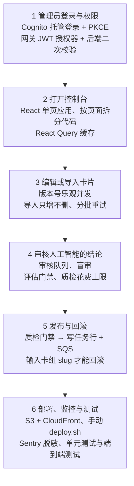

# 系统设计 · 控制台篇：管理员怎么生产、审核和发布内容

> 这一讲接在第 1 讲（手机端）之后，讲另一侧：Web 管理控制台。按管理员的使用流程，从登录讲到发布和部署。
> 内容来自 main（2026-10-03）的代码。四路代理分别梳理，再由另一个代理逐条对照代码核对：保留 171 条已核实的事实，更正了 21 条写错的说法。
> 第二部分里的英文简历条目是全文唯一的英文段落，可以直接放进英文简历。

## 第一部分：控制台系统设计

## 1 管理员登录与权限

- **用户做什么**：打开控制台后，被带到 Cognito 托管登录页，输入密码和 TOTP 验证码。
- **系统怎么做**：
  - 控制台有自己的用户池，和手机端分开。这个池强制开启 MFA，只能由管理员创建用户。手机端的池不开 MFA，允许自助注册。
  - 前端用授权码加 PKCE（S256）登录。它是公开客户端，不带密钥。另有一个随机 state，回调时先把 state 和 verifier 删掉，再做校验。
  - 登录后的跳转地址，用 `.invalid` 作为基准地址解析，只要来源（origin）变了就丢弃。写入时和读取时各检查一次。
  - 令牌放在 sessionStorage。请求拦截器在令牌过期前 60 秒主动刷新，同时发出的请求共用同一次刷新。
  - 后端分两层检查：
    - 第一层是 API 网关的 3 个 JWT 授权器，按受众分为 console、agent、mobile。
    - 第二层在 core-vpc 里。管理角色只有在令牌来自控制台池和控制台客户端时才算数，否则去掉角色，返回 403。下面还有一层按卡组的读写权限表 `admin_deck_permissions`。
- **为什么**：
  - 静态站点保存不了客户端密钥。
  - 网关在消耗算力之前就挡掉了错误客户端的令牌；万一某条路由配错，后端仍然会拒绝（失败即关闭）。
  - 提前刷新修好了"每小时被强制登出、编辑内容丢失"的问题。
- **代价**：
  - 令牌能被 JS 读到，XSS 是主要的窃取风险，而目前没有配置 CSP。
  - 登出时没有调用 Cognito 的 revoke 接口，被盗的刷新令牌最长还能用 30 天。

## 2 打开控制台（前端架构与性能）

- **用户做什么**：登录后看到卡组列表，在 16 个页面之间切换。
- **系统怎么做**：
  - 技术栈是 React 19、TypeScript 5.9、Vite 7。登录页和回调页立即加载，其余 16 个页面都懒加载，只在模块加载时预取卡组列表。
  - 路由改用数据路由，因为"未保存修改"守卫用到的 useBlocker 只能在数据路由下工作。
  - ChunkErrorBoundary 会区分"代码分块加载失败"和"渲染崩溃"，两种情况给出不同的处理。
  - React Query 设置：缓存 30 秒内视为新鲜，不自动重试。
- **为什么**：
  - 每次写入都会让它改到的缓存失效，所以缓存时间短一点也安全。
  - 一个可能已经写进服务器的请求不能自动重放，所以不重试。
  - 有一个预算测试会真实构建一次，然后量出首屏的静态导入闭包：上限 377,000 字节，拆分代码之前是 553,688 字节。
- **代价**：
  - 登录页仍要下载卡组列表那一串分块。
  - 换成数据路由让首屏增加了 55.6 kB。
  - 在别处改动的数据，最多可能 30 秒后才显示出来。

## 3 编辑或导入卡片

- **用户做什么**：修改单张卡片，或者粘贴 Markdown 批量导入。
- **系统怎么做**：
  - 编辑卡片时必须带上 `expectedVersion`。版本过期时，服务端返回 409 VERSION_CONFLICT。编辑页重新读取这张卡，但保留用户已经输入的内容，并提供"用最新版本重试"（后写的覆盖先写的）。
  - 导入分三步：输入、预览、结果。规则按 stableUid 对应卡片，只新增或更新，不删除。只要有冲突，"应用"按钮就不能点。
  - 每批最多 500 张卡或 900,000 个字符。超时、网络错误、429、5xx 会分别在 1、2、4 秒后重试。
  - 服务端把一批放在一个事务里 upsert，并用 `is distinct from` 判断内容是否真的变了，所以同一批重发时什么都不写。
- **为什么**：超时后重发的批次绝不能写两次；导入也不能悄悄删掉卡片，因为学习进度是按 stableUid 记录的。
- **代价**：
  - 批量导入不检查版本，会覆盖别人同时做的单卡编辑。
  - 删除卡片要走另外的流程。

## 4 审核人工智能的结论（人工把关的设计）

- **用户做什么**：在审核队列里处理 AI 起草的卡片：接受、修改后接受，或者选一个理由拒绝（共 7 种理由，其中 4 种计为 AI 的缺陷）。
- **系统怎么做**：
  - AI 代理的令牌只能访问 6 个端点，网关和 core-vpc 各检查一次。原则写在代码里："agents draft, humans decide"（AI 起草，人来决定）。
  - 在 dry_run 模式下做盲审：自动给出的结论先隐藏，点"显示"才能看到。每次决定都上报 `verdictShown`；客户端无法证明没看过时，按"已看过"上报。
  - 影子一致率只统计盲审的决定。控制台上展示运行手册里的上线门槛：至少 100 次盲审，一致率至少 95%。
  - 自动化模式在控制台里没有开关，只能改环境变量再部署。要进入 live 模式，最新一次评估门禁还必须是通过且没被撤销的。
  - 开始 AI 质检之前，先显示卡片数和预估成本。每日花费上限用"预留"的方式实现，并加 advisory lock。core-vpc 自己从不调用模型。
- **为什么**：
  - 盲审得到的一致率，才是能证明"可以上线"的证据。
  - 撤销评估门禁就是一键关停。
  - 花费上限加锁，是为了防止几个质检同时启动，各自都通过检查、合起来却超支。
- **代价**：
  - 审核多了几步操作，看过 AI 结论的决定不计入一致率。
  - 改模式要提交代码再部署，比较慢。
  - 95% 这个门槛只是展示出来，服务端并不强制。

## 5 发布与回滚

- **用户做什么**：点击"发布"；出问题时回滚到之前的某个构建版本。
- **系统怎么做**：
  - 发布前依次过两道检查：选择题格式检查、AI 质检门禁。质检门禁只有在两个开关都打开时才会拒绝发布。
  - 门禁生效时，发布会绑定通过质检的那份快照；如果中途有人改了卡，返回 409 AI_QA_STALE。
  - 发布是异步的：先写一行 PENDING 任务，再发 SQS 消息；SQS 发送失败，这一行立即标为 FAILED。
  - 15 分钟内重复点击发布，会接着用原来的任务。部分唯一索引保证每个卡组同时只有一个进行中的任务。
  - 回滚只有 super_admin 能做，只接受已经成功的构建，必须输入卡组 slug 确认。修改 live_build_id 和写审计记录在同一个事务里完成。
- **为什么**：构建是很慢的 S3 写入。双击或按 F5 不能造成重复构建，也不能留下没人处理的任务。
- **代价**：需要前端轮询，还需要一个回收器，处理卡住的任务（PENDING 超过 10 分钟、PROCESSING 闲置超过 30 分钟）。

## 6 部署、监控与测试

- **系统怎么做**：
  - 静态文件放在私有 S3 存储桶，只能通过 CloudFront（OAC）读取。
  - 带哈希的资源缓存一年且不可变；index.html 不缓存，最后上传。旧的分块不删。
  - 部署脚本最后会读回线上的 index.html，比对 SHA-256。
  - Sentry 只在打包时带了 DSN 才会懒加载。令牌、JWT、邮箱和 URL 查询参数都会被脱敏。
  - 测试规模：163 个 vitest 测试文件，1,486 个用例；Playwright 端到端测试在真实生产包上跑 16 个用例，API 和 Cognito 都打桩模拟；另有 axe 无障碍扫描。
- **为什么**：
  - 部署之前就打开的标签页还会请求旧分块。旧分块一旦被删，就会拿到 index.html，懒加载随之失败，这个问题出现过一次（CFE-23）。
  - CI 里不放任何凭据。
- **代价**：
  - 没有 CSP，也没有 WAF。
  - 部署靠手动运行 deploy.sh，没有持续部署（CD），也没有脚本化的控制台回滚。存储桶的版本控制是关闭的。
  - 端到端测试只用 Chromium，并且 API 全部打桩。

## 小结

| 步骤 | 核心设计 | 主要代价 |
|---|---|---|
| 1 登录与权限 | 独立用户池 + PKCE；网关和后端两层授权；按卡组的权限表 | 令牌可被 JS 读取、没有 CSP；登出不撤销令牌 |
| 2 前端架构 | 16 个页面懒加载；首屏预算测试；不自动重试 | 数据路由让首屏增加 55.6 kB；最多 30 秒旧数据 |
| 3 编辑与导入 | 版本号冲突检测；导入只增不删、同一批重发不写入 | 导入会覆盖同时进行的单卡编辑 |
| 4 AI 审核 | AI 只起草；盲审；评估门禁可一键撤销；花费上限预留制 | 审核步骤多；改模式要部署 |
| 5 发布与回滚 | 任务行 + SQS；15 分钟内续用原任务；快照绑定 | 需要轮询和回收器 |
| 6 部署与测试 | 资源不可变、旧分块保留；读回线上文件校验；Sentry 脱敏 | 手动部署、没有 WAF、没有版本控制 |

## 面试 30 秒版

> 除了 iOS App，我还做了一个 Web 管理控制台，用 React 和 TypeScript 写，部署在 S3 和 CloudFront 上。登录用 Cognito 加 PKCE。授权分两层：先在网关按令牌受众区分，再在后端绑定角色和每个卡组的读写权限。AI 代理的令牌只能访问 6 个端点：AI 负责起草，人来审核决定。审核用盲审，所以统计出的一致率才能作为上线的依据。发布是异步任务，重复点击不会产生重复构建。代价我也清楚：目前没有 CSP，部署是手动的。

## 自测题

**1. 为什么刷新令牌要提前 60 秒，而且要让并发请求共用一次刷新？**

答案
请求超时是 15 秒，令牌存储另外留了 30 秒的过期余量，提前 60 秒可以同时避开这两段时间。一个页面打开时会同时发出好几个请求，如果每个请求各自刷新，就会争抢同一个刷新令牌，结果可能把用户登出。所以并发请求共用同一个进行中的刷新，等它结束后再清掉。

**2. 导入的一批请求超时后重发，为什么不会重复写入？**

答案
服务端把一批放在一个事务里，按 (deck_id, stable_uid) 做 upsert，并用 `is distinct from` 判断内容有没有真的变化。重发的批次内容和已经写入的一样，所以什么都不写，版本号也不会增加。

**3. 盲审时，为什么由客户端上报 verdictShown，而不是让服务端推断？**

答案
一致率只有在审核人没有被 AI 结论影响时才有效，而只有客户端知道审核人有没有点过"显示"。客户端无法证明没看过时就按"已看过"上报，服务端只记录客户端上报的内容，从不自己推断是否盲审。

## 代码位置（可选）

| 内容 | 位置 |
|---|---|
| 两个用户池与 SPA 客户端 | infra/modules/identity/cognito.tf:1-108 |
| PKCE 与回调校验 | frontend/src/auth/cognito.ts:14-35,69-106 |
| 主动刷新、共用一次刷新 | frontend/src/api/http.ts:20-108 |
| 3 个 JWT 授权器、6 个代理端点 | infra/modules/api/gateway.tf:12-16,55-71,168-214 |
| 代理白名单 | src_C/Vpc/AgentClientPolicy.cs:6-56 |
| 控制台绑定与角色 | src_C/Shared/RecallSmith.Lambda.Common/Auth.cs:307-429 |
| 卡片版本冲突 | src_C/Vpc/Authoring/Cards.cs:241-250; frontend/src/pages/EditCardPage.tsx:209-242 |
| 导入事务 | src_C/Vpc/Authoring/CardsImport.cs:10-26,317-342 |
| 盲审与一致率 | frontend/src/lib/automationVerdictSeen.ts:100-108; src_C/Vpc/Automation/StatusRoutes.cs:179-206 |
| 异步发布 | src_C/Vpc/Authoring/Publish.cs:369-477 |
| 部署脚本 | frontend/deploy.sh:19-36 |
| 首屏预算测试 | frontend/tests/bundleFirstLoad.test.ts:43-107 |

---

## 第二部分：三个岗位怎么用控制台

## 全栈工程师

- **最能打动负责人的点**：
  - 有可度量的性能预算：首屏上限 377,000 字节，拆分前是 553,688 字节，由测试强制执行。
  - 前后端都用版本号做乐观并发：服务端返回 409，前端在冲突时保留用户的输入。
  - 发布异步、重复点击不会重复构建；部署时保留旧分块，并读回线上文件校验。
- **放进哪条简历条目**：**新增一条**"Web 管理控制台"。原简历只写了 App，这正是这次的缺口。
- **英文条目**：
  > Built a React 19/TypeScript admin console on S3/CloudFront with route-level code splitting, a test-enforced first-load budget (377,000 bytes, from 553,688), optimistic-concurrency card edits with 409 conflict recovery, and duplicate-safe async deck publishing through SQS.
- **面试时必须如实承认的局限**：
  - 没有 CSP，控制台前面也没有 WAF。
  - 部署靠手动运行 deploy.sh，没有 CD，没有脚本化回滚，存储桶的版本控制是关闭的。
  - 端到端测试只用 Chromium，API 全部打桩。
  - 批量导入会覆盖同时进行的单卡编辑。

## AI Agent 工程师

- **最能打动负责人的点**：
  - 给 AI 代理最小权限：只能访问 6 个端点，网关和 core-vpc 各检查一次，靠 CI 脚本保持两份白名单一致。
  - 运行器端点还要求令牌必须来自代理客户端，所以浏览器里的令牌无法驱动运行器。
  - 审核队列的检查和 MCP 的 lint_card 走同一条导入解析路径。
- **放进哪条简历条目**：**并入已有的 AI 代理（MCP 起草卡片）条目**，补上"权限边界和人工审核"这一半。
- **英文条目**：
  > Enforced least authority for AI-agent tokens: agents reach only 6 exact API routes, checked at both the API Gateway JWT authorizer and an in-Lambda allow-list kept in sync by a CI checker; agents can draft but never publish or administer.
- **面试时必须如实承认的局限**：
  - 代理令牌带着所有者的用户组，而且存放在磁盘上。
  - 两份白名单靠 CI 检查保持一致，并不是同一个来源。
  - 在 live 模式下且评估门禁通过时，存在自动接受，所以不能说"每一张都由人接受"。
  - 登出时不撤销令牌。

## AI 自动化工程师

- **最能打动负责人的点**：
  - 盲审只统计没看过 AI 结论的决定，这样一致率才可信。
  - 评估门禁会从计数重新算出各项指标，撤销门禁就是一键关停。
  - 质检的每日花费上限用加锁的预留方式实现。
  - 计入台账的审核时间只算页面可见的时间，上限 30 分钟，被驳回的结论也照样计入成本。
- **放进哪条简历条目**：**并入已有的自动化或评估条目**。如果简历里还没有这类条目，就新增一条"人工把关的自动化"。
- **英文条目**：
  > Built human-in-the-loop controls for card automation: blind dry-run review that withholds AI verdicts, shadow agreement counted only on blind decisions, an eval gate whose revoke acts as a kill switch, and a lock-protected daily AI QA spend cap.
- **面试时必须如实承认的局限**：
  - "至少 100 次、至少 95%"只是控制台展示的运行手册规则，服务端并不强制。
  - 质检成本按每张卡 0.05 美元的固定值估算，可能拒掉其实不会超支的质检。
  - 页面隐藏时的审核时间、或超过 30 分钟的部分，都会少算。
  - 改模式必须提交代码再部署。
  - 不要报出这些材料里没有的一致率数字，也不要声称生产环境已经开启 live 模式。