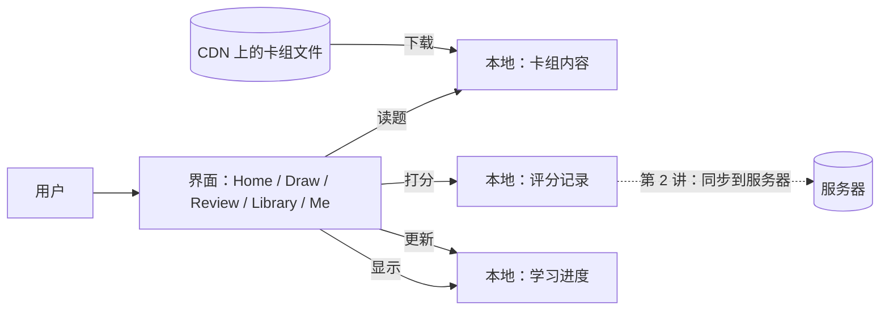

# 系统设计 · 第 1 讲：从打开 App 到学完一张卡（只看手机这一侧）

> 这个系列按"数据在系统里怎么流动"的顺序讲，一讲只讲一段。
> 这一讲只看手机，服务器先当成一个黑盒，第 2 讲再打开它。
> 数字取自 2026-10-02 的 main（`c0f3ac7`）和生产环境。

## 全景：手机上有什么

记住一句话：**手机自己就能完成学习，服务器只负责备份和多设备同步。**

## 第 1 步：用户打开 App

- App 先用手机上已有的东西把首页显示出来，**不等网络**。
- 拉远程配置、检查卡组有没有新版本这些事，在后台同时进行；失败了就继续用本地的。
- 第一次安装、又没网时，App 安装包里自带 3 个入门包（每副卡组的前 30 张），照样能学。联网后会自动换成完整版，学习进度保留。

**为什么**：学习类 App 常在地铁、飞机上用。打开就能学，比"转圈等加载"重要得多。

## 第 2 步：用户学的内容是什么

现在线上有 3 副卡组，全部免费：

| 卡组 | 卡片数 |
| --- | --- |
| Claude Developer Foundations (CCDV-F) | 441 |
| AWS Associate Architect (SAA-C03) | 371 |
| .NET & C# Interview | 217 |

一张卡里有什么：

| 字段 | 意思 |
| --- | --- |
| StableUid | 这张卡的永久 ID，改题也不变（进度靠它对上） |
| Revision | 内容版本号，改一次题加 1 |
| Question / Explanation | 题目 / 解析 |
| CodeSnippet | 代码片段（可选） |
| Difficulty | 难度 1–3 |
| Topic | 所属主题（可选），用来按考试领域统计进度 |
| Mcq | 选择题的选项、对错和每个选项的解释（可选；没有就是问答题） |

**内容怎么到手机**：卡组是一个静态文件，放在 CDN 上，每发布一次生成一个新版本（build），旧版本不改。另有一份"清单"（manifest）写着每副卡组现在最新是哪个版本。手机看清单，发现版本变了才下载新的。

**为什么**：内容对所有人都一样，当成静态文件放 CDN 最便宜、最快；改题只要重新发布，不用发新版 App。

## 第 3 步：用户学一张卡

1. 看题，翻面看答案，然后打分。界面默认只有两个按钮：Forgot（忘了）和 Remembered（记得）；设置里可以换成 Again / Hard / Good / Easy 四个。系统内部一律记成这四档之一（Forgot 记 Again，Remembered 记 Good）。
   - 选择题不用手动打分：选完选项后，按答对答错和作答速度自动折算成四档之一。
   - 一张新的问答卡第一次出现只是"学习"，点 Got it 就过，不打分；这一轮最后再考一次，那时才打分。
2. 手机**马上**算出这张卡下次什么时候再出现（FSRS 算法，在手机上算，不联网）。
3. 先把"这次打分"作为一条**评分记录**写进本地，等它写完。记录里带着这次算出的新进度。
4. 再更新这张卡的**学习进度**。

进度里记的是：上次复习时间、下次复习时间、阶段（stage）、忘了几次（lapses），以及 FSRS 的记忆状态（稳定性、难度）。

**为什么先写记录、后写进度**：评分记录是"发生过的事实"，进度是"结果"。如果两次写之间 App 被杀，记录还在本地队列里，下次同步时服务器会据此把进度补回来（所以要登录才能补回）；反过来，只存了进度却没有记录，服务器就永远不知道这次复习。

每次打分还会顺便结算奖励：第一次学会一张新卡（打分不是 Again）给 1 次抽卡机会，每张卡只给一次；这一下把这副卡组今天的到期卡清空了，再给 1 次（每天一次）。所以一次打分最多得 2 次，在 Draw 页抽卡收集（入门课的卡和 Review all 模式不给新卡这 1 次；入门课学完一次性给 3 次）。这是激励机制，不影响学习数据本身。

## 第 4 步：这些数据存在哪

- 全部存在手机本地（AsyncStorage，一个键值存储）。
- 按用户分区：键名以 `devcards:u:{用户 ID}:` 开头。
- 没登录时，进度放在 `anon` 分区；评分记录放在一个专门的"待领取"分区 `__pending__`，登录后交给这个账号。
- 不登录也能完整使用。登录以后，评分记录才会被送到服务器，这是第 2 讲的内容。

## 小结：手机上的三类数据

| 数据 | 谁产生 | 会不会变 | 存在哪 |
| --- | --- | --- | --- |
| 卡组内容 | 后台发布 | 只读，按版本整体替换 | CDN，手机缓存一份 |
| 评分记录 | 用户每次打分 | 只追加，从不修改 | 手机本地队列，之后送到服务器 |
| 学习进度 | 打分时算出（结果也写进记录） | 每次打分更新 | 手机本地，服务器也存一份合并结果 |

**面试 30 秒版**：
"这个 App 是离线优先的。卡组内容是 CDN 上带版本号的静态文件，手机按清单增量更新。用户每次打分，手机本地用 FSRS 算出下次复习时间，先把这次打分记成一条只追加的事件，再更新进度。所以学习完全不依赖网络，服务器只负责同步和备份。"

## 自测（先别看答案）

1. 为什么手机不通过 API 实时从数据库读卡组，而是下载 CDN 上的静态文件？

答案
卡片在后台数据库里编辑，发布时导出成带版本号的静态文件。内容对所有用户都一样、读多写少，做成带版本的静态文件放 CDN，又快又便宜，还能离线缓存；改题只需重新发布，不用发新版 App。

2. 打分时为什么先写"评分记录"，再写"进度"？

答案
记录是事实，进度是结果。中途被杀时，记录还在队列里，下次同步由服务器把进度补回来；只有进度没有记录，服务器就丢了这次复习。

3. StableUid 有什么用？

答案
它是卡片的永久 ID。改题、换版本、从入门包换成完整版时都不变，所以学习进度能一直对上同一张卡。

## 下一讲

**第 2 讲：评分记录怎么从手机到服务器**：什么时候同步、重复发送为什么不会出错、两台设备怎么合并。

## 想对照代码（可选）

| 内容 | 代码位置 |
| --- | --- |
| 五个主页面 | `mobile/src/navigation/mainTabs.ts:3-13` |
| 一张卡的字段 | `mobile/src/types/deckExport.ts:15-27` |
| 内置入门包 | `mobile/src/content/starter/index.ts`、`mobile/src/content/starterOffline.ts` |
| 打分：先写记录、再写进度 | `mobile/src/screens/SessionCardScreen.tsx:892-897`、`mobile/src/screens/SessionCardScreen.tsx:944` |
| 默认两个打分按钮 | `mobile/src/features/gacha/components/RatingBar.tsx:27-35`、`mobile/src/features/gacha/study/studyPrefs.ts:24` |
| 进度里记了什么 | `mobile/src/review/model.ts:4-42` |
| 按用户分区的存储键 | `mobile/src/review/storage.ts:24`、`mobile/src/review/storage.ts:64-67` |
| 每次打分最多 2 次抽卡奖励 | `mobile/src/features/gacha/rewards/sessionRewards.ts:38-40`、`mobile/src/features/gacha/rewards/sessionRewards.ts:62` |
